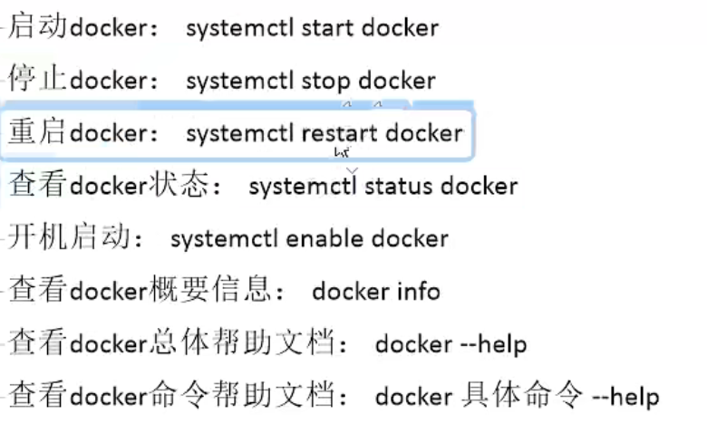
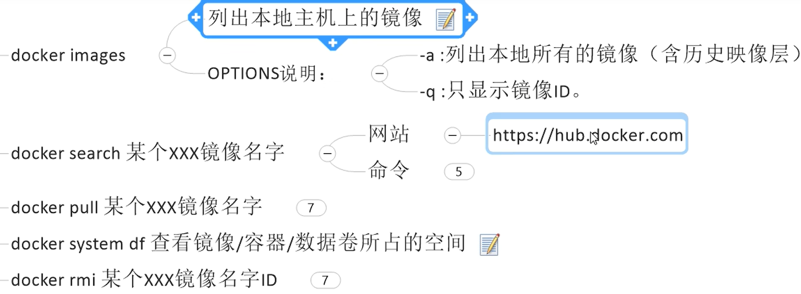
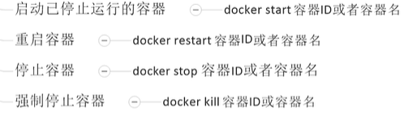
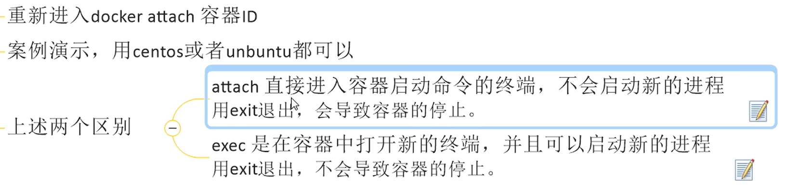
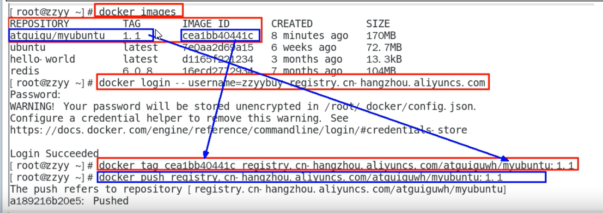

# 安装

需要提供虚拟机环境

安装gcc

```bash
yum -y install gcc
yum -y install gcc-c++
```

安装docker

https://docs.docker.com/engine/install/centos/

```bash
#卸载旧版本
yum remove docker \
                  docker-client \
                  docker-client-latest \
                  docker-common \
                  docker-latest \
                  docker-latest-logrotate \
                  docker-logrotate \
                  docker-engine
#安装需要的插件
yum install -y yum-utils
#设定仓库
yum-config-manager \
    --add-repo \
    https://download.docker.com/linux/centos/docker-ce.repo
```

安装docker引擎

```bash
yum install docker-ce docker-ce-cli containerd.io docker-compose-plugin
```

启动docker

```bash
systemctl start docker
```

测试

```bash
docker version
docker run hello-world
```

停止docker

```
systemctl stop docker
```

# 常用命令





# 容器命令

**创建容器**

```bash
docker run -it --name=mysystem ubuntu bash
```

-it是交互的意思 --name是命名 bash或/bin/bash都是终端命令交互的意思

**退出容器**

1.exit 退出容器的同时停止容器

2.ctrl + p + q 退出容器但是容器还是运行的



进入已经运行的容器



```bash
docker exec -it 容器名 bash
```

**后台守护式启动**

除了前后台交互式启动外可以后台守护启动，但是如果没后进程运行容器会自杀

```bash
docker run -d redis
```

```bash
#查看日志
docker logs 容器id
#查看容器的详细内容
docker inspect 容器id
#从容器拷贝文件到主机
docker cp 容器id:容器文件路径 目的主机路径
```

导入和导出容器

```
#导出
docker export 容器id > 文件名.tar
docker export 1048a5010070 > adc.tar
#导出
cat 文件名.tar | docker import - 镜像用户/镜像名:版本号
cat adc.tar | docker import - chb/ubuntu:3.8sss
```

提交自己的容器镜像到本地

```
docker commit -m="信息" -a="author" id chb/mybunt:1.1
```

本地镜像发布到云



