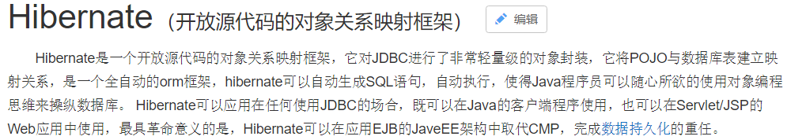

# Hibernate是什么

一款持久化ORM框架，ORM就是对象-关系-映射。



官方问道https://docs.jboss.org/hibernate/stable/orm/javadocs/

# maven依赖

```xml
<!-- https://mvnrepository.com/artifact/org.hibernate/hibernate-core -->
<dependency>
    <groupId>org.hibernate</groupId>
    <artifactId>hibernate-core</artifactId>
    <version>5.6.2.Final</version>
</dependency>

```

# Hibernate.cfg.xml

```xml
<?xml version="1.0" encoding="UTF-8"?>
<!DOCTYPE hibernate-configuration PUBLIC
        "-//Hibernate/Hibernate Configuration DTD 3.0//EN"
        "http://www.hibernate.org/dtd/hibernate-configuration-3.0.dtd">
<hibernate-configuration>
    <session-factory>
        <!-- 连接数据库的基本参数 -->
        <property name="hibernate.connection.driver_class">com.mysql.cj.jdbc.Driver</property>
        <property name="hibernate.connection.url">jdbc:mysql:///cmybatis</property>
        <property name="hibernate.connection.username">root</property>
        <property name="hibernate.connection.password">221700</property>
        <!-- 配置Hibernate的方言 -->
        <property name="hibernate.dialect">org.hibernate.dialect.MySQLDialect</property>


        <mapping resource="com/HiberOb/pojo/Children.hbm.xml"/>
    </session-factory>
</hibernate-configuration>
```

# 类与表的映射文件hibernate.cfg.xml

```xml
<?xml version="1.0" encoding="UTF-8"?>
<!DOCTYPE hibernate-mapping PUBLIC
        "-//Hibernate/Hibernate Mapping DTD 3.0//EN"
        "http://www.hibernate.org/dtd/hibernate-mapping-3.0.dtd">
<hibernate-mapping>
    <!-- 建立类与表的映射 -->
    <class name="com.HiberOb.pojo.Children" table="children">
        <!-- 建立类中的属性与表中的主键对应 -->
<!--        主键自增-->
        <id name="id" >
            <generator class="native"/>
        </id>

        <!-- 建立类中的普通的属性和表的字段的对应 -->
        <property name="name" column="name" />
        <property name="password" column="password"/>
    </class>
</hibernate-mapping>
```

# 测试类

```java
public class StartHib {
    public static void main(String[] args) {
        // A SessionFactory is set up once for an application!
        // 初始化注册服务对象
        final StandardServiceRegistry registry = new StandardServiceRegistryBuilder()
                .configure() // configures settings from hibernate.cfg.xml
                .build();
        // 从元信息中获取Session
        SessionFactory sessionFactory    = new MetadataSources(registry)
                .buildMetadata()
                .buildSessionFactory();
        // 从工厂创建session连接
        Session session = sessionFactory.openSession();
        // 开启事务
        Transaction transaction = session.beginTransaction();
        Children children01 = new Children();

        children01.setName("chenhaha");
        children01.setPassword("22156");
        session.save(children01);
        transaction.commit();
        session.close();


    }

}

```

# Hibernate自动生成表和格式规范

```xml
<!-- 配置Hibernate的方言 -->
        <property name="hibernate.dialect">org.hibernate.dialect.MySQL8Dialect</property>
        <!-- 数据库生成方式 每次先去查看表是否存在，如果不存在则新建-->
        <property name="hibernate.hbm2ddl.auto">update</property>
<!--        打印sql-->
        <property name="hibernate.show_sql">true</property>
<!--        格式化sql-->
        <property name="format_sql">true</property>
```

**踩坑**

如果配置Hibernate方言时默认org.hibernate.dialect.MySQLDialect，但是自己的数据库是8.0的，所以要加版本org.hibernate.dialect.MySQL8Dialect，不然会自动建表语法错误

# 五大关键接口

## 1.Configuration

## 2.SessionFactory

## 3.Session

## 4.Transaction

## 5.Query

# 日志配置log4j

导入maven依赖

```xml
<dependency>
            <groupId>org.slf4j</groupId>
            <artifactId>slf4j-api</artifactId>
            <version>2.0.0-alpha4</version>
        </dependency>
        <dependency>
            <groupId>org.slf4j</groupId>
            <artifactId>slf4j-log4j12</artifactId>
            <version>2.0.0-alpha4</version>
        </dependency>
        <dependency>
            <groupId>log4j</groupId>
            <artifactId>log4j</artifactId>
            <version>1.2.12</version>
        </dependency>
```

log4j配置文件中需要加以下配置，否则会出现追加器找不到等问题

```xml
# Global logging configuration 这个配置是调试用的配置，生产环境要改成INFO或更高级别
log4j.rootLogger=DEBUG, stdout
# Console output...
log4j.appender.stdout=org.apache.log4j.ConsoleAppender
log4j.appender.stdout.layout=org.apache.log4j.PatternLayout
log4j.appender.stdout.layout.ConversionPattern= %-d{yyyy-MM-dd HH:mm:ss} [ %t:%r ] - [ %p ] %m%n
```

# 对象状态及生命周期

**瞬时状态**：刚刚使用new语句创建，还没有被持久化，不处于Session的缓存中，处于临时状态的java对象被称为临时对象。Session中没有，数据库中没有。

**持久化状态**：已经被持久化，加入到Session的缓存中，处于持久化状态的java对象被称为持久化对象。Session中有，数据库中有。

**游离状态**：已经被持久化，但不处于Session的缓存中。处于游离状态的Java对象被称为游离对象。Session中没有，数据库中有

# 工具类HibernateUtil

```java 

public class HibernateUtil {

    // 使用Threadlocal模式初始化Session
    private static ThreadLocal<Session> threadLocal= new ThreadLocal<Session>();
    private static StandardServiceRegistry registry;
    private static SessionFactory sessionFactory;

    // 静态代码块初始化Session工厂
    static{
        // 初始化注册服务对象
       registry= new StandardServiceRegistryBuilder().configure().build();
       // 从元信息获取Session工厂
        sessionFactory = new MetadataSources(registry).buildMetadata().buildSessionFactory();
    }

    //获取Session的方法
    public static Session getSession() {
        Session session = threadLocal.get();
        if (null == session || session.isOpen()) {
            if (null == sessionFactory)
                reBuildSessionFactroy();
                session = (null != sessionFactory) ? sessionFactory.openSession() : null;

                threadLocal.set(session);


        }
        return session;
    }


    private static void reBuildSessionFactroy () {
            // 初始化注册服务对象
            registry = new StandardServiceRegistryBuilder().configure().build();
            // 从元信息获取Session工厂
            sessionFactory = new MetadataSources(registry).buildMetadata().buildSessionFactory();
        }

    public static void closeSession(){
        Session session = threadLocal.get();
        if (null != session && session.isOpen()){
            session.close();
        }
    }


}

```

测试类Util

````JAVA 
public class UtilTest {
    public static void main(String[] args) {
        Session session;
        Transaction t = null;
        try{
            session = HibernateUtil.getSession();
            t = session.beginTransaction();
            Children children = new Children();
            children.setName("ccc");
            children.setPassword("4445");
            session.save(children);
            t.commit();

        }catch (Exception e){
            e.printStackTrace();
            t.rollback();
        }finally {
            HibernateUtil.closeSession();
        }
    }
}

````

**get和load方法的区别**

二者都可以读取数据库的数据，但是get是立即加载，而load是懒加载，也就是说当你调用时它才去读取。

# HibernateSchemaExport的使用

```java 
public class testCreateDB {

    public static void main(String[] args) {
        // .configure如果不写参数，表示默认获取的是hibernate.cfg.xml.
        //配置文件的名字是不能改的，如果改掉就应该在configure方法中传入配置文件名字
        StandardServiceRegistry serviceRegistry = new StandardServiceRegistryBuilder().configure().build();
        // 生成metadata构建元信息
        Metadata metadata = new MetadataSources(serviceRegistry).buildMetadata();
        SchemaExport schemaExport = new SchemaExport();
        // 生成表
        schemaExport.create(EnumSet.of(TargetType.DATABASE),metadata);
    }
}

```

# 映射关系

## 单向多对一

编写cfg.xml

```xml
<?xml version="1.0" encoding="UTF-8"?>
        <!DOCTYPE hibernate-mapping PUBLIC
                "-//Hibernate/Hibernate Mapping DTD 3.0//EN"
                "http://www.hibernate.org/dtd/hibernate-mapping-3.0.dtd">
<hibernate-mapping package="com.HiberOb.pojo">
<!-- 建立类与表的映射 -->
<class name="Student" table="student">
    <!-- 建立类中的属性与表中的主键对应 -->
    <!--        主键自增-->
    <id name="id" >
        <generator class="native"/>
    </id>

    <!-- 建立类中的普通的属性和表的字段的对应 -->
    <property name="name" column="st_name" />
    <property name="age" column="st_age"/>
    <!--        多对一-->
    <many-to-one name="grade" class="Grade" column="st_grade" not-null="true" />
</class>
</hibernate-mapping>
```

主要就是 <many-to-one name="grade" class="Grade" column="st_grade" not-null="true" />，它表示多对一的关系映射。进行存储操作时，建议先存储外键，如Grade是外键的一端，否则会造成资源的消耗。可能会update进行修改表的关系映射。多余操作

## 单向一对多

```xml
<?xml version="1.0" encoding="UTF-8"?>
<!DOCTYPE hibernate-mapping PUBLIC
        "-//Hibernate/Hibernate Mapping DTD 3.0//EN"
        "http://www.hibernate.org/dtd/hibernate-mapping-3.0.dtd">
<hibernate-mapping package="com.HiberOb.pojo">
    <!-- 建立类与表的映射 -->
    <class name="Grade" >
        <!-- 建立类中的属性与表中的主键对应 -->
        <!--        主键自增-->
        <id name="id" >
            <generator class="native"/>
        </id>

        <!-- 建立类中的普通的属性和表的字段的对应 -->
        <property name="name" column="g_name" />
<!--        单向一对多-->

        <set name="Students">
            <key foreign-key="fk_grade" column="grade_id" not-null="true"></key>
            <one-to-many class="Student"/>

        </set>

    </class>
</hibernate-mapping>
```

另一个表不变，

执行

```java 
 public static void main(String[] args) {
        Session session;
        Transaction t = null;
        try{
            session = HibernateUtil.getSession();
            t = session.beginTransaction();
            Student student01 = new Student();
            Student student02 = new Student();
            Student student03 = new Student();
            student01.setAge(18);
            student01.setName("张三");

            student02.setAge(20);
            student02.setName("李四");

            student03.setAge(25);;
            student03.setName("王五");

            Grade grade01 = new Grade();
            Grade grade02 = new Grade();
            grade01.setName("基础");
            grade01.getStudents().add(student01);
            grade01.getStudents().add(student02);
            grade02.setName("进阶");
            grade02.getStudents().add(student03);

            session.save(grade01);
            session.save(grade02);

            session.save(student01);
            session.save(student02);
            session.save(student03);

            t.commit();

        }catch (Exception e){
            e.printStackTrace();
            t.rollback();
        }finally {
            HibernateUtil.closeSession();
        }
    }
```

一对多效率低于多对一

## 双向一对多

双向其实就是前面二者的融合，从两个方向都可以存取数据。

尽量不要设置主键not nullbianxie

## 级联操作

级联操作就是一张表的操作会对关联的表也进行相应的操作。一般用的是插入级联，比如年纪表级联学生表

```java
<set name="Students" cascade="save-update">
            <key foreign-key="fk_grade" column="grade_id" not-null="true"></key>
            <one-to-many class="Student"/>

        </set>
```

在新增或插入年纪表的同时对应的学生不需要操作即可插入。

## 维护关系inverse

```xml
<set name="Students" cascade="save-update" inverse="true">
            <key foreign-key="fk_grade" column="grade_id" not-null="true"/>
            <one-to-many class="Student"/>

        </set>
```

cascade="save-update"表示的就是由对方去维护关系，一般在程序中由多的一方维护关系，代码的关系指定会失效。
