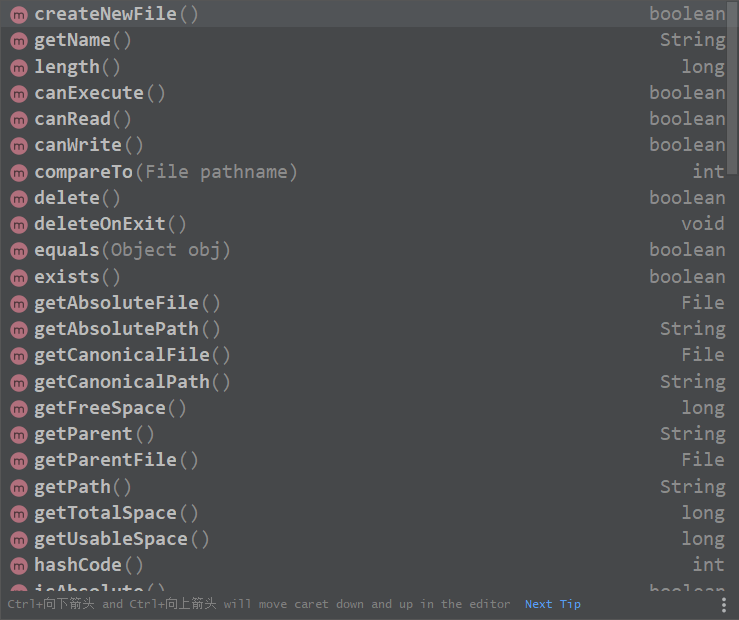
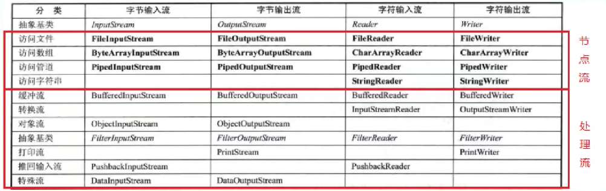

# 文件

保存数据的地方

文件在程序中是以流的形式来操作的  

输入流是数据从数据源（文件）到程序内存的路径

输出流是数据从程序内存到数据源的路径

## **创建文件**

File类实现了Serializable接口和Comparable接口 

第一种创建文件的方式

new File(String path)

```java
package FileIo;

import com.sun.org.glassfish.gmbal.ParameterNames;

import java.io.File;
import java.io.IOException;

public class creatFile {
    public static void main(String[] args) {

        String filePath = "H:\\objectProgram\\JavaEE\\fileTest\\helloFile";

        File file = new File(filePath);
        try {
            file.createNewFile();
            System.out.println("文件创建成功");
        } catch (IOException e) {
            e.printStackTrace();
        }
    }
}

```

第二种方式

new File(File parentFilepath,String childfileName)

```java 
package FileIo;

import com.sun.org.glassfish.gmbal.ParameterNames;

import java.io.File;
import java.io.IOException;


public class creatFile {
    public static void main(String[] args) {
        
        File parentFile = new File("H:\\objectProgram\\JavaEE\\fileTest");
        String fileName = "news2.txt";
        File file = new File(parentFile, fileName);

        try {
            file.createNewFile();
            System.out.println("文件创建成功");
        } catch (IOException e) {
            e.printStackTrace();
        }
    }
}

```

## 获取文件信息



new 一个文件对象，然后通过该对象来操作文件

## 目录操作

文件夹也称为目录

mkdir单目录操作

mkdirs多级目录操作

```java
package FileIo;

import java.io.File;

public class mkdir {
    public static void main(String[] args) {
        String path = "H:\\objectProgram\\JavaEE\\fileTest\\new文件夹";
        String pathMkdir = "H:\\objectProgram\\JavaEE\\fileTest\\newWorld\\welcome\\chb";
        File file = new File(path);
        File file1 = new File(pathMkdir);
        if(file.exists()&&file1.exists()){
            System.out.println("文件夹已经存在");
        }else{
            file.mkdir();
            file1.mkdirs();
            System.out.println("文件创建成功");
        }
    }
}
```

# io流分类

| 抽象基类 |    字节流    | 字符流 |
| :------: | :----------: | :----: |
|  输入流  | InputStream  | Reader |
|  输出流  | OutputStream | Writer |

# FileInputStream

一次按一个字节读取；如果文档中有中文会乱码

```java 
package FileIo;

import java.io.FileInputStream;

import java.io.IOException;

public class fileInputOne {
    public static void main(String[] args) throws IOException {
        String filePath = "H:\\objectProgram\\JavaEE\\fileTest\\newWorld\\helloWord.txt";
        int readNum = 0;
        FileInputStream fileInputStream = new FileInputStream(filePath);
        while((readNum = fileInputStream.read()) != -1){
            System.out.print((char)readNum);
        }
        // 读取完毕后要记得关闭流，否则会造成资源的损耗
        fileInputStream.close();
    }
}
```

  -1值的判断是因为当文档读取返回-1时，表示内容读取结束

按照规定的步长来读取数据

```Java
package FileIo;

import java.io.FileInputStream;

import java.io.IOException;

public class fileInputOne {
    public static void main(String[] args) throws IOException {
        String filePath = "H:\\objectProgram\\JavaEE\\fileTest\\newWorld\\helloWord.txt";
        int readLon= 0;
        // 多字节读取先定义一个长度的容器
        byte[] buf = new byte[9];
        FileInputStream fileInputStream = new FileInputStream(filePath);
        while((readLon = fileInputStream.read(buf)) != -1){
            // readLon返回值是读取到值的长度，读取到的数据其实都分9个长度衡量来存储到buf里面了
            System.out.print(new String(buf,0,readLon));
            // 将获得的数据由数组里的字节码转换成字符转，参数buf为数据容器，0起始下标，readLon表示步长，也就是说需要从
            //容器的哪里结束转译
        }
        // 读取完毕后要记得关闭流，否则会造成资源的损耗
        fileInputStream.close();

    }
}
```

# FileOutputStream

将数据写入文件的输出流操作

```java 
public class fileOutput {
    public static void main(String[] args) throws IOException {

        String path = "H:\\objectProgram\\JavaEE\\fileTest\\news2.txt";
        // false参数是表示后来写入的值会覆盖前面的数据，目前的Java默认是true，不会覆盖。
        FileOutputStream outputStream = new FileOutputStream(path,false);
        //写入一个字节
        outputStream.write('a');
        //写入一个字符串
        String str = "hello,io";
        outputStream.write(str.getBytes());
//        //选择性输入
//        outputStream.write(str.getBytes(),0,str.length());
        outputStream.close();

    }
}

```

# 文件的拷贝

```java 
package FileIo;

import java.io.FileInputStream;
import java.io.FileNotFoundException;
import java.io.FileOutputStream;
import java.io.IOException;

public class fileCopy {
    public static void main(String[] args) throws IOException {
        //1.文件输入流，读取数据
        //2.文件输出流，写入数据
        String path = "H:\\objectProgram\\JavaEE\\fileTest\\news2.txt";
        String toPath = "H:\\objectProgram\\JavaEE\\fileTest\\helloFile.txt";
        FileInputStream inputStream = new FileInputStream(path);
        FileOutputStream outputStream = new FileOutputStream(toPath);
        byte[] buf= new byte[1024];
        int init =0;
        while ((init = inputStream.read(buf)) != -1){
            // 边读边写
            // write中结束的长度为循环读取到数据的长度init，避免造成文件损失
            outputStream.write(buf,0,init);
        }
        inputStream.close();
        outputStream.close();
    }
}

```

# 字符流FileReader和FileWriter

```java 
public class fileReader {
    public static void main(String[] args) throws IOException {
        String path = "H:\\objectProgram\\JavaEE\\fileTest\\helloFile.txt";
        int data = 0;
        FileReader reader = new FileReader(path);
        while ((data = reader.read())!=-1){
            System.out.println((char)data);
        }
        reader.close();
    }
}

```

字符流可以处理文字，因为它的编码格式就是utf-8，同样的也可以按照一个设定大小的容器来读取数据

```java 
public class fileWriter {
    public static void main(String[] args) throws IOException {
        String path = "H:\\objectProgram\\JavaEE\\fileTest\\helloFile.txt";
        char dat = '你';
        char [] dat01 = {'你','好','呀','嘿'};
        String data = "哈哈哈哈";
        FileWriter fileWriter = new FileWriter(path,true);
//        fileWriter.write(data);
        fileWriter.write(dat01);
        fileWriter.close();


    }
}
```

# 节点流和处理流



处理流的功能主要体现在以下两个方面：

1.性能的提高：主要以增加缓冲的方式来提高输入输出的效率。

2.操作的便捷：处理流可能提供了一系列便捷的方法来一次输入输出大批量的数据，使用更加灵活方便

## BufferedReader

```java 
public class buffer {
    public static void main(String[] args) throws IOException {

        String path = "H:\\objectProgram\\JavaEE\\fileTest\\helloFile.txt";
        BufferedReader bufferedReader = new BufferedReader(new FileReader(path));
        //按行读取 返回为空值时表示结束
        String line ;
        while ((line = bufferedReader.readLine())!= null){
            System.out.println(line);
        }
        // 关闭时只需要关闭外层的流
        bufferedReader.close();
    }

}

```

## BufferedWriter

```java 
public class BufferW {
    public static void main(String[] args) throws IOException {
        String path = "H:\\objectProgram\\JavaEE\\fileTest\\helloFile.txt";
        BufferedWriter bufferedWriter = new BufferedWriter(new FileWriter(path,true));
        bufferedWriter.write("之前还有数据的");
        bufferedWriter.close();
    }
}

```

## Buffer实现文件拷贝

```java 
public class bufferCopy {
    public static void main(String[] args) throws IOException {
        String path = "H:\\objectProgram\\JavaEE\\fileTest\\helloFile.txt";
        String toPath ="H:\\objectProgram\\JavaEE\\fileTest\\copyHelloFile.txt";
        BufferedReader reader = new BufferedReader(new FileReader(path));
        BufferedWriter writer = new BufferedWriter(new FileWriter(toPath,true));
        String lin;
        while ((lin = reader.readLine())!= null){
            writer.write(lin);
            writer.newLine();
        }
        reader.close();
        writer.close();
    }
}
```

## BufferInputStream和BufferOutputStream

可以实现对视频照片等文件的操作，字节处理流可以处理字符流处理的文件，但是字符流不能处理字节流处理的文件

```java
public class bufferStream {
    public static void main(String[] args) throws IOException {
        String path = "H:\\objectProgram\\JavaEE\\IMG_bg01.JPG";
        String toPath = "H:\\objectProgram\\JavaEE\\newImage.JPG";
        BufferedInputStream bufferedInputStream = new BufferedInputStream(new FileInputStream(path));
        BufferedOutputStream bufferedOutputStream = new BufferedOutputStream(new FileOutputStream(toPath));
        byte[] to = new byte[1024];
        int l;
        while ((l=bufferedInputStream.read(to)) != -1){
            bufferedOutputStream.write(to,0,l);
        }
        bufferedInputStream.close();
        bufferedOutputStream.close();
    }
}
```

# 对象处理流

**ObjectInputStream和ObjectOutputStream**

提供序列化和反序列化

类中静态static和transient修饰的属性不会被序列化。

```java
package FileIo;

import java.io.*;

    public class ObjIn {
    public static void main(String[] args) throws IOException, ClassNotFoundException {
        // 反序列化
        String path = "H:\\objectProgram\\JavaEE\\fileTest\\ObjStr.txt";

        ObjectInputStream objectInputStream = new ObjectInputStream(new FileInputStream(path));

        System.out.println(objectInputStream.readInt());
        objectInputStream.readBoolean();
        objectInputStream.readChar();
        objectInputStream.readUTF();
        //有错
//        Object oPet = objectInputStream.readObject(); 
//        System.out.println(oPet.getClass());
//        System.out.println(oPet.getClass().getName());
//
    }
}

```

```java
package FileIo;

import java.io.*;

public class ObjOut {
    public static void main(String[] args) throws IOException {
        String path = "H:\\objectProgram\\JavaEE\\fileTest\\ObjStr.txt";
        ObjectOutputStream objectOutputStream = new ObjectOutputStream(new FileOutputStream(path));
        objectOutputStream.writeInt(152);
        objectOutputStream.writeBoolean(true);
        objectOutputStream.writeChar('a');
        objectOutputStream.writeUTF("哈哈哈");// String
        objectOutputStream.writeObject(new pet("huahua",3));
    }
}


```

序列化一般要在需要序列化的实体类中添加版本号为了兼容

```java
private static final long serialVersionUID = 1L;
```

# 标准输入输出流

```java
package FileIo;

import java.util.Scanner;

/**
 * Created by Mr.Prefect on 2021/12/17
 * Author : 陈和斌
 * Data : 2021/12/17
 * Time : 15:47
 */
public class systemP {
    public static void main(String[] args) {
        Scanner scanner = new Scanner(System.in);
//        System.out.println(scanner.getClass());
        System.out.println("plase enter values that you need:");
        String next = scanner.next();
        System.out.println("输入的内容"+next);
    }
}

```

system表示键盘的操作对象

# 转换流

文件乱码引出转换流，指定编码方式

IntputStreamReader和OutputStreamWriter

```java

public class InputReader {
    public static void main(String[] args) throws IOException {
        String path = "H:\\objectProgram\\JavaEE\\fileTest\\helloFile.txt";
        // 默认是utf-8 ，所以指定gbk会乱码
        InputStreamReader gbk = new InputStreamReader(new FileInputStream(path), "gbk");
        BufferedReader bufferedReader = new BufferedReader(gbk);
        String s = bufferedReader.readLine();
        System.out.println(s);
        bufferedReader.close();
    }
}

```

# 打印流

printStresm和printWriter

# Properties类配置文件操作

```java
package FileIo;

import java.io.FileInputStream;
import java.io.FileNotFoundException;
import java.io.IOException;
import java.util.Properties;

/**
 * Created by Mr.Prefect on 2021/12/21
 * Author : 陈和斌
 * Data : 2021/12/21
 * Time : 9:43
 * Note :
 */
public class propertise {
    public static void main(String[] args) throws IOException {
        String path = "H:\\objectProgram\\JavaEE\\src\\FileIo\\test.properyise";
        Properties properties = new Properties();
        properties.load(new FileInputStream(path));
        properties.list(System.out);
        System.out.println();
        String id = properties.getProperty("id");
        System.out.println(id);
    }
}

```

修改添加配置

```java
package FileIo;

import java.io.FileNotFoundException;
import java.io.FileOutputStream;
import java.io.IOException;
import java.util.Properties;

/**
 * Created by Mr.Prefect on 2021/12/21
 * Author : 陈和斌
 * Data : 2021/12/21
 * Time : 10:01
 * Note :
 */
public class newProp {
    public static void main(String[] args) throws IOException {
        Properties properties = new Properties();
        properties.setProperty("name","chb");
        properties.setProperty("password","456");
        properties.setProperty("encode","utf-8");
        properties.store(new FileOutputStream("src\\FileIo\\new.properyise"),"hello");
        System.out.println("保存成功");
    }
}

```

如果有key则是修改，如果没有则是新增

