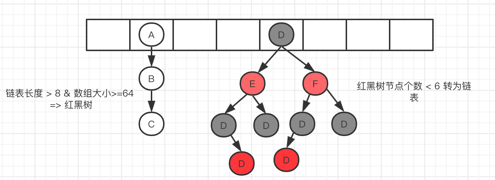
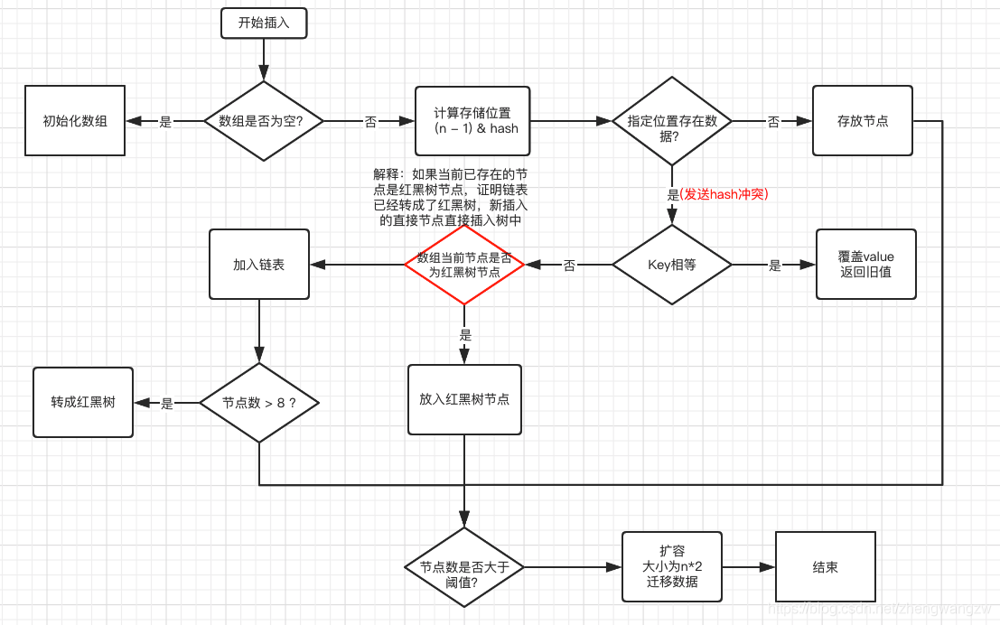

# Map

Map用于保存具有映射关系的数据，Map集合里保存着两组值，一组用于保存Map的key，另一组保存着Map的value。

key不可以重复，也没有顺序之分

Map中的常用方法：

```java
boolean containsKey(Object key):查询Map中是否包含指定的key值；
0000 an 0ontainsValue(Object value):查询Map中是否包含一个或多个value;
Set entrySet():返回map中包含的键值对所组成的Set集合，每个集合都是Map.Entry对象。
Object get():返回指定key对应的value，如果不包含key则返回null；
boolean isEmpty():查询该Map是否为空；
Set keySet():返回Map中所有key组成的集合；
Collection values():返回该Map里所有value组成的Collection。
Object put(Object key,Object value):添加一个键值对，如果集合中的key重复，则覆盖原来的键值对；
void putAll(Map m):将Map中的键值对复制到本Map中；
Object remove(Object key):删除指定的key对应的键值对，并返回被删除键值对的value，如果不存在，则返回null；
boolean remove(Object key,Object value):删除指定键值对，删除成功返回true；
int size():返回该Map里的键值对个数；

```

**Map和Set的关系**                                                                                                                                                                                                                                                                                                                                                                                                                                                                                                                                                                                                                                                                                                                                                                                                                                                                                                                                                                                                                                                                                                                                                                                                                                                                                                                                                                                                                                                                                                                                                                                                                                                                                                                                                                                                                                                                                                                                                                                                                                                                                                                                                                                                                                                                                                                                                                                                                                                                                                                            

可以说关系是很密切了，虽然Map中存放的是键值对，Set中存放的是单个对象，但如果把value看做key的附庸，key在哪里，value就在哪里，这样就可以像对待Set一样来对待Map了。事实上，Map提供了一个Entry内部类来封装key-value对，计算Entry存储时则只考虑Entry封装的key。

**内部类Entry**

Map中包括一个内部类Entry,该类封装一个键值对，常用方法：

Object getKey():返回该Entry里包含的key值；
Object getvalue():返回该Entry里包含的value值；
Object setValue(V value):设置该Entry里包含的value值，并设置新的value值。

**java8改进的HashMap和Hashtable**

Hashtable是线性安全的，HashMap是线性不安全的，所以HashMap效率更高。

Hashtable不允许使用null作为key和value，否则会引发异常，而HashMap可以

他们二者的关系完全类似于ArrayList和Vector的关系

# HashMap

```java
public class HashMap<K,V> extends AbstractMap<K,V>
    implements Map<K,V>, Cloneable, Serializable {}

public abstract class AbstractMap<K,V> implements Map<K,V> {}
```


```java

//默认的初始化容量为16，必须是2的n次幂
static final int DEFAULT_INITIAL_CAPACITY = 1 << 4; // aka 16

//最大容量为 2^30
static final int MAXIMUM_CAPACITY = 1 << 30;

//默认的加载因子0.75，乘以数组容量得到的值，用来表示元素个数达到多少时，需要扩容。
//为什么设置 0.75 这个值呢，简单来说就是时间和空间的权衡。
//若小于0.75如0.5，则数组长度达到一半大小就需要扩容，空间使用率大大降低，
//若大于0.75如0.8，则会增大hash冲突的概率，影响查询效率。
static final float DEFAULT_LOAD_FACTOR = 0.75f;

//刚才提到了当链表长度过长时，会有一个阈值，超过这个阈值8就会转化为红黑树
static final int TREEIFY_THRESHOLD = 8;

//当红黑树上的元素个数，减少到6个时，就退化为链表
static final int UNTREEIFY_THRESHOLD = 6;

//链表转化为红黑树，除了有阈值的限制，还有另外一个限制，需要数组容量至少达到64，才会树化。
//这是为了避免，数组扩容和树化阈值之间的冲突。
static final int MIN_TREEIFY_CAPACITY = 64;

//存放所有Node节点的数组
transient Node<K,V>[] table;

//存放所有的键值对
transient Set<Map.Entry<K,V>> entrySet;

//map中的实际键值对个数，即数组中元素个数
transient int size;

//每次结构改变时，都会自增，fail-fast机制，这是一种错误检测机制。
//当迭代集合的时候，如果结构发生改变，则会发生 fail-fast，抛出异常。
transient int modCount;

//数组扩容阈值
int threshold;

//加载因子
final float loadFactor;					

//普通单向链表节点类
static class Node<K,V> implements Map.Entry<K,V> {
	//key的hash值，put和get的时候都需要用到它来确定元素在数组中的位置
	final int hash;
	final K key;
	V value;
	//指向单链表的下一个节点
	Node<K,V> next;

	Node(int hash, K key, V value, Node<K,V> next) {
		this.hash = hash;
		this.key = key;
		this.value = value;
		this.next = next;
	}
}

//转化为红黑树的节点类
static final class TreeNode<K,V> extends LinkedHashMap.Entry<K,V> {
	//当前节点的父节点
	TreeNode<K,V> parent;  
	//左孩子节点
	TreeNode<K,V> left;
	//右孩子节点
	TreeNode<K,V> right;
	//指向前一个节点
	TreeNode<K,V> prev;    // needed to unlink next upon deletion
	//当前节点是红色或者黑色的标识
	boolean red;
	TreeNode(int hash, K key, V val, Node<K,V> next) {
		super(hash, key, val, next);
	}
}	

```


数据插入原理



1.判断数组是否为空，为空进行初始化;
2.不为空，计算 k 的 hash 值，通过(n - 1) & hash计算应当存放在数组中的下标 index;
查看 table[index] 是否存在数据，没有数据就构造一个Node节点存放在 table[index] 中；
3.存在数据，说明发生了hash冲突(存在二个节点key的hash值一样), 继续判断key是否4.相等，相等，用新的value替换原数据(onlyIfAbsent为false)；
5.如果不相等，判断当前节点类型是不是树型节点，如果是树型节点，创造树型节点插入红黑树中；(如果当前节点是树型节点证明当前已经是红黑树了)
6.如果不是树型节点，创建普通Node加入链表中；判断链表长度是否大于 8并且数组长度大于64， 大于的话链表转换为红黑树；
7.插入完成之后判断当前节点数是否大于阈值，如果大于开始扩容为原数组的二倍。
**补充**

```Java
int a = 5 << 6; //5*2^6   5*64

int b = 16 >> 2; //16/2 8/2
```

**HashMap的哈希函数设计**

hash函数是先拿到 key 的hashcode，是一个32位的int值，然后让hashcode的高16位和低16位进行异或操作。

```java
static final int hash(Object key) {
    int h;
    return (key == null) ? 0 : (h = key.hashCode()) ^ (h >>> 16);
}
```

这个也叫扰动函数，这么设计有二点原因：

1. 一定要尽可能降低hash碰撞，越分散越好；
2. 算法一定要尽可能高效，因为这是高频操作, 因此采用位运算；

# Set

set接口继承了Collection，Collection又继承了Iterable

Set集合类似于一个罐子，程序可以依次把多个对象“丢进”Set集合，而Set集合通常不能记住元素的添加顺序。实际上Set就是Collection只是行为略有不同(Set不允许包含重复元素)。
Set集合不允许包含相同的元素，如果试图把两个相同元素加入同一个Set集合中，则添加操作失败，add()方法返回false，且新元素不会被加入

# HashSet

HashSet同样不允许相同元素出现，且五无序

元素的哈希值是通过元素的hashcode方法 来获取的, HashSet首先判断两个元素的哈希值，如果哈希值一样，接着会比较equals方法 如果 equls结果为true ，HashSet就视为同一个元素。如果equals 为false就不是同一个元素。

```java
---| Itreable      接口 实现该接口可以使用增强for循环
				---| Collection		描述所有集合共性的接口
					---| List接口	    有序，可以重复，有角标的集合
                            ---| ArrayList   
                             ---|  LinkedList
					---| Set接口	    无序，不可以重复的集合
                            ---| HashSet  线程不安全，存取速度快。底层是以hash表实现的。
                            ---| TreeSet  红-黑树的数据结构，默认对元素进行自然排序（String）。如果在比较的时候两个对象返回值为0，那么元素重复。
```

# List

- 有序集合,用户可以精确控制列表中每个元素插入位置 用户可以通过整数索引访问元素,并搜索列表中的元素 与Set集合不同,列表通常允许重复的元素
- List集合特点
  1.有索引
  2.可以重复存储元素
  3.元素存储有序

```java
public interface List<E> extends Collection<E> 
```


```java
// LinkedList数据结构为链表
public class LinkedList<E>
    extends AbstractSequentialList<E>
    implements List<E>, Deque<E>, Cloneable, java.io.Serializable
```

```java
// ArrayList数据结构为数组
public class ArrayList<E> extends AbstractList<E>
        implements List<E>, RandomAccess, Cloneable, java.io.Serializable
```

 LinkedList和ArrayList

1. LinkedList和ArrayList的差别主要来自于Array和LinkedList数据结构的不同。ArrayList是基于数组实现的，LinkedList是基于双链表实现的。另外LinkedList类不仅是List接口的实现类，可以根据索引来随机访问集合中的元素，除此之外，LinkedList还实现了Deque接口，Deque接口是Queue接口的子接口，它代表一个双向队列，因此LinkedList可以作为双向队列 ，栈（可以参见Deque提供的接口方法）和List集合使用，功能强大。
2. 因为Array是基于索引(index)的数据结构，它使用索引在数组中搜索和读取数据是很快的，可以直接返回数组中index位置的元素，因此在随机访问集合元素上有较好的性能。Array获取数据的时间复杂度是O(1),但是要插入、删除数据却是开销很大的，因为这需要移动数组中插入位置之后的的所有元素。
3. 相对于ArrayList，LinkedList的随机访问集合元素时性能较差，因为需要在双向列表中找到要index的位置，再返回；但在插入，删除操作是更快的。因为LinkedList不像ArrayList一样，不需要改变数组的大小，也不需要在数组装满的时候要将所有的数据重新装入一个新的数组，这是ArrayList最坏的一种情况，时间复杂度是O(n)，而LinkedList中插入或删除的时间复杂度仅为O(1)。ArrayList在插入数据时还需要更新索引（除了插入数组的尾部）。
4. LinkedList需要更多的内存，因为ArrayList的每个索引的位置是实际的数据，而LinkedList中的每个节点中存储的是实际的数据和前后节点的位置。

# 红黑树

1.根节点必须为黑色，叶子节点是不存储数据的黑色空节点

2.任何相邻的两个节点不能同时为红色

3.任何节点到达叶节点所包含的黑色节点数相同

4.任意节点左右子树高度相差不大于1  

**虽然AVL树效率更高，但是红黑树的插入、删除、查找更稳定。红黑树的查找效率最大不会超过2log(n+1)**

增删操作会改变树的结构，所以通过变色和旋转维持结构

# 线性表

 **顺序表**

内部结构为数组

**链表**

内部是物理存储地址随机的，增删性能更好，只需要将元素的指针指向来实现顺序。

链表由数据和指针域组成。

# 栈

基于先进后出的数据结构

# **枚举**

通过常量来表示离散量所带来的问题

一个简单的枚举可以写为

```java 
package Enum;

enum Week{
    MON,
    TUE,
    WED,
    THU,
    FRI,
    SAT,
    SUN;

}
public class enumTest02 {
    public static void main(String[] args) {
        Week[] weeks =Week.values();
        for (Week we: weeks
             ) {
            System.out.println(we);
        }
    }
}
```

如果要为每个枚举值指定属性，则在枚举中必须声明一个参数为属性对应类型的构造方法（不能是public）。否则编译器将给出The constructor TypeEnum(int, String) is undefined的错误。

```java
package Enum;

enum Week{
    MON(8),
    TUE(6),
    WED(12),
    THU(6),
    FRI(3),
    SAT(9),
    SUN(10);
    int value;
    Week(int value){
        this.value=value;
    }

}
public class enumTest02 {
    public static void main(String[] args) {
        Week[] weeks =Week.values();
        for (Week we: weeks
             ) {
            System.out.println(we.value);
        }
    }
}

```

如果需要赋值多条，同样道理要在构造函数中添加定义的属性。

当枚举类中添加抽象方法时，每个实例要实现抽象方法

```java 
package Enum;

enum Season{
    SPRING {
        @Override
        public String tofo() {
            return "春天到了";
        }
    },SUMMER {
        @Override
        public String tofo() {
            return "夏天到了";
        }
    },AUTUMN {
        @Override
        public String tofo() {
            return "秋天到了";
        }
    },
    WINTER{
        public String tofo(){
            return "冬天来了";
        }
        };
    public abstract String tofo();
        }
public class enumTest {
    public static void main(String[] args) {
        String se=Season.AUTUMN.tofo();
        System.out.println(se);
    }
}

```

# 迭代器

```Java
Collection oc = new ArrayList();
        oc.add("456");
        oc.add("1254");
        oc.add("坏蛋的惩罚");
        oc.add("American");
        Iterator iterator = oc.iterator();
        while (iterator.hasNext()){
            System.out.println(iterator.next());
        }
```

迭代器中只要调用next()方法的时候集合对象的“指针”标识就后移一位，所以只做判断的时候用hasNext()方法。同时可以调用remove方法移除元素，但这里和集合对象直接调用是不一样的。


  