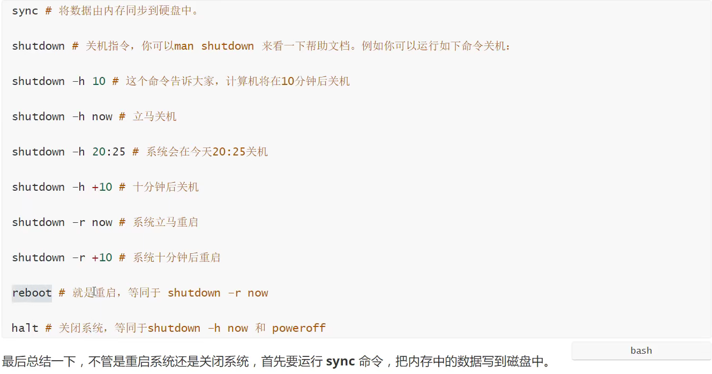
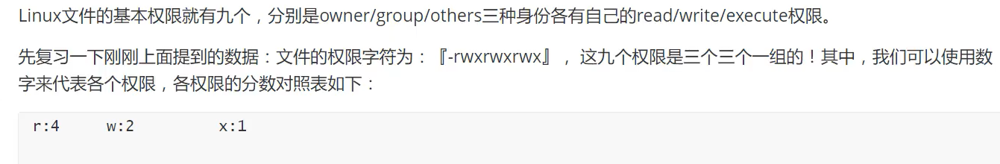

# 安装虚拟机VMware

## 在虚拟机上安装CentOS7

清华开源镜像：

https://mirrors.tuna.tsinghua.edu.cn/centos/7.9.2009/isos/x86_64/

下载下来后根据步骤https://blog.csdn.net/promsing/article/details/120208826?ops_request_misc=%257B%2522request%255Fid%2522%253A%2522164274657216780255252727%2522%252C%2522scm%2522%253A%252220140713.130102334..%2522%257D&request_id=164274657216780255252727&biz_id=0&utm_medium=distribute.pc_search_result.none-task-blog-2~all~top_positive~default-2-120208826.first_rank_v2_pc_rank_v29&utm_term=centos7%E5%AE%89%E8%A3%85%E6%95%99%E7%A8%8B&spm=1018.2226.3001.4187完成安装

ip addr 查看自己虚拟机的ip

虚拟机CentOS 7 Linxu01

密码：chb

chb用户密码也是：chb123456

# 命令



**ls /** 命令查看根目录下所有文件


## 常用基本命令

## 目录管理

```bash
ls #列出目录
cd .. #退一级目录
clear #清除窗口
#参数
-a #表示所有
-l #表示列表详情
-al #可以组合一起使用
cd ~ #回到当前的用户目录
pwd #查看当前目录
mkdir filename #创建一个文件jia
mkdir -p file01/file02/file03 #递归创建
rmdir filename #删除文件
rmdir -p file01/file02/file03 #递归删除
cp afile bfile/ #拷贝文件
-f 忽略不存在的文件，不会出现警告
-r 递归删除目录
-i 互动，删除询问是否删除
rm -rf / #系统中所有的文件就被删除了
-f 强制
-u 只替换已经更新过的文件
mv file01 file02 # 重命名文件夹
```

目录里面白色的表示文件，蓝色的表示文件夹

查看文件详情

ls -ll


## 基本属性

修改文件属性

1.chgrp:更改文件属组

chgrp -R root www


2.chown:更改文件属主，也可以同时更改文件属组

chown -R www www

3.chmod:更改文件9个属性

chmod -R xyz 文件或者目录




## 查看文件


# 环境安装

安装软件的三种方式：rpm（jdk）	解压安装（tomcat）	yum在线安装（docker）

## JDK安装


