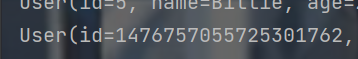
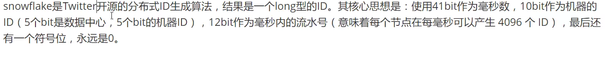
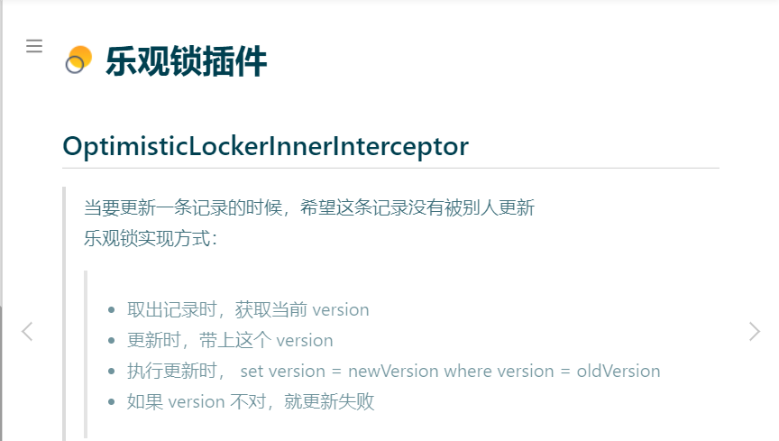

# 概述

官网地址https://baomidou.com/

```xml
<dependency>
    <groupId>com.baomidou</groupId>
    <artifactId>mybatis-plus</artifactId>
    <version>3.4.3.4</version>
</dependency>
```

[MyBatis-Plus (opens new window)](https://github.com/baomidou/mybatis-plus)（简称 MP）是一个 [MyBatis (opens new window)](https://www.mybatis.org/mybatis-3/)的增强工具，在 MyBatis 的基础上只做增强不做改变，为简化开发、提高效率而生。

## 特性

- **无侵入**：只做增强不做改变，引入它不会对现有工程产生影响，如丝般顺滑
- **损耗小**：启动即会自动注入基本 CURD，性能基本无损耗，直接面向对象操作
- **强大的 CRUD 操作**：内置通用 Mapper、通用 Service，仅仅通过少量配置即可实现单表大部分 CRUD 操作，更有强大的条件构造器，满足各类使用需求
- **支持 Lambda 形式调用**：通过 Lambda 表达式，方便的编写各类查询条件，无需再担心字段写错
- **支持主键自动生成**：支持多达 4 种主键策略（内含分布式唯一 ID 生成器 - Sequence），可自由配置，完美解决主键问题
- **支持 ActiveRecord 模式**：支持 ActiveRecord 形式调用，实体类只需继承 Model 类即可进行强大的 CRUD 操作
- **支持自定义全局通用操作**：支持全局通用方法注入（ Write once, use anywhere ）
- **内置代码生成器**：采用代码或者 Maven 插件可快速生成 Mapper 、 Model 、 Service 、 Controller 层代码，支持模板引擎，更有超多自定义配置等您来使用
- **内置分页插件**：基于 MyBatis 物理分页，开发者无需关心具体操作，配置好插件之后，写分页等同于普通 List 查询
- **分页插件支持多种数据库**：支持 MySQL、MariaDB、Oracle、DB2、H2、HSQL、SQLite、Postgre、SQLServer 等多种数据库
- **内置性能分析插件**：可输出 SQL 语句以及其执行时间，建议开发测试时启用该功能，能快速揪出慢查询
- **内置全局拦截插件**：提供全表 delete 、 update 操作智能分析阻断，也可自定义拦截规则，预防误操作

# 快速入门

##  初始化工程

创建一个空的 Spring Boot 工程

提示

可以使用 [Spring Initializer (opens new window)](https://start.spring.io/)快速初始化一个 Spring Boot 工程

## [#](https://baomidou.com/pages/226c21/#添加依赖)添加依赖

引入 Spring Boot Starter 父工程：

```xml
<parent>
    <groupId>org.springframework.boot</groupId>
    <artifactId>spring-boot-starter-parent</artifactId>
    <version>2.6.2</version>
    <relativePath/>
</parent>
```

引入 `spring-boot-starter`、`spring-boot-starter-test`、`mybatis-plus-boot-starter`、依赖：

```xml
<dependencies>
    <dependency>
        <groupId>org.springframework.boot</groupId>
        <artifactId>spring-boot-starter</artifactId>
    </dependency>
    <dependency>
        <groupId>org.springframework.boot</groupId>
        <artifactId>spring-boot-starter-test</artifactId>
        <scope>test</scope>
    </dependency>
    <dependency>
        <groupId>com.baomidou</groupId>
        <artifactId>mybatis-plus-boot-starter</artifactId>
        <version>3.4.3.4</version>
    </dependency>
</dependencies>
```


## [#](https://baomidou.com/pages/226c21/#配置)配置

在 Spring Boot 启动类中添加 `@MapperScan` 注解，扫描 Mapper 文件夹：

```java
@SpringBootApplication
@MapperScan("com..mapper")
public class Application {

    public static void main(String[] args) {
        SpringApplication.run(Application.class, args);
    }

}
```

## [#](https://baomidou.com/pages/226c21/#编码)编码

编写实体类 `User.java`（此处使用了 [Lombok (opens new window)](https://www.projectlombok.org/)简化代码）

```java
@Data
public class User {
    private Long id;
    private String name;
    private Integer age;
    private String email;
}
```

编写 Mapper 类 `UserMapper.javahttps://baomidou.com/pages/226c21/#开始使用)开始使用

添加测试类，进行功能测试：

```java
@SpringBootTest
public class SampleTest {

    @Autowired
    private UserMapper userMapper;

    @Test
    public void testSelect() {
        System.out.println(("----- selectAll method test ------"));
        List<User> userList = userMapper.selectList(null);
        Assert.assertEquals(5, userList.size());
        userList.forEach(System.out::println);
    }

}
```

提示

UserMapper 中的 `selectList()` 方法的参数为 MP 内置的条件封装器 `Wrapper`，所以不填写就是无任何条件

## 导入依赖

```xml
<!--        数据库驱动-->
<dependency>
            <groupId>mysql</groupId>
            <artifactId>mysql-connector-java</artifactId>
</dependency>
<dependency>
        <groupId>com.baomidou</groupId>
        <artifactId>mybatis-plus-boot-starter</artifactId>
        <version>3.4.3.4</version>
</dependency>
<dependency>
        <groupId>com.h2database</groupId>
        <artifactId>h2</artifactId>
        <scope>runtime</scope>
</dependency>
```

不要同时导入mybatis和mybatisplus，否则可能会出很多错误

## 数据库配置

时区设置

东八区

！有报错

```properties
serverTimezone=GMT%2B8
```

```properties
spring.datasource.username=root
spring.datasource.password=221700
spring.datasource.driver-class-name=com.mysql.cj.jdbc.Driver
spring.datasource.url=jdbc:mysql://localhost:3306/cmybatis?useUnicode=true&characterEncoding=utf8&useSSL=false&nullCatalogMeansCurrent=true&serverTimezone=Asia/Shanghai

```

# 开始

**mapper**

```java
package com.chb.mybatisplusgo.mapper;

import com.baomidou.mybatisplus.core.mapper.BaseMapper;
import com.chb.mybatisplusgo.pojo.User;
import org.apache.ibatis.annotations.Mapper;

/**
 * Created by Mr.Prefect on 2021/12/31
 * Author : 陈和斌
 * ClassName : UserMapper
 * Date : 2021/12/31
 * Time : 10:15
 * Note :
 */
// 在对应的mapper上面继承基本的类BaseMapper
@Mapper
public interface UserMapper extends BaseMapper<User> {
    // 所有的CRUD已经内包

}

```

extends BaseMapper<User>需要去继承基本的类BaseMapper,<T>泛型传递的值表示要处理的对象。

@Mapper注解来标注mapper，或者在启动主类上添加mapper包扫描注解

**properties**

```properties
spring.datasource.username=root
spring.datasource.password=221700
spring.datasource.driver-class-name=com.mysql.cj.jdbc.Driver
spring.datasource.url=jdbc:mysql://localhost:3306/cmybatisplus?useUnicode=true&characterEncoding=utf8&useSSL=false&nullCatalogMeansCurrent=true&serverTimezone=Asia/Shanghai
```

# 配置日志

希望sql是怎么执行的

首先是配置文件配置mybatisplus默认的，log4j需要导入依赖

```properties
mybatis-plus.configuration.log-impl=org.apache.ibatis.logging.stdout.StdOutImpl
```

# CRUD扩展

主键自增



虽然插入的时候没有设置id，但是自动填充，这是所谓的**主键生成策略**

雪花算法



实体类

```java

@Data
@AllArgsConstructor
@NoArgsConstructor
public class User {
    @TableId(type = IdType.ASSIGN_ID)
    Long id;
    String name;
    Integer age;
    String email;

}

```

@TableId(type = IdType.ASSIGN_ID)默认主键id是雪花算法生成id

**不同的主键策略**

```java
public enum IdType {
    AUTO(0), // 数据库id自增
    NONE(1), // 未设置主键
    INPUT(2), // 手动输入
    ASSIGN_ID(3), //默认全局唯一id
    ASSIGN_UUID(4); //全局唯一id

    private final int key;

    private IdType(int key) {
        this.key = key;
    }

    public int getKey() {
        return this.key;
    }
}

```

## 插入

```java
 @Test
    void insertNew(){
        User user = new User();
        user.setAge(28);
        user.setEmail("2417423080@qq.com");
        user.setName("mrPrefect");
        userMapper.insert(user);
    }
```

## 更新

```java
@Test
    void updateTest(){
        User user = new User();
        user.setName("kitten");
        user.setId(3l);
        // 根据id查到的user去更新设置
        userMapper.updateById(user);
        System.out.println(user);
    }
```

## 自动填充

创建时间、修改时间

**方式一：数据库**

!不推荐

在表中新增字段create_time,update_time

**sql:**alter table user add update_time datetime default current_timestamp;

**方式二：代码实现**

工作中都是使用代码实现

实体类的字段上添加注解实现

```java
@Data
@AllArgsConstructor
@NoArgsConstructor
public class User {
    @TableId(type = IdType.AUTO)
    Long id;
    String name;
    Integer age;
    String email;
    // 字段添加填充内容
    @TableField(fill = FieldFill.INSERT)
    LocalDateTime createTime;
    @TableField(fill = FieldFill.INSERT_UPDATE)
    LocalDateTime updateTime;


}
```

创建一个handler类去继承主类**MetaObjectHandler**

来自官网的最新讲解https://baomidou.com/pages/4c6bcf/

```java 
package com.chb.mybatisplusgo.handler;

import com.baomidou.mybatisplus.core.handlers.MetaObjectHandler;
import lombok.extern.slf4j.Slf4j;
import org.apache.ibatis.reflection.MetaObject;
import org.springframework.stereotype.Component;

import java.time.LocalDateTime;

/**
 * Created by Mr.Prefect on 2021/12/31
 * Author : 陈和斌
 * ClassName : MyPlusHandler
 * Date : 2021/12/31
 * Time : 14:43
 * Note :
 */
@Slf4j
@Component
public class MyPlusHandler implements MetaObjectHandler {
    //插入时候的填充策略
    @Override
    public void insertFill(MetaObject metaObject) {
        log.info("start insert fill ....");
        this.strictInsertFill(metaObject,"createTime", LocalDateTime.class,LocalDateTime.now());
        this.strictInsertFill(metaObject,"updateTime",() -> LocalDateTime.now(),LocalDateTime.class);
    }

    // 更新时候的填充策略
    @Override
    public void updateFill(MetaObject metaObject) {
        this.strictUpdateFill(metaObject,"updateTime",() -> LocalDateTime.now(),LocalDateTime.class);

    }
}

```

要注意字段，实体类，handler里面对应的数据类型

@TableField注解表示和数据库对应的字段

# 乐观锁

总是认为不会出现问题，无论干什么都不去上锁，如果出了问题。再次更新测试值

**悲观锁**：顾名思义就是很悲观，它总是认为会出现问题，无论干什么都会上锁。再去操作

乐观锁：https://baomidou.com/pages/0d93c0/



配置插件

```java
@Bean
public MybatisPlusInterceptor mybatisPlusInterceptor() {
    MybatisPlusInterceptor interceptor = new MybatisPlusInterceptor();
    interceptor.addInnerInterceptor(new OptimisticLockerInnerInterceptor());
    return interceptor;
}
```


spring boot注解方式配置

```java 
//测试类
//乐观锁-成功
    @Test
    void lockTest(){
        User user = userMapper.selectById(2l);
        user.setEmail("598899@qq.com");
        user.setName("chenehbin");
        userMapper.updateById(user);
    }
    // 乐观锁失败
    @Test
    void lockTeat02(){
        User user = userMapper.selectById(3l);
        user.setName("哈哈大王");
        user.setEmail("000@163.com");
        User user1 = userMapper.selectById(3l);
        user1.setName("嗝屁大王");
        user1.setEmail("222@123.com");
        // 在没有乐观锁的情况下，user1会覆盖user
        userMapper.updateById(user);
        userMapper.updateById(user1);

    }


// 实体类 字段上添加@Version

@Version
Integer version;


// 配置类


package com.chb.mybatisplusgo.config;

/**
 * Created by Mr.Prefect on 2022/1/4
 * Author : 陈和斌
 * ClassName : mybatisPlusConfig
 * Date : 2022/1/4
 * Time : 11:18
 * Note :
 */
@MapperScan("com.chb.mybatisplusgo.mapper")
@Configuration
@EnableTransactionManagement //事务注解
public class mybatisPlusConfig {
    // 注册乐观锁插件
    @Bean
    public MybatisPlusInterceptor mybatisPlusInterceptor() {
        MybatisPlusInterceptor mybatisPlusInterceptor = new MybatisPlusInterceptor();
        mybatisPlusInterceptor.addInnerInterceptor(new OptimisticLockerInnerInterceptor());
        return mybatisPlusInterceptor;
    }
}


```

# 查询

```java 
@Test
    void selectUser(){
        // 批量查询 包含1，2，3，
        List<User> users = userMapper.selectBatchIds(Arrays.asList(1, 2, 3));
        users.forEach(System.out::println);
        // map查询
        HashMap<String, Object> map = new HashMap<>();
        map.put("name", "Jone");
        List<User> users1 = userMapper.selectByMap(map);
        users1.forEach(System.out::println);
    }

```

**分页查询**

配置插件

```java
// 最新版
    @Bean
    public MybatisPlusInterceptor mybatisPlusInterceptor() {
        MybatisPlusInterceptor interceptor = new MybatisPlusInterceptor();
        interceptor.addInnerInterceptor(new PaginationInnerInterceptor(DbType.H2));
        return interceptor;
    }
```

测试类

```java
 // 分页查询
    @Test
    void pageSelect(){
        // 参数一，当前页
        // 参数二，页面大小
        Page<User> objectPage = new Page<>(3,3);
        userMapper.selectPage(objectPage,null);
        // records 为查询到的页面记录
        List<User> records = objectPage.getRecords();
        records.forEach(System.out::println);
//        System.out.println("records"+records);
//        System.out.println(objectPage.getTotal());

    }
```

# 删除

```JAVA
    @Test
    void delectTest(){
        User user = new User();
        // 根据id删除
        userMapper.deleteById(1476818367339814916l);
        // 批量删除
        userMapper.deleteBatchIds(Arrays.asList(1,2,3));
        // map删除
        Map<String, Object> obj = new HashMap<>();
        obj.put("name","xiaoming");
        userMapper.deleteByMap(obj);
    }

```

**逻辑删除**

类似于回收站，管理员可以查看删除记录

1.数据库表中加deleted字段

2.实体类中增加属性

3.添加注解@TableLogic在属性上

```java
@TableLogic
Integer deleted;
```

4.配置文件添加配置

```yaml
mybatis-plus:
  global-config:
    db-config:
      logic-delete-field: flag # 全局逻辑删除的实体字段名(since 3.3.0,配置后可以忽略不配置步骤2)
      logic-delete-value: 1 # 逻辑已删除值(默认为 1)
      logic-not-delete-value: 0 # 逻辑未删除值(默认为 0)

```

虽然是删除，但是逻辑删除的本质是update。当被逻辑删除后是查询不到的。

# wrapper条件构造器

https://baomidou.com/pages/10c804/

```JAVA
/**
 * Created by Mr.Prefect on 2022/1/5
 * Author : 陈和斌
 * ClassName : wrapperTest
 * Date : 2022/1/5
 * Time : 10:13
 * Note :
 */
@SpringBootTest
public class wrapperTest {
    @Autowired
    UserMapper userMapper;

    @Test
    void test1(){
        QueryWrapper<User> wrapper = new QueryWrapper<>();
        // wrapper是一个对象
//        System.out.println("===wrapper==="+wrapper);
        wrapper.eq("name", "陈和斌");
//        System.out.println("-------:"+wrapper.eq("name", "陈和斌"));
        User user = userMapper.selectOne(wrapper);
        System.out.println(user);
    }
    @Test
    void test2(){
        HashMap<String, Object> objectObjectHashMap = new HashMap<>();
        objectObjectHashMap.put("name","陈和斌");
        QueryWrapper<User> queryWrapper = new QueryWrapper<>();
        queryWrapper.allEq(true,objectObjectHashMap,false);
        List<User> users = userMapper.selectList(queryWrapper);
        users.forEach(System.out::println);
    }
    @Test
    void test3(){
        QueryWrapper<User> wrapper = new QueryWrapper<>();
        wrapper.ge("id","22").isNotNull("version");
        userMapper.selectCount(wrapper);
        userMapper.selectList(wrapper).forEach(System.out::println);

    }
    @Test
    void test4(){
        QueryWrapper<User> wrapper = new QueryWrapper<>();
        wrapper.orderByDesc("id");
        userMapper.selectObjs(wrapper).forEach(System.out::println);
    }
}

```

# 代码自动生成器

首先要导入一些必须的依赖包

```xml
<!--配置ApiModel在实体类中不生效-->
        <dependency>
            <groupId>com.spring4all</groupId>
            <artifactId>spring-boot-starter-swagger</artifactId>
            <version>1.5.1.RELEASE</version>
        </dependency>

<dependency>
    <groupId>com.baomidou</groupId>
    <artifactId>mybatis-plus-generator</artifactId>
    <version>3.5.1</version>
</dependency>

<dependency>
            <groupId>org.springframework.boot</groupId>
            <artifactId>spring-boot-starter-freemarker</artifactId>
        </dependency>

```

编写一个主类去生成文件

```java
package com.chb.mybatispluspro;

import com.baomidou.mybatisplus.core.mapper.BaseMapper;
import com.baomidou.mybatisplus.generator.FastAutoGenerator;
import com.baomidou.mybatisplus.generator.config.OutputFile;
import com.baomidou.mybatisplus.generator.engine.FreemarkerTemplateEngine;

import java.util.Collections;

/**
 * Created by Mr.Prefect on 2022/1/5
 * Author : 陈和斌
 * ClassName : mybatisAutoCode
 * Date : 2022/1/5
 * Time : 11:20
 * Note :
 */
public class mybatisAutoCode {
    public static void main(String[] args) {
        FastAutoGenerator.create("jdbc:mysql://localhost:3306/cmybatisplus?useUnicode=true&characterEncoding=utf8&useSSL=false&nullCatalogMeansCurrent=true&serverTimezone=Asia/Shanghai", "root", "221700")
                .globalConfig(builder -> {
                    builder.author("陈和斌") // 设置作者
                            .enableSwagger() // 开启 swagger 模式
                            .fileOverride() // 覆盖已生成文件
                            .commentDate("yyyy-MM-dd")
                            .disableOpenDir()
                            .outputDir("H:\\objectProgram\\mybatisplusPro\\src\\main\\java"); // 指定输出目录
                })
                .packageConfig(builder -> {
                    builder.parent("com.chb.mybatispluspro") // 设置父包名
                            .moduleName("system") // 设置父包模块名
                            .entity("entity")
                            .service("service")
                            .serviceImpl("serviceImpl")
                            .controller("controller")
                            .mapper("mapper")
                            .xml("mapper")
                            .pathInfo(Collections.singletonMap(OutputFile.mapperXml, "H:\\objectProgram\\mybatisplusPro\\src\\main\\resources\\mapper")); // 设置mapperXml生成路径
                })
                .strategyConfig(builder -> {
                    builder.addInclude("student") // 设置需要生成的表名
                            .addTablePrefix("t_", "c_") // 设置过滤表前缀
                            .serviceBuilder()
                            .formatServiceFileName("%sService")
                            .formatServiceImplFileName("%sServiceImpl")
                            .entityBuilder()
                            .enableLombok()
                            .logicDeleteColumnName("deleted")
                            .enableTableFieldAnnotation()
                            .controllerBuilder()
                            .formatFileName("%sController")
                            .enableRestStyle()
                            .mapperBuilder()
                            .superClass(BaseMapper.class)
                            .formatMapperFileName("%sMapper")
                            .enableMapperAnnotation()
                            .formatXmlFileName("%sMapper");

                })
                .templateEngine(new FreemarkerTemplateEngine()) // 使用Freemarker引擎模板，默认的是Velocity引擎模板
                .execute();
    }
}

```

参考博客

```java
package com.xp.practice.generator;

import com.baomidou.mybatisplus.core.mapper.BaseMapper;
import com.baomidou.mybatisplus.generator.FastAutoGenerator;
import com.baomidou.mybatisplus.generator.config.OutputFile;
import com.baomidou.mybatisplus.generator.engine.FreemarkerTemplateEngine;

import java.util.ArrayList;
import java.util.Collections;
import java.util.List;

public class UserGenerator {
    public static void main(String[] args) {
        List<String> tables = new ArrayList<>();
        tables.add("p_user");
        tables.add("p_question");
        tables.add("p_answer");
        tables.add("p_correct");

        FastAutoGenerator.create("jdbc:mysql://localhost:3306/xpa","root","111111")
                .globalConfig(builder -> {
                    builder.author("向培")               //作者
                            .outputDir(System.getProperty("user.dir")+"\\src\\main\\java")    //输出路径(写到java目录)
                            .enableSwagger()           //开启swagger
                            .commentDate("yyyy-MM-dd")
                            .fileOverride();            //开启覆盖之前生成的文件

                })
                .packageConfig(builder -> {
                    builder.parent("com.xp")
                            .moduleName("practice")
                            .entity("entity")
                            .service("service")
                            .serviceImpl("serviceImpl")
                            .controller("controller")
                            .mapper("mapper")
                            .xml("mapper")
                            .pathInfo(Collections.singletonMap(OutputFile.mapperXml,System.getProperty("user.dir")+"\\src\\main\\resources\\mapper"));
                })
                .strategyConfig(builder -> {
                    builder.addInclude(tables)
                            .addTablePrefix("p_")
                            .serviceBuilder()
                            .formatServiceFileName("%sService")
                            .formatServiceImplFileName("%sServiceImpl")
                            .entityBuilder()
                            .enableLombok()
                            .logicDeleteColumnName("deleted")
                            .enableTableFieldAnnotation()
                            .controllerBuilder()
                            .formatFileName("%sController")
                            .enableRestStyle()
                            .mapperBuilder()
                            .superClass(BaseMapper.class)
                            .formatMapperFileName("%sMapper")
                            .enableMapperAnnotation()
                            .formatXmlFileName("%sMapper");
                })
                .templateEngine(new FreemarkerTemplateEngine()) // 使用Freemarker引擎模板，默认的是Velocity引擎模板
                .execute();
    }
}


```

```java
// 简便的路径fang'a

package com.chb.mybatispluspro;

import com.baomidou.mybatisplus.core.mapper.BaseMapper;
import com.baomidou.mybatisplus.generator.FastAutoGenerator;
import com.baomidou.mybatisplus.generator.config.OutputFile;
import com.baomidou.mybatisplus.generator.engine.FreemarkerTemplateEngine;

import java.util.Collections;

/**
 * Created by Mr.Prefect on 2022/1/5
 * Author : 陈和斌
 * ClassName : mybatisAutoCode
 * Date : 2022/1/5
 * Time : 11:20
 * Note :
 */
public class mybatisAutoCode {
    public static void main(String[] args) {
        FastAutoGenerator.create("jdbc:mysql://localhost:3306/cmybatisplus?useUnicode=true&characterEncoding=utf8&useSSL=false&nullCatalogMeansCurrent=true&serverTimezone=Asia/Shanghai", "root", "221700")
                .globalConfig(builder -> {
                    builder.author("陈和斌") // 设置作者
                            .enableSwagger() // 开启 swagger 模式
                            .fileOverride() // 覆盖已生成文件
                            .commentDate("yyyy-MM-dd")
                            .disableOpenDir()
                            .outputDir(System.getProperty("user.dir")+"\\src\\main\\java"); // 指定输出目录
                })
                .packageConfig(builder -> {
                    builder.parent("com.chb.mybatispluspro") // 设置父包名
                            .moduleName("system") // 设置父包模块名
                            .entity("entity")
                            .service("service")
                            .serviceImpl("serviceImpl")
                            .controller("controller")
                            .mapper("mapper")
                            .xml("mapper")
                            .pathInfo(Collections.singletonMap(OutputFile.mapperXml,System.getProperty("user.dir")+"\\src\\main\\resources\\mapper")); // 设置mapperXml生成路径
                })
                .strategyConfig(builder -> {
                    builder.addInclude("student") // 设置需要生成的表名
                            .addTablePrefix("t_", "c_") // 设置过滤表前缀
                            .serviceBuilder()
                            .formatServiceFileName("%sService")
                            .formatServiceImplFileName("%sServiceImpl")
                            .entityBuilder()
                            .enableLombok()
                            .logicDeleteColumnName("deleted")
                            .enableTableFieldAnnotation()
                            .controllerBuilder()
                            .formatFileName("%sController")
                            .enableRestStyle()
                            .mapperBuilder()
                            .superClass(BaseMapper.class)
                            .formatMapperFileName("%sMapper")
                            .enableMapperAnnotation()
                            .formatXmlFileName("%sMapper");

                })
                .templateEngine(new FreemarkerTemplateEngine()) // 使用Freemarker引擎模板，默认的是Velocity引擎模板
                .execute();


    }
}

```

