# NoSQL数据库简介

随着web2.0的快速发展，非关系型、分布式数据存储得到了快速的发展，它们不保证关系数据的ACID特性（原子性、一致性、隔离性、持久性，一个支持事务的数据库，必需要具有这四种特性，否则在事务过程当中无法保证数据的正确性）。NoSQL概念在2009年被提了出来。NoSQL最常见的解释是“non-relational”，“Not Only SQL”也被很多人接受（“NoSQL”一词最早于1998年被用于一个轻量级的关系数据库的名字）。NoSQL被我们用得最多的当数key-value存储，当然还有其他的文档型的、列存储、图型数据库、xml数据库等。
**适用场景**

1.对数据高并发的读写

2.海量数据的读写

3.对数据高可扩展性的

# 安装

https://redis.io/

# Window版安装：

https://github.com/MicrosoftArchive/redis/releases

直接解压到目录文件下即可

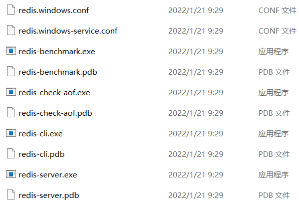

benchamark.exe是检查性能

redis-cli.exe 是客户端

redis-server.exe是启动服务

# Redis开始

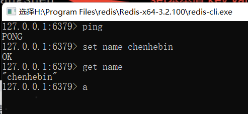

ping测试连接，返回pong表示连接成功

# Linux下的Redis

下载，安装在opt目录下，具体步骤略

后台运行

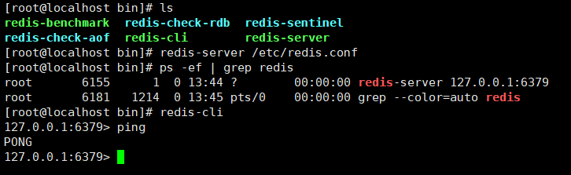

redis关闭

shutdown -->exit

或者kill命令杀死进程

# 介绍

默认16个数据库，初始默认0号数据库

使用select x 来切换数组库

redis 单线程+多路IO复用

# 常用五大数据类型

**键Redis**

keys * 查看当前库所有key

exists k 判断k是否存在

type k 查看k是什么类型

del key 删除指定的k数据

unlink k 根据v选择非阻塞删除，真正的删除操作在后续的异步操作，仅是从keyspace元数据中删除

expire key 10 设置k过期时间

ttl k 查看过期时间，返回值-1表示永远不过期，-2表示已经过期

dbsize 查看k的数量 

flushdb 清空当前库

flushall 清空所有库

## 字符串String

String是Redis最基本的类型，

set添加键值对，再次添加会覆盖

append k v 在末尾追加值，返回的是v的长度

strlen k 获得值的长度

setnx k v 只有在k不存在时，设置k的值

incr k  将k中存储的数字值增1，只能对数字值操作，如果为空，新增为1

decr k   将k中存储的数字值减1

incr decr / k L自定义补偿L

mset k1 v1 k2 v2 同时设置多个值

mget k1 k2 k3 同时取多个值

getrange k<起始位置> <结束位置>

setrange k <起始位置> v

setex k outtime v 设置过期时间同时设值

getset k v 设置新值获得旧值

## 列表List

底层就是一个双向链表

lpush / rpush  从左边/右边插入一个或者多个值

lpop/rpop k 从左边/右边吐出一个值。值在键在，值光键亡

lrange k start stop 按照索引下标获得元素

rpoplpush k1 k2 列表右边吐出一个值，插入到列表k2左边

lindex k1 index 按照索引下标获取值

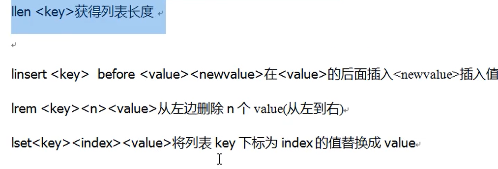

## Set集合

不重复，无序，底层是hash表

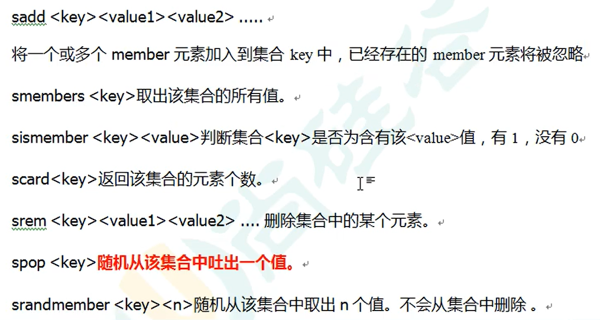

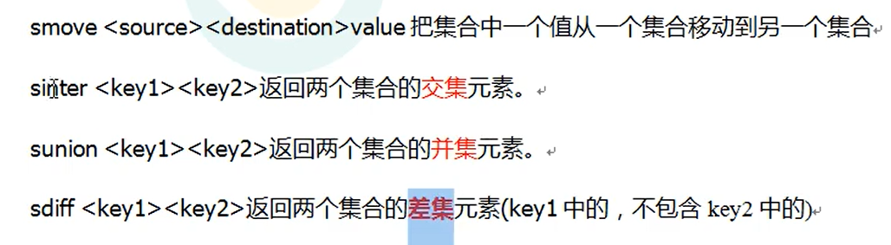

内部实现使用的是hashMap

## Hash哈希

键值对集合

Redis hash 是一个string类型的field和value的映射表，hash特别适合用于存储对象。类似java里面的Map<String,Object>

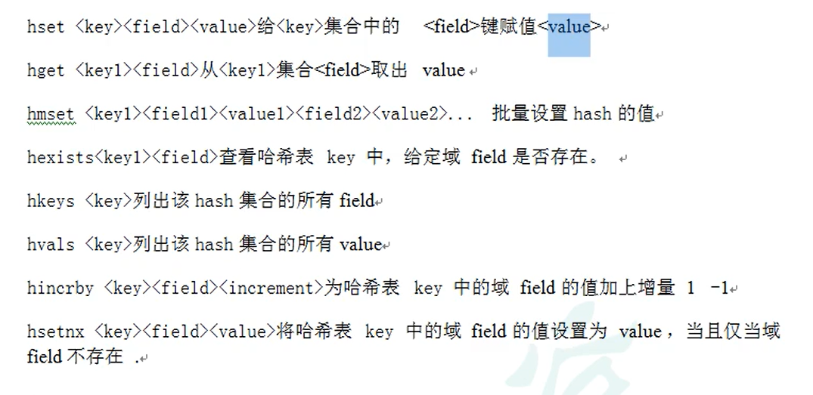

hmset过期，hset可实现同样功能

## 有序集合Zset

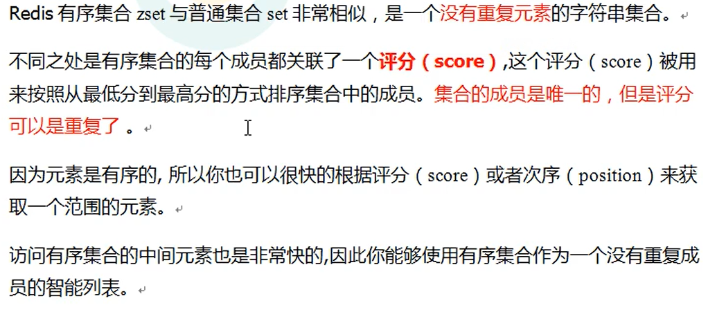

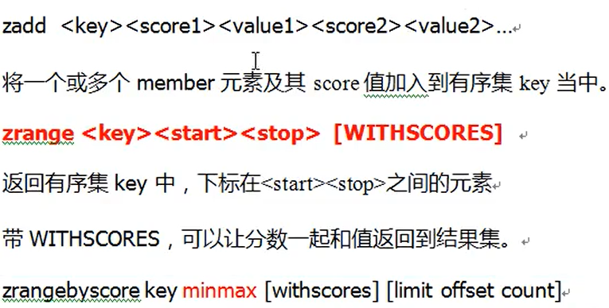

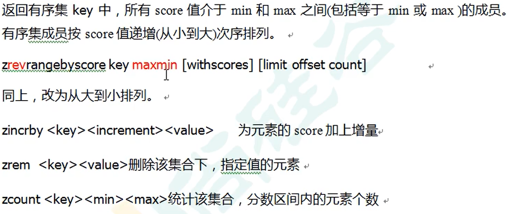

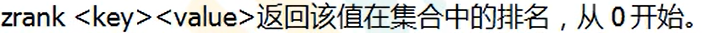数据结构

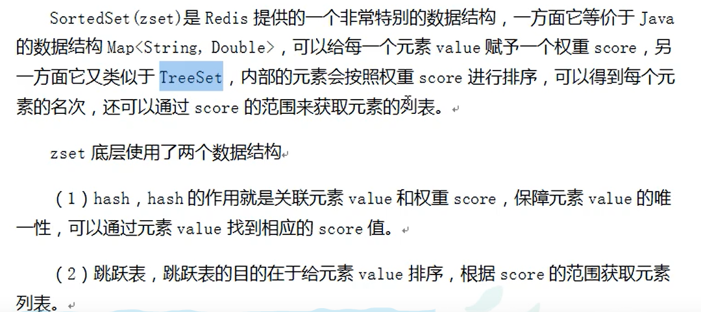

# 发布和订阅

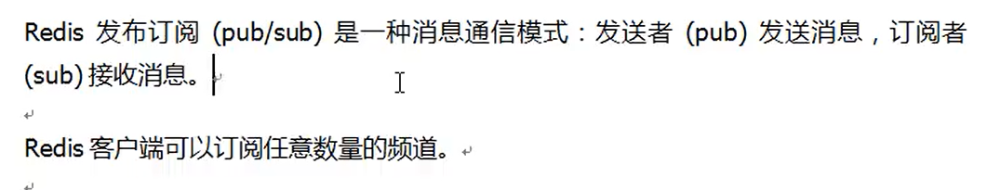

订阅频道channel1

subscribe channel1

在另一个redis客户端发布channel1消息

publish channel1 hello

# 新数据类型Bitmaps

位操作的字符串

setbit key 偏移量 value   ==》 设置Bitmaps中某个偏移量的值（0或者1）

getbit key 偏移量  ==》 获取值

bitcount key [start  end] ==》统计数量

bitop and  dest  key01 key02 ==》 意思是 BITOP 是命令 AND 并运算 dest 并运算的结果存储在dest里面，key1 key2 就是redis缓存key

# 新数据类型HyperLogLog

统计基数数量（去重）

pfadd key element ==>如果新增的已经存在，则返回0，表示失败

pfcount key ==>统计基数总量（去重）

pfmerge desk k1 k2 ==>合并，并且放入新desk key中

# 新数据类型Geospatial

添加地理位置（经度，纬度，名称）

geoadd key 经度 纬度 value

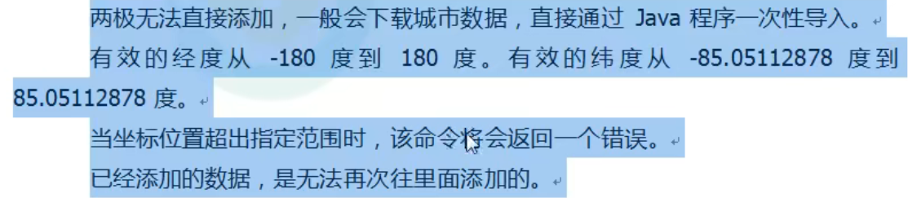

geopos key value m/km/im

根据value城市获取经纬度

geodist key member01 member02 km

在同key下根据value城市获取两个地点的直线距离

# Jedis操作

## 模拟验证码效验

```java
package JedisTest;

import org.testng.annotations.Test;
import redis.clients.jedis.Jedis;

import java.util.Random;

/**
 * Created by Mr.Prefect on 2022/1/28
 * Author : 陈和斌
 * ClassName : JedisDemo01
 * Date : 2022/1/28
 * Time : 11:04
 * Note :
 */
public class JedisDemo01 {
    public static void main(String[] args) {
//        Jedis jedis = new Jedis("172.16.113.137",6379);
//        System.out.println(jedis.ping());
    }
    @Test
    void test01() {
//        setOneDay("18483627710");

        toTrueCode("18483627710", String.valueOf(681388));


    }

    // 生成6位随机验证码
    public static String getCode(){
            Random random = new Random();
            String code = "";
            for (int i=0;i<6;i++){
                int num = random.nextInt(9);
                code = num +code;
            }
            return code;
    }

    //一个手机一天只能发送三次验证码
    public static void setOneDay(String phone ){
        Jedis jedis = new Jedis("172.16.113.137", 6379);

        String countKey = "countKey"+phone;
        String codeKey = "codeKey"+phone;

        String cout = jedis.get(countKey);
        if (cout == null){
            jedis.setex(countKey,24*3600, String.valueOf(1));
        }else if(Integer.parseInt(cout) <=2){
            jedis.incr(countKey);
        }else {
            System.out.println("验证码发送次数已达上限");
        }

        String code = getCode();
        //验证码放进redis
        jedis.setex(codeKey,120, code);
        jedis.close();
    }

    // 效验验证码
    public static void toTrueCode(String phone,String code){
        Jedis jedis = new Jedis("172.16.113.137", 6379);

        String codeKey = "codeKey"+phone;

        String codes = jedis.get(codeKey);
        if (codes == null){
            System.out.println("验证码超时");
        }else if (codes.equals(code)){
            System.out.println("验证通过");

        }else{
            System.out.println("验证失败");
        }
        jedis.close();

    }

}
```

# SpringBoot整合Redis

导入maven依赖

```xml
<!-- https://mvnrepository.com/artifact/org.springframework.boot/spring-boot-starter-data-redis -->
<!-- redis -->
<dependency>
    <groupId>org.springframework.boot</groupId>
    <artifactId>spring-boot-starter-data-redis</artifactId>
    <version>2.6.3</version>
</dependency>

```

配置文件配置

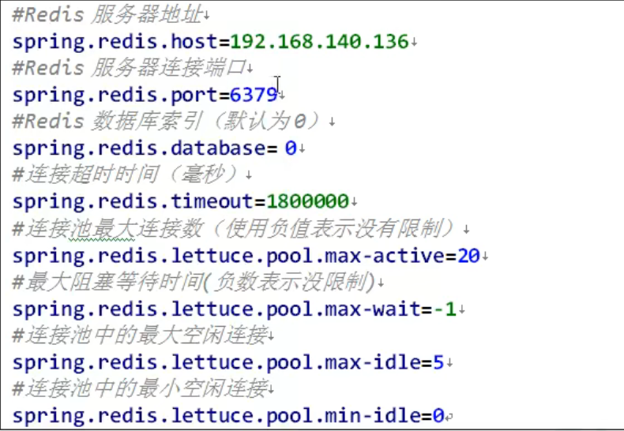

编写配置类

```java
/**
 * Created by Mr.Prefect on 2022/2/10
 * Author : 陈和斌
 * ClassName : RedisConfig
 * Date : 2022/2/10
 * Time : 16:12
 * Note :
 */
@EnableCaching
@Configuration
public class RedisConfig extends CachingConfigurerSupport {

    @Bean
    public RedisTemplate<String,Object> redisTemplate(RedisConnectionFactory factory){
        RedisTemplate<String, Object> template = new RedisTemplate<>();
        RedisSerializer<String> redisSerializer = new StringRedisSerializer();
        Jackson2JsonRedisSerializer jackson2JsonRedisSerializer = new Jackson2JsonRedisSerializer(Object.class);
        ObjectMapper objectMapper = new ObjectMapper();
        objectMapper.setVisibility(PropertyAccessor.ALL, JsonAutoDetect.Visibility.ANY);
        jackson2JsonRedisSerializer.setObjectMapper(objectMapper);
        template.setConnectionFactory(factory);
        // key序列化方式
        template.setKeySerializer(redisSerializer);
        // value序列化
        template.setValueSerializer(jackson2JsonRedisSerializer);
        //value hashmap序列化
        template.setHashValueSerializer(jackson2JsonRedisSerializer);
        return template;
    }

    public CacheManager cacheManager(RedisConnectionFactory factory){
        RedisSerializer<String> redisSerializer = new StringRedisSerializer();
        Jackson2JsonRedisSerializer jackson2JsonRedisSerializer = new Jackson2JsonRedisSerializer(Object.class);
        // 解决查询缓存转换异常的问题
        ObjectMapper objectMapper = new ObjectMapper();
        objectMapper.setVisibility(PropertyAccessor.ALL, JsonAutoDetect.Visibility.ANY);
        jackson2JsonRedisSerializer.setObjectMapper(objectMapper);
        // 配置序列化(解决乱码问题)，过期时间600s
        RedisCacheConfiguration config = RedisCacheConfiguration.defaultCacheConfig().entryTtl(Duration.ofSeconds(600))
                .serializeKeysWith(RedisSerializationContext.SerializationPair.fromSerializer(redisSerializer))
                .serializeKeysWith(RedisSerializationContext.SerializationPair.fromSerializer(jackson2JsonRedisSerializer))
                .disableCachingNullValues();
        RedisCacheManager builder = RedisCacheManager.builder(factory)
                .cacheDefaults(config)
                .build();
        return builder;
    }
}
```

controller控制操作实现

```java
/**
 * Created by Mr.Prefect on 2022/2/10
 * Author : 陈和斌
 * ClassName : redisController
 * Date : 2022/2/10
 * Time : 16:58
 * Note :
 */
@RestController
@RequestMapping("/redis")
public class redisController {
    @Autowired
    private RedisTemplate redisTemplate;

    @GetMapping("test01")
    public String testRedis(){
        redisTemplate.opsForValue().set("chb","yyds");

        Object key = redisTemplate.opsForValue().get("chb");
        return (String) key;
    }
}
```

# Redis事务

redis事务是一个单独的隔离操作：事务中的所有命令都会序列化，按顺序地执行。事务在执行的过程中，不会被其他客户端发送来的命令请求所打断。

Redis事务的主要作用就是串联多个命令防止别的命令插队

Multi , Exec , discard

Multi 组队阶段，如果有一个命令失败，则执行失败。组队成功，执行失败时，只无效执行错误的命令

Exec 执行阶段

discard 取消组队

# 锁

## 悲观锁

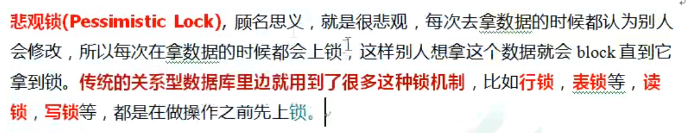


## 乐观锁


**WATCH key [key ...]**

Watch 命令是Exec命令的执行条件；也就是说，如果Watch的Key没有被修改则Redis执行事务，否则（Watch的key被其他事务修改了）事务不会被执行。
Watch 命令可以被调用多次，一个Watch 命令可以监控多个key。Watch 命令调用即启动监控功能，从Watch 命令开始点到执行EXEC命令终止。一旦EXEC被调用，所有的键都将不被监视，无论所讨论的事务是否被中止。关闭客户端连接也会触发所有的键被取消监视。

Redis Watch 命令给事务提供check-and-set (CAS) 机制。被Watch的Key被持续监控，如果key在Exec命令执行前有改变，那么整个事务被取消，Exec返回null表示事务没有成功


unwatch 取消watch命令对所有key的监视

# Redis事务三特性

**单独的隔离操作**

事务中的所有命令都会序列化，按顺序地执行。事务在执行的过程中，不会被其他客户端发送来的命令请求所打断

**没有隔离级别的概念**

队列中的命令没有提交之前都不会实际被执行，因为事务提交前任何指令都不会被实际执行

**不保证原子性**

事务中如果有一条命令执行失败，其后的命令仍然会被执行，没有回滚

# 持久化操作RDB

什么叫RDB

在指定的时间间隔内将内存中的数据集快照写入磁盘，也就是行话讲的Snapshot快照，它恢复时是将快照文件直接读到内存中

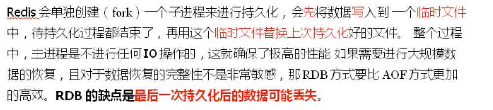

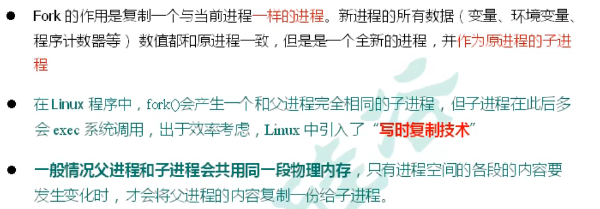

# 持久化操作AOF


AOF默认是不开启的，


如果RDB和AOF同时开启，默认选取AOF

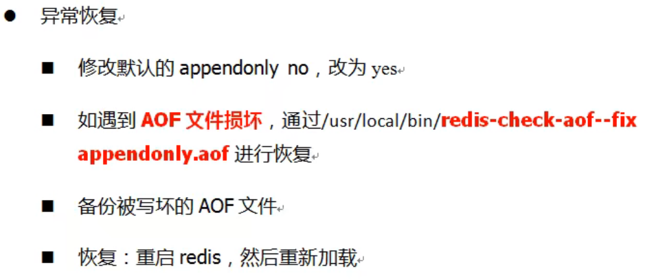

AOP同步频率设置

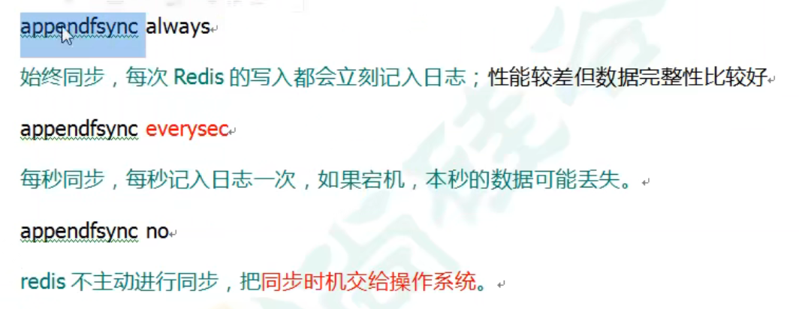