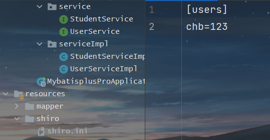

 https://shiro.apache.org/

# 认证

**shiro中认证的关键对象**

Subject：主体

访问系统的用户，主体可以是用户、程序等，进行认证的都称为主体

Principal：身份信息

是主体进行身份认证的标识，标识必须具有统一性，如用户名、手机号，邮箱地址等，一个主体可以有多个身份，但是必须有一个主身份。

credential：凭证信息

是只有主体自己


# shiro开始

依赖

```xml
<!-- https://mvnrepository.com/artifact/org.apache.shiro/shiro-core -->
<dependency>
    <groupId>org.apache.shiro</groupId>
    <artifactId>shiro-core</artifactId>
    <version>1.8.0</version>
</dependency>

```

shiro配置文件

.ini结尾文件



编写测试类

```java
package com.chb.mybatispluspro;

import org.apache.shiro.SecurityUtils;
import org.apache.shiro.authc.UsernamePasswordToken;
import org.apache.shiro.mgt.DefaultSecurityManager;
import org.apache.shiro.realm.text.IniRealm;
import org.apache.shiro.subject.Subject;

import javax.naming.InitialContext;

/**
 * Created by Mr.Prefect on 2022/3/4
 * Author : 陈和斌
 * ClassName : DemoShiro
 * Date : 2022/3/4
 * Time : 9:45
 * Note :
 */
public class DemoShiro {
    public static void main(String[] args) {
        // 创建安全管理器
        DefaultSecurityManager manager = new DefaultSecurityManager();
        // 安全管理器设置realm
        manager.setRealm(new IniRealm("classpath:shiro\\shiro.ini"));
        //给全局安全工具类设置安全管理器
        SecurityUtils.setSecurityManager(manager);
        //关键对象 subject主体
        Subject subject = SecurityUtils.getSubject();
        //创建令牌
        UsernamePasswordToken token = new UsernamePasswordToken("chb", "123");
        //认证
        System.out.println(subject.isAuthenticated());
        subject.login(token);
        System.out.println(subject.isAuthenticated());
    }
}
```

# 自定义realm

测试

```Java
@Test
void test(){
    // 创建安全管理器
    DefaultSecurityManager manager = new DefaultSecurityManager();
    // 安全管理器设置realm
    manager.setRealm(new customerRealm());
    //给全局安全工具类设置安全管理器
    SecurityUtils.setSecurityManager(manager);
    //关键对象 subject主体
    Subject subject = SecurityUtils.getSubject();
    //创建令牌
    UsernamePasswordToken token = new UsernamePasswordToken("chb", "123");
    //认证
    System.out.println(subject.isAuthenticated());

    subject.login(token);
    System.out.println(subject.isAuthenticated());

}
```

自定义realm类

```Java
package com.chb.mybatispluspro;

import org.apache.shiro.authc.AuthenticationException;
import org.apache.shiro.authc.AuthenticationInfo;
import org.apache.shiro.authc.AuthenticationToken;
import org.apache.shiro.authc.SimpleAuthenticationInfo;
import org.apache.shiro.authz.AuthorizationInfo;
import org.apache.shiro.realm.AuthorizingRealm;
import org.apache.shiro.subject.PrincipalCollection;

/**
 * Created by Mr.Prefect on 2022/3/4
 * Author : 陈和斌
 * ClassName : customerRealm
 * Date : 2022/3/4
 * Time : 10:23
 * Note : 自定义realm实现 将认证/授权数据的来源转为数据库的实现
 */
public class customerRealm extends AuthorizingRealm {
    //授权
    @Override
    protected AuthorizationInfo doGetAuthorizationInfo(PrincipalCollection principalCollection) {
        return null;
    }
    //认证
    @Override
    protected AuthenticationInfo doGetAuthenticationInfo(AuthenticationToken authenticationToken) throws AuthenticationException {
       // 获取token中的用户名
        String principal = (String) authenticationToken.getPrincipal();
        //数据库查询
        if("chb".equals(principal)){
            return new SimpleAuthenticationInfo("chb","123",this.getName());
        }
        return null;
    }
}
```

# MD5+salt

```java
void md5(){
    // 默认散列一次，等于简单的MD5加密
    Md5Hash hash = new Md5Hash("221700");
    System.out.println(hash.toHex());
    // md5 + salt
    Md5Hash hash1 = new Md5Hash("221700", "CY^cpwJ2");
    System.out.println(hash1);
    //md5+salt+hash
    Md5Hash hash2 = new Md5Hash("221700", "CY^cpwJ2", 1024);
    System.out.println(hash2);
}
```

# shiro实现MD5+salt

```java
package com.chb.mybatispluspro.shiroTest;

import org.apache.shiro.authc.AuthenticationException;
import org.apache.shiro.authc.AuthenticationInfo;
import org.apache.shiro.authc.AuthenticationToken;
import org.apache.shiro.authc.SimpleAuthenticationInfo;
import org.apache.shiro.authz.AuthorizationInfo;
import org.apache.shiro.realm.AuthorizingRealm;
import org.apache.shiro.subject.PrincipalCollection;
import org.apache.shiro.util.ByteSource;

/**
 * Created by Mr.Prefect on 2022/3/4
 * Author : 陈和斌
 * ClassName : CPWRealm
 * Date : 2022/3/4
 * Time : 14:03
 * Note :
 */
public class CPWRealm extends AuthorizingRealm {
    @Override
    protected AuthorizationInfo doGetAuthorizationInfo(PrincipalCollection principalCollection) {
        return null;
    }

    @Override
    protected AuthenticationInfo doGetAuthenticationInfo(AuthenticationToken authenticationToken) throws AuthenticationException {
        String principal = (String) authenticationToken.getPrincipal();
        if ("chb".equals(principal)){
            return new SimpleAuthenticationInfo(principal,
                    "08235d5a8a7ea12f4b0d482b0b4a66d8",
                    ByteSource.Util.bytes("CY^cpwJ2"),
                    this.getName());
        }
        return null;
    }
}

```

```java
package com.chb.mybatispluspro.shiroTest;

import com.chb.mybatispluspro.customerRealm;
import org.apache.shiro.SecurityUtils;
import org.apache.shiro.authc.UsernamePasswordToken;
import org.apache.shiro.authc.credential.HashedCredentialsMatcher;
import org.apache.shiro.mgt.DefaultSecurityManager;
import org.apache.shiro.subject.Subject;

/**
 * Created by Mr.Prefect on 2022/3/4
 * Author : 陈和斌
 * ClassName : ShiroTest
 * Date : 2022/3/4
 * Time : 14:03
 * Note :
 */
public class ShiroTest {
    public static void main(String[] args) {
        // 创建安全管理器
        DefaultSecurityManager manager = new DefaultSecurityManager();
        // 安全管理器设置realm
        CPWRealm realm = new CPWRealm();
        HashedCredentialsMatcher credentialsMatcher = new HashedCredentialsMatcher();
        // 使用算法
        credentialsMatcher.setHashAlgorithmName("md5");
        // 散列次数
        credentialsMatcher.setHashIterations(1024);
        realm.setCredentialsMatcher(credentialsMatcher);
        manager.setRealm(realm);
        //给全局安全工具类设置安全管理器
        SecurityUtils.setSecurityManager(manager);
        //关键对象 subject主体
        Subject subject = SecurityUtils.getSubject();
        //创建令牌
        UsernamePasswordToken token = new UsernamePasswordToken("chb", "221700");
        //认证
        System.out.println(subject.isAuthenticated());

        subject.login(token);
        System.out.println(subject.isAuthenticated());

    }
}
```

# 授权


```Java 
// 授权
@Override
protected AuthorizationInfo doGetAuthorizationInfo(PrincipalCollection principalCollection) {
    String primaryPrincipal = (String) principalCollection.getPrimaryPrincipal();
    System.out.println(primaryPrincipal);
    //根据身份信息，用户名 获取当前用户的角色信息，以及权限信息
    SimpleAuthorizationInfo info = new SimpleAuthorizationInfo();
   // 将数据库中查询角色信息赋值给权限对象
    info.addRole("admin");
    return info;
}


//验证授权
        if (subject.isAuthenticated()) {
            System.out.println(subject.hasRole("admin"));
        }
```

# SpringBoot整合shiro

依赖

```xml
<dependency>
    <groupId>org.apache.shiro</groupId>
    <artifactId>shiro-spring-boot-starter</artifactId>
    <version>1.8.0</version>
</dependency>
```

配置类

```java
package com.chb.mybatispluspro.system.config;

import com.chb.mybatispluspro.system.config.Shiro.CustomerRealm;
import org.apache.shiro.realm.Realm;
import org.apache.shiro.spring.web.ShiroFilterFactoryBean;
import org.apache.shiro.web.mgt.DefaultWebSecurityManager;
import org.springframework.context.annotation.Bean;
import org.springframework.context.annotation.Configuration;

import java.util.HashMap;

/**
 * Created by Mr.Prefect on 2022/3/7
 * Author : 陈和斌
 * ClassName : ShiroConfig
 * Date : 2022/3/7
 * Time : 9:38
 * Note :
 */
@Configuration
public class ShiroConfig {

    //1.创建shiroFilter - 负责拦截所有请求
    @Bean
    public ShiroFilterFactoryBean getShiroFilterFactoryBean(DefaultWebSecurityManager defaultWebSecurityManager){
        ShiroFilterFactoryBean factoryBean = new ShiroFilterFactoryBean();
        //给filter设置安全管理器
        factoryBean.setSecurityManager(defaultWebSecurityManager);
        //配置资源权限
        HashMap<String, String> map = new HashMap<>();
        map.put("/index.jsp","authc"); //authc 请求这个资源需要认证和授权
        factoryBean.setFilterChainDefinitionMap(map);
        //默认认证界面路径
        factoryBean.setLoginUrl("/user/login");
        return factoryBean;
    }
    //2.创建安全管理器
    @Bean
    public DefaultWebSecurityManager getDefaultWebSecurityManager(Realm realm){
        DefaultWebSecurityManager manager = new DefaultWebSecurityManager();
        //给安全管理器设置realm
        manager.setRealm(realm);
        return manager;
    }
    //3.创建自定义realm
    @Bean
    public Realm getRealm(){
        return new CustomerRealm();
    }
}
```

自定义一个realm

# 常见过滤器


# 退出

```Java
//退出登录
@GetMapping("logout")
public String logout(){
    Subject subject = SecurityUtils.getSubject();
    subject.logout();
    return "/login";
}
```

# shiro缓存

