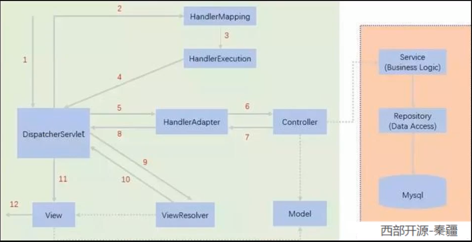

 


#    补充Spring MVC执行原理




# 1.SpringBoot开始

*maven导入web启动器依赖

```xml
<!--需要哪个模块就导入那个依赖-->
<dependency>
    <groupId>org.springframework.boot</groupId>
    <artifactId>spring-boot-starter-web</artifactId>
</dependency>
```

*启动类

```java
/**
 *主程序-引导程序
 * @SpringBootApplication 这是一个springboot应用
 */
@SpringBootApplication
public class Springboot001Application {

    public static void main(String[] args) {
        SpringApplication.run(Springboot001Application.class, args);
    }

}
```

*写一个controller

```java
@ResponseBody
@Controller
public class HelloController {

    @RequestMapping("/hello")
    public String handle01(){
        return "hello";
    }
}
```

@ResponseBody 直接返回方法中的字符串，多用于测试

@Controller 注释这是一个controller控制类

@ResponseBody + @Controller = @RestController

@RequestMapping("/hello") 注释地址映射，当浏览器访问地址xxx/hello时响应

*application.properties文件配置

https://docs.spring.io/spring-boot/docs/current/reference/html/application-properties.html#application-properties.server

```properties
# 设置端口号
server.port=8888
```

*springboot 打包插件

```xml
<build>
    <plugins>
        <plugin>
            <groupId>org.springframework.boot</groupId>
            <artifactId>spring-boot-maven-plugin</artifactId>
        </plugin>
    </plugins>
</build>
```

有了插件可以进行对项目打包，生成JAR包直接运行

生成的JAR包在项目的target目录下

---   	使用命令提示符进行运行

首先cmd进入JAR包所在目录target

**H:\objectProgram\springboot-hello\target>**

使用命令

**java -jar springboot-hello-0.0.1-SNAPSHOT.jar**

# 2.springboot特点

*依赖管理

​	父类继承依赖管理

```xml
-- 版本控制-
<parent>
    <groupId>org.springframework.boot</groupId>
    <artifactId>spring-boot-starter-parent</artifactId>
    <version>2.5.2</version>
    <relativePath/> <!-- lookup parent from repository -->
</parent>
```

​		开发导入starter场景启动器


查看整个项目封装的启动器结构

*自动配置

自动配置Tomcat

​	引入依赖，分装的启动器

自动配置springmvc

自动扫面主程序同级目录或子目录下的所有包

​	如果要修改，则在主程序的注解加

```Java
@SpringBootApplication(scanBasePackages = "com")
```

主程序里包含了所需的所有组件

```java
@SpringBootApplication(scanBasePackages = "com")
-- 等于
@SpringBootConfiguration
@EnableAutoConfiguration
@ComponentScan(scanBasePackages = "com")
```

# 3.@Configuration

在一个类上标注@Configuration注解时，告诉spring boot这是一个配置类

而且config这个类（代理对象）也是属于组件

```Java
//proxy 代理
@Configuration(proxyBeanMethods = true)
//配置模式
//Full(proxyBeanMethods = true) 全配置
//Lite(proxyBeanMethods = false) 轻量级配置
```

spring boot2默认proxyBeanMethods = true，无论对配置类中的这个组件注册方法调用多少次获取的都是之前注册容器中的单实例。通常用于组件依赖。

proxyBeanMethods = false时,对配置类中的方法（组件）不会去检查，直接去调用，每次都是新的实例对象

 ---   @Bean

```java
@Configuration //告诉spring boot这是一个配置类
public class myConfig {
    @Bean //添加组件到容器中，方法名为组件id，方法类型为组件类型，返回的值为组件的实例,默认是单例模式
    public User user01(){
        return new User();
    }
}
```

--- @Import

```java
@Import({User.class, DBAppender.class})
//给容器中自动创建出这两个类型的组件
//默认组件的名字是全类名
```

# 4.@Conditional

条件装配

​	满足conditional指定的条件时，则进行组件注入

例：

```java
@ConditionalOnBean(name = "chb")
@Bean
public User user01(){
    return new User();
}
```

@ConditionalOnBean(name = "chb")上述如果有名为chb的Bean注入在容器中时，user01注入Bean才会生效。

@ConditionalOnClass(name = "chb")
@ConditionalOnMissingBean(name = "chb")同理

# 5.@ImportResource

```java
@ImportResource("classpath:ApplicationContext.xml")
```

导入配置文件并解析，该注解使用在随意一个配置类上即可

# 6.配置绑定

@ConfigurationProperties

```java
@Component
@ConfigurationProperties(prefix = "myCar")
public class User {
    private Long id;
    private String name;
    private Integer age;

}
```

实体类绑定配置文件里前缀为myCar的值，包括yaml文件和properties文件

但要注意的是@Component必须对其注入，因为只有在容器中的组件才会拥有spring boot提供的强大功能

或者

在配置类上使用@EnableConfigurationProperties(需绑定的实体类.class)

```java
@EnableConfigurationProperties(User.class)
//1.开启car属性配置绑定功能
//2.把这个User组件自动注入到容器
```

一般推荐后者

# 7.@SpringBootApplication

主程序上的注解，他是一个组合注解

@SpringBootConfiguration

----底层是@Configuration，就是一个配置类上的注解

@EnableAutoConfiguration

----也是合成注解

```Java
@AutoConfigurationPackage
@Import({AutoConfigurationImportSelector.class})
```

​		@AutoConfigurationPackage

```java
// 自动配置包，指定了默认的包规则
@Import({Registrar.class})
public @interface AutoConfigurationPackage {}
```

​		@Import({AutoConfigurationImportSelector.class})

```java
1、利用getAutoConfigurationEntry(annotationMetadata);给容器中批量导入一些组件 
2、调用List<String> configurations = getCandidateConfigurations(annotationMetadata, attributes)获取到所有需要导入到容器中的配置类
3、利用工厂加载 Map<String, List<String>> loadSpringFactories(@Nullable ClassLoader classLoader)；得到所有的组件 
4、从META-INF/spring.factories位置来加载一个文件。 默认扫描我们当前系统里面所有META-INF/spring.factories位置的文件    spring-boot-autoconfigure-2.3.4.RELEASE.jar包里面也有META-INF/spring.factories    
```

@ComponentScan

----声名这是一个包扫描注解

# 8.yaml

基本语法

- key: value；kv之间有空格
- 大小写敏感

- 使用缩进表示层级关系
- 缩进不允许使用tab，只允许空格

- 缩进的空格数不重要，只要相同层级的元素左对齐即可
- '#'表示注释

- 字符串无需加引号，如果要加，''与""表示字符串内容 会被 转义/不转义

绑定配置类提示

​		导入依赖

```xml
<dependency>
    <groupId>org.springframework.boot</groupId>
    <artifactId>spring-boot-configuration-processor</artifactId>
    <optional>true</optional>
</dependency>
```

在pom.xml配置中，打包插件加上过滤

```xml
<exclude>                            <groupId>org.springframework.boot</groupId>                            <artifactId>spring-boot-configuration-processor</artifactId>                        </exclude>
```

意思是生成Jar包的时候不要把我加进去

# 9.web开发

Spring Boot 提供来自类路径中名为`/static`（或`/public`或`/resources`或`/META-INF/resources`）的目录或从`ServletContext`. 它使用`ResourceHttpRequestHandler`来自 Spring MVC 的，以便您可以通过添加自己`WebMvcConfigurer`的`addResourceHandlers`方法并覆盖该方法来修改该行为。

当访问http://localhost:8080/ + 静态资源时，首先判断Controller映射，如果为否才去静态资源路径下

为了方便后期请求的过滤，设置静态资源路径

默认的静态资源路径为spring.mvc.static-path-pattern=/**

重新设置

spring.mvc.static-path-pattern=/resources/**

也可以自己设置静态资源的作用域，不过目前已经过时

spring.resources.static-locations

**默认首页**

第一种

​	在静态资源路径下找index.html，默认将它设置为首页

第二种

​	如果在第一种为找到的情况之下，在controller中找index映射，设为首页

**页面地址栏图标**

​	在静态资源路径下放入favicon.ico图标，自动识别

**注意**

index.xml和favicon.ico会因为spring.mvc.static-path-pattern=/resources/**前缀失效

# 10.Rest映射请求处理

```html
<form action="/hello-p.html" method="post">
    <input name="_method" type="hidden" value="PUT">
    <input value="Rest-put " type="submit">
</form>
```

在前端使用<input name="_method" type="hidden" value="PUT">隐藏域声名告知，是put请求，但是必须表单的提交方式是post,默认是get请求。在配置文件里开启映射-如下。

```yaml
spring:
	mvc:
    hiddenmethod:
      filter:
        enabled: true
```

# 11.参数注解

@PathVariable

这个注解是通过获取url地址映射中值的方式获取参数值

```java
@RequestMapping("/byStudentId/{id}")
    public Student queryStudentID(@PathVariable Integer id){
        Student stu = studentService.studentId(id);
        return stu;
    }
```

例如上例@RequestMapping("/byStudentId/{id}")实现映射时，地址中有一个id,通过@PathVariable注解可以将地址中的id值获取实现参数id的赋值。

@RequestParam

这个注解是通过url请求参数获取的形式赋值，比如通过地址来传值http://localhost:8080/hello?age=8&name=chb

```java
@RequestParam("age") Integer age
```

@CookieValue

```java
@CookieValue Cookie cookie
```

同理获取请求的Cookie

@RequestAttribute

```java
@RequestAttribute("msg") String msg
```

获取请求域中的值，或者HttpServletRequest

```Java
   @RequestMapping("/byStudent")
    public Student queryStudentID(HttpServletRequest re，@PathVariable Integer id){
        Student stu = studentService.studentId(id);
        re.setAttribute("asd","a");
        return stu;
    }
```

@MatrixVariable   矩阵变量

如果cookie被禁用，则可以使用矩阵变量传递sessionid获得session.

地址栏的格式	http://localhost:8080/hello;low=34;brand=byd,auid,yd

不过spring默认是关闭这个功能的，需要开启

# 12.Thymeleaf

高并发不推荐使用

**语法**

| 表达式名字 | 语法   | 用途                               |
| ---------- | ------ | ---------------------------------- |
| 变量取值   | ${...} | 获取请求域、session域、对象等值    |
| 选择变量   | *{...} | 获取上下文对象值                   |
| 消息       | #{...} | 获取国际化等值                     |
| 链接       | @{...} | 生成链接                           |
| 片段表达式 | ~{...} | jsp:include 作用，引入公共页面片段 |

同样也需要引入Maven依赖

而且在前端页面中引入它，这样就有提示了

```html
<!DOCTYPE html>
<html lang="en" xmlns:th="http://www.thymeleaf.org">
<head>
    <meta charset="UTF-8">
    <title>Title</title>
</head>
<body>

</body>
</html>
```

*要想实现这种模块化的功能，controller中参数必须要有Model类型的设定

*一般默认的静态资源存放在templates下

# 13.复杂参数

**Map**、**Model（map、model里面的数据会被放在request的请求域  request.setAttribute）、**Errors/BindingResult、**RedirectAttributes（ 重定向携带数据）**、**ServletResponse（response）**、SessionStatus、UriComponentsBuilder、ServletUriComponentsBuilder

```Java
Map<String,Object> map,  Model model, HttpServletRequest request 都是可以给request域中放数据， request.getAttribute();
```

**Map、Model类型的参数**，会返回 mavContainer.getModel（）；---> BindingAwareModelMap 是Model 也是Map

**mavContainer**.getModel(); 获取到值的BindingAwareModelMap，它既是model也是map，在request域中，model和map封装的是同一个对象。

一步一步的传递值，在渲染的时候封装

# 14.自定义对象参数

- **ServletModelAttributeMethodProcessor**封装

  参数处理原理

  - HandlerMapping中找到能处理请求的Handler（Controller.method()）
  - 为当前Handler 找一个适配器 HandlerAdapter； **RequestMappingHandlerAdapter**

  - 适配器执行目标方法并确定方法参数的每一个值

# 15.拦截器

第一步

编写一个类实现HandlerInterceptor接口，

```java
public class LoginInterceptor implements HandlerInterceptor {
    //目标执行方法处理之前
    @Override
    public boolean preHandle(HttpServletRequest request, HttpServletResponse response, Object handler) throws Exception {
        System.out.println("拦截器被访问");
        //登录检查
        HttpSession session = request.getSession();
        Object loginCp = session.getAttribute("LoginCp");
        if (loginCp != null){
            return true; //放行
        }
//        session.setAttribute("msg","请先登录");
        request.setAttribute("msg","请先登录");
//        response.sendRedirect("/");
        request.getRequestDispatcher("/").forward(request,response);

        return false;//拦截
    }

    //目标执行方法处理之后
    @Override
    public void postHandle(HttpServletRequest request, HttpServletResponse response, Object handler, ModelAndView modelAndView) throws Exception {

    }

    @Override
    public void afterCompletion(HttpServletRequest request, HttpServletResponse response, Object handler, Exception ex) throws Exception {

    }
}
```

**HandlerInterceptor有三个实现方法**

1.public boolean preHandle

目标方法执行前

2.public void postHandle

目标方法执行后

3.public void afterCompletion

视图渲染之后

第二步

拦截器注册到容器中，实现WebMvcConfigurer接口

```java
@Configuration
public class InterceptorConfig implements WebMvcConfigurer {
    @Override
    public void addInterceptors(InterceptorRegistry registry) {
        registry.addInterceptor(new LoginInterceptor()) //绑定LoginInterceptor拦截器
                .addPathPatterns("/**")// 添加拦截的请求路径 ---包含静态资源
                .excludePathPatterns("/","/login");//排除拦截路径
    }
}
```

# 16.文件上传和下载

配置yaml

```yaml
spring:
  servlet:
    multipart:
      max-file-size: 10MB   #单独文件上传的大小限制
      max-request-size: 100MB
```

前端页面

```HTML
<form th:action="@{/upload}" method="post" enctype="multipart/form-data">

    <label>选择要上传的文件</label>
    <input type="file" name="multipartFile"><br>
    <label>选择要上传的多个文件</label>
    <input type="file" name="multipartFiles" multiple><br>
    <button type="submit">提交</button>
</form>
```

文件提交类型必须在form表单添加method="post" enctype="multipart/form-data"

input添加multiple属性表示多文件上传

**controller**

```Java
@RequestMapping("/upload")
public String upload(@RequestPart MultipartFile multipartFile,
                     @RequestPart MultipartFile[] multipartFiles) throws IOException {

    // 单文件
    if (multipartFile.isEmpty()){
        //保存到文件服务器
        String originalFilename = multipartFile.getOriginalFilename();
        multipartFile.transferTo(new File("D:\\objectImg\\"+originalFilename));
    }
    //多文件
    if (multipartFiles.length >0){
        for (MultipartFile photo: multipartFiles
             ) {
            if (!photo.isEmpty()){
                String originalFilename = photo.getOriginalFilename();
                photo.transferTo(new File("D:\\objectImg\\"+originalFilename));
                
            }
        }
    }
    return "myhome";
}
```

# 17.异常处理

返回两种数据类型，如果是浏览器则返回默认的error页面，如果是机器客户端，它将生成JSON响应

自定义异常处理页面，自动识别默认路径


在error文件下创建5xx.html文件和404.html文件会被自动识别

# 18.数据访问

首先导入依赖

mysql驱动

```xml
		<dependency>
            <groupId>mysql</groupId>
            <artifactId>mysql-connector-java</artifactId>
            <scope>runtime</scope>
        </dependency>
```

具体需要什么数据库实现来选择依赖

数据库连接

```yaml
spring:
  datasource:
    username: root
    password: 221700
    url: jdbc:mysql://localhost:3306/cmybatis?useUnicode=true&characterEncoding=utf8&useSSL=false&nullCatalogMeansCurrent=true&serverTimezone=Asia/Shanghai
    driver-class-name: com.mysql.cj.jdbc.Driver
```

# 19.德鲁伊Druid

https://github.com/alibaba/druid

引入 maven场景启动器

```xml
<dependency>
    <groupId>com.alibaba</groupId>
    <artifactId>druid-spring-boot-starter</artifactId>
    <version>1.2.6</version>
</dependency>
```

自动装备

- 扩展配置项 **spring.datasource.druid**
- DruidSpringAopConfiguration.**class**,   监控SpringBean的；配置项：**spring.datasource.druid.aop-patterns**

- DruidStatViewServletConfiguration.**class**, 监控页的配置：**spring.datasource.druid.stat-view-servlet；默认开启**
-  DruidWebStatFilterConfiguration.**class**, web监控配置；**spring.datasource.druid.web-stat-filter；默认开启**

- DruidFilterConfiguration.**class**}) 所有Druid自己filter的配置

```java
private static final String FILTER_STAT_PREFIX = "spring.datasource.druid.filter.stat";    private static final String FILTER_CONFIG_PREFIX = "spring.datasource.druid.filter.config";    private static final String FILTER_ENCODING_PREFIX = "spring.datasource.druid.filter.encoding";    private static final String FILTER_SLF4J_PREFIX = "spring.datasource.druid.filter.slf4j";    private static final String FILTER_LOG4J_PREFIX = "spring.datasource.druid.filter.log4j";    private static final String FILTER_LOG4J2_PREFIX = "spring.datasource.druid.filter.log4j2";    private static final String FILTER_COMMONS_LOG_PREFIX = "spring.datasource.druid.filter.commons-log";    private static final String FILTER_WALL_PREFIX = "spring.datasource.druid.filter.wall";
```

在yaml里面配置

在spring datasource下配置

监控页配置

```yaml
spring:
  datasource:
	druid:
      stat-view-servlet:
        enabled: true
        login-username: chbadmin
        login-password: 221700
        reset-enable: false #重置按钮
```

druid管理员访问后台地址

http://localhost:8080/druid/login

web监控

```yaml
web-stat-filter:
  enabled: true
  url-pattern: /* #需要匹配那些
  # exclusions: #排除--有默认值
```

```yaml
druid:
	aop-patterns: com.chbmybatis.chbtest.*
    filters: stat,wall #监听、防火墙

    filter:
       stat:
          slow-sql-millis: 1000 #SQL慢查询
          log-slow-sql: true #是否记载慢查询
          enabled: true #是否开启
       wall:
          enabled: true
          config:
            drop-table-allow: false #删表操作
```

配置参考示例

```yaml
spring:
  datasource:
    url: jdbc:mysql://localhost:3306/db_account
    username: root
    password: 123456
    driver-class-name: com.mysql.jdbc.Driver

    druid:
      aop-patterns: com.atguigu.admin.*  #监控SpringBean
      filters: stat,wall     # 底层开启功能，stat（sql监控），wall（防火墙）

      stat-view-servlet:   # 配置监控页功能
        enabled: true
        login-username: admin
        login-password: admin
        resetEnable: false

      web-stat-filter:  # 监控web
        enabled: true
        urlPattern: /*
        exclusions: '*.js,*.gif,*.jpg,*.png,*.css,*.ico,/druid/*'


      filter:
        stat:    # 对上面filters里面的stat的详细配置
          slow-sql-millis: 1000
          logSlowSql: true
          enabled: true
        wall:
          enabled: true
          config:
            drop-table-allow: false
```


SpringBoot配置示例

https://github.com/alibaba/druid/tree/master/druid-spring-boot-starter


配置项列表[https://github.com/alibaba/druid/wiki/DruidDataSource%E9%85%8D%E7%BD%AE%E5%B1%9E%E6%80%A7%E5%88%97%E8%A1%A8](https://github.com/alibaba/druid/wiki/DruidDataSource配置属性列表)

# 20.整合mybatis

**配置**

引入场景启动器

```xml
<dependency>
    <groupId>org.mybatis.spring.boot</groupId>
    <artifactId>mybatis-spring-boot-starter</artifactId>
    <version>2.2.0</version>
</dependency>
```

首先需要一个全局配置文件

mybatis-config.xml

```xml
<?xml version="1.0" encoding="UTF-8" ?>
<!DOCTYPE configuration
  PUBLIC "-//mybatis.org//DTD Config 3.0//EN"
  "http://mybatis.org/dtd/mybatis-3-config.dtd">
<configuration>
  <environments default="development">
    <environment id="development">
      <transactionManager type="JDBC"/>
      <dataSource type="POOLED">
        <property name="driver" value="${driver}"/>
        <property name="url" value="${url}"/>
        <property name="username" value="${username}"/>
        <property name="password" value="${password}"/>
      </dataSource>
    </environment>
  </environments>
  <mappers>
    <mapper resource="org/mybatis/example/BlogMapper.xml"/>
  </mappers>
</configuration>
```


```xml
    --- 开启驼峰命名
    <settings>
        <setting name="mapUnderscoreToCamelCase" value="true"/>
    </settings>
```

mapper映射文件

```xml
<?xml version="1.0" encoding="UTF-8" ?>
<!DOCTYPE mapper
  PUBLIC "-//mybatis.org//DTD Mapper 3.0//EN"
  "http://mybatis.org/dtd/mybatis-3-mapper.dtd">
<mapper namespace="org.mybatis.example.BlogMapper">
  <select id="selectBlog" resultType="Blog">
    select * from Blog where id = #{id}
  </select>
</mapper>
```

这些需要在yaml中配置，告诉这些映射配置文件的位置来生效

```yaml
mybatis:
  mapper-locations: classpath:mybatis/mapper/*.xml #mapper映射文件路径配置
  config-location: classpath:mybatis-config.xml #核心配置文件路径
```

*注意点*

```yaml
mybatis:
      mapper-locations: classpath:mybatis/mapper/*.xml
      configuration:
        map-underscore-to-camel-case: true

```

configuration:
        map-underscore-to-camel-case: true

这个配置项包含了mybatis的基础配置，比如核心配置文件路径，驼峰命名等，所以当有这个配置出现时，不应再次写核心配置文件路径的配置，不然会有冲突

在完成配置后设定后，编程的思路结构

**xxxMapper接口 ---》xxxMapper.xml**

注意实现绑定，xml绑定到要实现的接口，接口处需要@Mapper注解

**xxxMappe接口---》service层---》serviceimpl实现service---》controller**

service引入mapper通过@Autowired注入Mapper组件,controller同理

**注解**

```java
@Mapper 
public interface CityMapper {  
    @Select("select * from city where id=#{id}")   
    public City getById(Long id);
    
}
```

除了在mapper具体方法上添加注解和不用xml以外，其他操作都一样

而且可以用注解和配置混搭完成  
