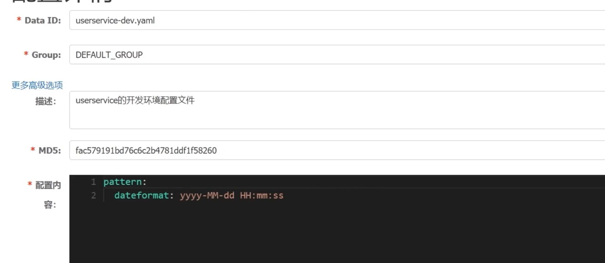

# 微服务技术栈


# 版本管理


# 微服务远程调用

服务调用关系

服务提供者：暴露接口给其他微服务调用

服务消费者：调用其他微服务提供的接口

提供者与消费者角色其实是相对的

# 开始

首先创建一个maven项目，在spring cloud中，版本要和spring boot达成兼容一致

https://start.spring.io/actuator/info

参照版本信息导入依赖

工程pom模板

父类pom文件

```xml
<?xml version="1.0" encoding="UTF-8"?>
<project xmlns="http://maven.apache.org/POM/4.0.0"
         xmlns:xsi="http://www.w3.org/2001/XMLSchema-instance"
         xsi:schemaLocation="http://maven.apache.org/POM/4.0.0 http://maven.apache.org/xsd/maven-4.0.0.xsd">
    <modelVersion>4.0.0</modelVersion>

    <groupId>org.example</groupId>
    <artifactId>cloud_Demo_01</artifactId>
    <packaging>pom</packaging>
    <version>1.0-SNAPSHOT</version>
    <modules>
        <module>Son_demo_01</module>
        <module>Son_demo_02</module>
        <module>Son_demo_03</module>
    </modules>

    <parent>
        <groupId>org.springframework.boot</groupId>
        <artifactId>spring-boot-starter-parent</artifactId>
        <version>2.6.3</version>
        <relativePath/> <!-- lookup parent from repository -->
    </parent>

    <properties>
        <maven.compiler.source>8</maven.compiler.source>
        <maven.compiler.target>8</maven.compiler.target>
        <spring.cloud.alibaba.version>2021.0.1.0</spring.cloud.alibaba.version>
        <spring.cloud.version>2021.0.1</spring.cloud.version>
    </properties>

    <dependencyManagement>
        <dependencies>
            <dependency>
                <groupId>com.alibaba.cloud</groupId>
                <artifactId>spring-cloud-alibaba-dependencies</artifactId>
                <version>${spring.cloud.alibaba.version}</version>
                <type>pom</type>
                <scope>import</scope>
            </dependency>
            <dependency>
                <groupId>org.springframework.cloud</groupId>
                <artifactId>spring-cloud-dependencies</artifactId>
                <version>${spring.cloud.version}</version>
                <type>pom</type>
                <scope>import</scope>
            </dependency>
        </dependencies>
    </dependencyManagement>

</project>
```

子工程pom文件

```xml
<?xml version="1.0" encoding="UTF-8"?>
<project xmlns="http://maven.apache.org/POM/4.0.0"
         xmlns:xsi="http://www.w3.org/2001/XMLSchema-instance"
         xsi:schemaLocation="http://maven.apache.org/POM/4.0.0 http://maven.apache.org/xsd/maven-4.0.0.xsd">
    <parent>
        <artifactId>cloud_Demo_01</artifactId>
        <groupId>org.example</groupId>
        <version>1.0-SNAPSHOT</version>
    </parent>
    <modelVersion>4.0.0</modelVersion>

    <artifactId>Son_demo_02</artifactId>

    <properties>
        <maven.compiler.source>8</maven.compiler.source>
        <maven.compiler.target>8</maven.compiler.target>
    </properties>
    <dependencies>
        <dependency>
            <groupId>org.springframework.boot</groupId>
            <artifactId>spring-boot-starter-web</artifactId>
        </dependency>
        <dependency>
            <groupId>com.alibaba.cloud</groupId>
            <artifactId>spring-cloud-starter-alibaba-nacos-discovery</artifactId>
        </dependency>
    </dependencies>
    <build>
        <plugins>
            <plugin>
                <groupId>org.springframework.boot</groupId>
                <artifactId>spring-boot-maven-plugin</artifactId>
                <configuration>
                    <excludes>
                        <exclude>
                            <groupId>org.projectlombok</groupId>
                            <artifactId>lombok</artifactId>
                        </exclude>
                    </excludes>
                </configuration>
            </plugin>
        </plugins>
    </build>


</project>
```


# Eureka注册中心

**服务消费者如何获取服务提供者的地址信息？**

Eureka的作用


1.服务提供者启动时向Eureka注册自己的信息，为了证明自己没有挂机，会30s/次 向Eureka心跳续约。

2.eureka保存这些信息

3.消费者根据服务名称向Eureka拉取提供者信息


# 搭建Eureka

1.引入eureka-server依赖

```
<dependency>
    <groupId>org.springframework.cloud</groupId>
    <artifactId>spring-cloud-netflix-eureka-server</artifactId>
</dependency>
```

2.添加@EnableEurekaServer注解在启动类上

3.在application.yml中配置eureka地址


# 注册Eureka

1.引入依赖eureka-client（Eureka客户端依赖）

```xml
<dependency>
    <groupId>org.springframework.cloud</groupId>
    <artifactId>spring-cloud-netflix-eureka-client</artifactId>
</dependency>
```

2.在application.yml中配置eureka地址


# 服务发现

完成服务拉去

1.修改访问路径，用服务名代替IP、端口

2.在RestTemplate类上添加负载均衡注解


# Ribbon负载均衡

## 原理

流程


## 策略


# 饥饿加载

Ribbon默认是采用懒加载，即第一次访问时才会去创建LoadBalanceClient，请求时间会很长。而饥饿加载则会在项目启动时创建，降低第一次访问的耗时，通过下面配置开启饥饿加载


# Nacos 

- 动态配置服务
- 服务发现及管理
- 动态DNS服务

下载地址：https://github.com/alibaba/nacos/releases

启动：进入bin目录

执行cmd命令单机启动

-单机启动

```bash
startup.cmd -m standalone
```

# Nacos注册中心

**服务注册到Nacos**

1.在父工程中添加spring-cloud-alibaba的管理依赖

```xml
<dependency>
    <groupId>com.alibaba.cloud</groupId>
    <artifactId>spring-cloud-alibaba-dependencies</artifactId>
    <version>2021.1</version>
    <type>pom</type>
    <scope>import</scope>
</dependency>
```

2.注释掉项目中原有的eureka依赖

!!!注意点，在最新的springBoot版本中，需要添加新的依赖

```xml
<dependency>
    <groupId>org.springframework.cloud</groupId>
    <artifactId>spring-cloud-starter-loadbalancer</artifactId>
    <version>3.1.0</version>
</dependency>
<dependency>
    <groupId>com.alibaba.cloud</groupId>
    <artifactId>spring-cloud-starter-alibaba-nacos-discovery</artifactId>
    <version>2021.1</version>
    <exclusions>
       <exclusion>
            <groupId>org.springframework.cloud</groupId>
            <artifactId>spring-cloud-starter-netflix-ribbon</artifactId>
       </exclusion>
    </exclusions>
</dependency>
```

由于SpringCloud Feign在Hoxton.M2 RELEASED版本之后不再使用Ribbon而是使用spring-cloud-loadbalancer，所以不引入spring-cloud-loadbalancer会报错
解决方法
加入spring-cloud-loadbalancer依赖 并且在nacos中排除ribbon依赖，不然loadbalancer无效

3.添加nacos的客户端依赖（放在mould）

```xml
<!-- https://mvnrepository.com/artifact/com.alibaba.cloud/spring-cloud-starter-alibaba-nacos-discovery -->
<dependency>
    <groupId>com.alibaba.cloud</groupId>
    <artifactId>spring-cloud-starter-alibaba-nacos-discovery</artifactId>
    <version>2021.1</version>
</dependency>
```

4.配置nacos地址

```yaml
spring:
  cloud:
    nacos:
      server-addr: localhost:8848
  application:
    name: userserver
server:
  port: 6601

```


# Nacos服务多级存储模型


# Nacos-NacosRule负载均衡

设定优先访问本地集群


**权重设定**


# Nacos环境隔离

Nacos中服务存储和数据存储的最外层是一个名为namespace的东西，用来做最外层隔离

在nacos控制台可以新建空间，然后再配置文件中修改配置，id不填默认生成uuid


不同环境空间的服务是不能相互访问的

# Nacos和Eureka


nacos临时实例采用心跳监测，非临时实例采用主动询问，如果有服务变更，会主动立刻推送变更消息给服务消费者


# Nacos配置管理

## 统一配置管理

配置更改热更新




Data ID 不能重复

## 微服务配置拉取

配置获取步骤


1.引入Nacos的配置管理客户端依赖


2.在userservice中的resource目录添加一个bootstrap.yaml文件。这个文件是引导文件，优先级高于application.yaml


## 配置热更新


## 多环境配置共享


优先级


## Nacos集群搭建

步骤


https://www.bilibili.com/video/BV1LQ4y127n4?p=29&spm_id_from=pageDriver

1.搭建多个Nacos环境，修改配置文件cluster.conf.example，重命名为cluster.conf，然后添加节点

然后修改application.properties文件，添加数据库配置。

1）打开数据源

2）数据库相关配置完成后，直接启动默认就是集群启动。startup.cmd

3）使用Nginx实现反向代理


# 基于Feign远程调用

https://github.com/OpenFeign/feign

feign是一个声明式的http客户端 

帮助我们优雅的实现http请求的发送，解决上面提到的问题。

1.引入依赖


2.在order-service的启动类添加注解开启Feign的功能


3.编写Feign客户端


调用的时候注入这个接口，调用所需的方法

# Feign自定义配置


# Feign的性能优化


引入依赖


配置连接池


# 的最佳实践

  方式一(继承)：给消费者的FeignClient和提供者的controller定义统一的父接口作为标准。


**实现**


引入module依赖


问题提示

# 统一网关Gateway


功能：

身份认证和权限验证

服务路由，负载均衡

请求限流

**历史发展**

zuul是基于Servlet的实现，属于阻塞式编程。Gatway则是基于Spring5中提供的Webflux，属于响应式编程，具有更佳的性能。

创建gatway服务

导入依赖

```xml
<?xml version="1.0" encoding="UTF-8"?>
<project xmlns="http://maven.apache.org/POM/4.0.0"
         xmlns:xsi="http://www.w3.org/2001/XMLSchema-instance"
         xsi:schemaLocation="http://maven.apache.org/POM/4.0.0 http://maven.apache.org/xsd/maven-4.0.0.xsd">
    <parent>
        <artifactId>cloud_Demo_01</artifactId>
        <groupId>org.example</groupId>
        <version>1.0-SNAPSHOT</version>
    </parent>
    <modelVersion>4.0.0</modelVersion>

    <artifactId>gateway</artifactId>

    <properties>
        <maven.compiler.source>8</maven.compiler.source>
        <maven.compiler.target>8</maven.compiler.target>
    </properties>
    <dependencies>

        <dependency>
            <groupId>org.springframework.cloud</groupId>
            <artifactId>spring-cloud-starter-gateway</artifactId>
        </dependency>
       
        <dependency>
            <groupId>org.springframework.cloud</groupId>
            <artifactId>spring-cloud-starter-loadbalancer</artifactId>
        </dependency>

        <dependency>
            <groupId>com.alibaba.cloud</groupId>
            <artifactId>spring-cloud-starter-alibaba-nacos-discovery</artifactId>
            <exclusions>
                <exclusion>
                    <groupId>org.springframework.cloud</groupId>
                    <artifactId>spring-cloud-starter-netflix-ribbon</artifactId>
                </exclusion>
            </exclusions>
        </dependency>
    </dependencies>
    <build>
        <plugins>
            <plugin>
                <groupId>org.springframework.boot</groupId>
                <artifactId>spring-boot-maven-plugin</artifactId>
                <configuration>
                    <excludes>
                        <exclude>
                            <groupId>org.projectlombok</groupId>
                            <artifactId>lombok</artifactId>
                        </exclude>
                    </excludes>
                </configuration>
            </plugin>
        </plugins>
    </build>

</project>
```

这里没有这个依赖

```xml
<dependency>
            <groupId>org.springframework.boot</groupId>
            <artifactId>spring-boot-starter-web</artifactId>
        </dependency>
```

编写配置

```yaml
server:
  port: 9962
spring:
  application:
    name: gateway
  cloud:
    nacos:
      server-addr: localhost:8848
    gateway:
      routes: #网关路由
        - id: demo1 #路由id，自定义
          uri: lb://service-name #路由的目标地址，lb就是负载均衡，后面跟服务器名称
          predicates: #路由断言，也就是判断请求是否符合路由规则的条件
            - Path=/user/** #这个是按照路径匹配，只要/user/开头就符合

```

编写启动类后启动网关

## 路由断言


官网地址：https://docs.spring.io/spring-cloud-gateway/docs/current/reference/html/#gateway-request-predicates-factories

## 路由过滤器

GatewayFilter是网关中提供的一种过滤器，可以对进入网关的请求和微服务返回的响应做处理：


过滤器工厂GatwayFilterFactory

https://docs.spring.io/spring-cloud-gateway/docs/current/reference/html/#gatewayfilter-factories

```yaml
default-filters: #全局配置规则 - 和routes同级
        - AddRequestHeader=Token,Token is what?
```

**全局过滤器GlobalFilter**

处理一切进入网关的请求和微服务响应，与default-filter差不多，不过default-filter是一个写死的配置，而它可以自定义。

```java
package com.chb.gateway.filter;

import org.springframework.cloud.gateway.filter.GatewayFilterChain;
import org.springframework.cloud.gateway.filter.GlobalFilter;
import org.springframework.core.Ordered;
import org.springframework.core.annotation.Order;
import org.springframework.http.HttpStatus;
import org.springframework.http.server.reactive.ServerHttpRequest;
import org.springframework.stereotype.Component;
import org.springframework.util.MultiValueMap;
import org.springframework.web.server.ServerWebExchange;
import reactor.core.publisher.Mono;

/**
 * Created by Mr.Prefect on 2022/4/29
 * Author : 陈和斌
 * ClassName : AuthorizedFilter
 * Date : 2022/4/29
 * Time : 11:20
 * Note :
 */
//@Order(-4512) // 过滤器的顺序，越小级别越高。除此之外还可以通过接口Ordered实现来完成
@Component
public class AuthorizedFilter implements GlobalFilter, Ordered {
    @Override
    public Mono<Void> filter(ServerWebExchange exchange, GatewayFilterChain chain) {
        // 1.获取请求参数
        ServerHttpRequest request = exchange.getRequest();
        MultiValueMap<String, String> params = request.getQueryParams();

        // 2.获取参数中的authorization参数
        String authorization = params.getFirst("authorization");
        // 3.判断参数值是否等于admin
        if ("admin".equals(authorization)) {
            // 4.是，放行
            return chain.filter(exchange);
        }
        // 5.设置状态码
        exchange.getResponse().setStatusCode(HttpStatus.UNAUTHORIZED);

        // 5.否，拦截
        return exchange.getResponse().setComplete();
    }

    @Override
    public int getOrder() {
        return -5656;
    }
}

```

## 跨域问题处理

网关处理跨域采用的同样是CORS方案，并且只需要以下配置即可实现：


# Docker


# docker基本操作

# 服务异步通讯RabbitMQ

MQ（MessageQueue）,中文是消息队列。也就是事件驱动架构中的Broker。

## 安装

