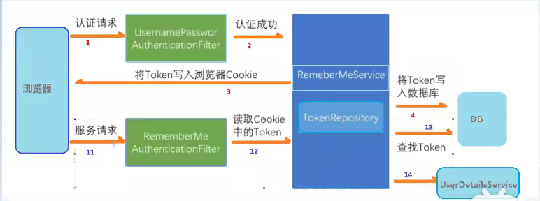

# SpringSecurity简介

https://spring.io/projects/spring-security

Spring Security 是一个提供[身份验证](https://docs.spring.io/spring-security/reference/features/authentication/index.html)、[授权](https://docs.spring.io/spring-security/reference/features/authorization/index.html)和[针对常见攻击的保护](https://docs.spring.io/spring-security/reference/features/exploits/index.html)的框架。凭借对保护[命令式](https://docs.spring.io/spring-security/reference/servlet/index.html)和[反应式](https://docs.spring.io/spring-security/reference/reactive/index.html)应用程序的一流支持，它是保护基于 Spring 的应用程序的事实上的标准。

https://docs.spring.io/spring-security/reference/getting-spring-security.html

首先只要导入了security的依赖后会自动拦截所有请求，需要登录才能访问，默认的登录名user，密码控制台随机打印

所以需要我们自定义实现UserDetailsService接口

SpringSecutrity专门有接口PasswordEncoder的实现类来加密密码

# PasswordEncoder

BCryptPasswordEncoder类实现了PasswordEncoder接口

```java
BCryptPasswordEncoder bCryptPasswordEncoder = new BCryptPasswordEncoder();
// 使用BCryptPasswordEncoder类来实现加密
String encode = bCryptPasswordEncoder.encode("221700");
// 使用matches方法进行密码对比
boolean matches = bCryptPasswordEncoder.matches("2217", encode);
```

每次输入的明文密码生成的密文都不一样，即便是明文密码一摸一样。

# 自定义登录逻辑

首先需要一个配置类

```java
package com.chb.securityspring.Until;

import org.springframework.context.annotation.Bean;
import org.springframework.context.annotation.Configuration;
import org.springframework.security.core.userdetails.UserDetails;
import org.springframework.security.core.userdetails.UserDetailsService;
import org.springframework.security.core.userdetails.UsernameNotFoundException;
import org.springframework.security.crypto.bcrypt.BCryptPasswordEncoder;
import org.springframework.security.crypto.password.PasswordEncoder;

/**
 * Created by Mr.Prefect on 2022/1/5
 * Author : 陈和斌
 * ClassName : loginUntil
 * Date : 2022/1/5
 * Time : 16:35
 * Note :
 */
@Configuration
public class loginUntil  {

    @Bean
    public PasswordEncoder login(){
        return new BCryptPasswordEncoder();
    }

}

```

其次是写一个service去实现逻辑操作

```java
package com.chb.securityspring.service;

import org.springframework.beans.factory.annotation.Autowired;
import org.springframework.security.core.authority.AuthorityUtils;
import org.springframework.security.core.userdetails.User;
import org.springframework.security.core.userdetails.UserDetails;
import org.springframework.security.core.userdetails.UserDetailsService;
import org.springframework.security.core.userdetails.UsernameNotFoundException;
import org.springframework.security.crypto.password.PasswordEncoder;
import org.springframework.stereotype.Service;

/**
 * Created by Mr.Prefect on 2022/1/6
 * Author : 陈和斌
 * ClassName : LoginService
 * Date : 2022/1/6
 * Time : 9:18
 * Note :
 */
@Service
public class LoginService implements UserDetailsService {
    @Autowired
    private PasswordEncoder pw;
    @Override
    public UserDetails loadUserByUsername(String username) throws UsernameNotFoundException {
        String password = pw.encode("221700");
        // 此处的user是封装的专门处理登录的用户工具类，
        return new User("admin",password, AuthorityUtils.commaSeparatedStringToAuthorityList("adim,user"));
    }
}

```

# 详解尚硅谷

SpringSecurity本质是一个过滤器链

# 认证

1.设置登录的用户名和密码

第一种：通过配置文件

```properties
spring.security.user.name=chb
spring.security.user.password=221700
```

第二种：通过配置类

```java
@Configuration
public class SecurityConfig extends WebSecurityConfigurerAdapter {
    @Bean
    public PasswordEncoder login(){
        return new BCryptPasswordEncoder();
    }
    @Override
    protected void configure(AuthenticationManagerBuilder auth) throws Exception {
        BCryptPasswordEncoder passwordEncoder = new BCryptPasswordEncoder();
        String password = passwordEncoder.encode("9527");
        auth.inMemoryAuthentication().withUser("cpw").password(password).roles("admin");
    }
}

```

第三种：自定义编写实体类

​	1.创建配置类，设置使用哪个userDetailsService实现类

​	2.编写实体类，返回User对象，User对象有用户名密码和操作权限

```java
@Service
public class SecurityService implements UserDetailsService {
    @Override
    public UserDetails loadUserByUsername(String username) throws UsernameNotFoundException {
        List<GrantedAuthority> role = AuthorityUtils.commaSeparatedStringToAuthorityList("role");
        User cpp = new User("cpp", new BCryptPasswordEncoder().encode("8888"), role);

        return cpp;
    }
}
```

```java
@Configuration
public class SpringSecConfig {

    @Bean
    public PasswordEncoder login(){
        return new BCryptPasswordEncoder();
    }
}

```

# 数据库查询用户登录

使用mybatisplus查询数据库

```java
package com.chb.securitygo.Controller.Service;

import com.baomidou.mybatisplus.core.conditions.query.QueryWrapper;
import com.chb.securitygo.Mapper.CustomerMapper;
import com.chb.securitygo.Mapper.securityMapper;
import com.chb.securitygo.Pojo.Customer;
import org.springframework.beans.factory.annotation.Autowired;
import org.springframework.security.core.GrantedAuthority;
import org.springframework.security.core.authority.AuthorityUtils;
import org.springframework.security.core.userdetails.User;
import org.springframework.security.core.userdetails.UserDetails;
import org.springframework.security.core.userdetails.UserDetailsService;
import org.springframework.security.core.userdetails.UsernameNotFoundException;
import org.springframework.security.crypto.bcrypt.BCryptPasswordEncoder;
import org.springframework.stereotype.Service;

import java.util.List;

/**
 * Created by Mr.Prefect on 2022/1/6
 * Author : 陈和斌
 * ClassName : SecurityService
 * Date : 2022/1/6
 * Time : 16:41
 * Note :
 */
@Service
public class SecurityService implements UserDetailsService {
    @Autowired
    CustomerMapper customerMapper;
    @Override
    public UserDetails loadUserByUsername(String username) throws UsernameNotFoundException {
        QueryWrapper<Customer> customerQueryWrapper = new QueryWrapper<>();
        customerQueryWrapper.eq("name",username);
        Customer customer = customerMapper.selectOne(customerQueryWrapper);
        System.out.println(customer);
        if(customer == null){
           throw new UsernameNotFoundException("用户不存在");
        }

        List<GrantedAuthority> role = AuthorityUtils.commaSeparatedStringToAuthorityList("role");
        User cpp = new User(customer.getName(), new BCryptPasswordEncoder().encode(customer.getPassword()), role);

        return cpp;
    }
}

```

# 自定义登录页

```JAVA
package com.chb.securitygo.Controller.Service;

import com.baomidou.mybatisplus.core.conditions.query.QueryWrapper;
import com.chb.securitygo.Mapper.CustomerMapper;
import com.chb.securitygo.Mapper.securityMapper;
import com.chb.securitygo.Pojo.Customer;
import org.springframework.beans.factory.annotation.Autowired;
import org.springframework.security.core.GrantedAuthority;
import org.springframework.security.core.authority.AuthorityUtils;
import org.springframework.security.core.userdetails.User;
import org.springframework.security.core.userdetails.UserDetails;
import org.springframework.security.core.userdetails.UserDetailsService;
import org.springframework.security.core.userdetails.UsernameNotFoundException;
import org.springframework.security.crypto.bcrypt.BCryptPasswordEncoder;
import org.springframework.stereotype.Service;

import java.util.List;

/**
 * Created by Mr.Prefect on 2022/1/6
 * Author : 陈和斌
 * ClassName : SecurityService
 * Date : 2022/1/6
 * Time : 16:41
 * Note :
 */
@Service
public class SecurityService implements UserDetailsService {
    @Autowired
    CustomerMapper customerMapper;
    @Override
    public UserDetails loadUserByUsername(String username) throws UsernameNotFoundException {
        QueryWrapper<Customer> customerQueryWrapper = new QueryWrapper<>();
        customerQueryWrapper.eq("name",username);
        Customer customer = customerMapper.selectOne(customerQueryWrapper);
        System.out.println(customer);
        if(customer == null){
            System.out.println("用户不存在");
           throw new UsernameNotFoundException("用户不存在");

        }else if (!username.equals(customer.getName())){
            System.out.println("用户不存在");
            throw new UsernameNotFoundException("用户不存在");
        }

        List<GrantedAuthority> role = AuthorityUtils.commaSeparatedStringToAuthorityList("role");
        User cpp = new User(customer.getName(), new BCryptPasswordEncoder().encode(customer.getPassword()), role);

        return cpp;
    }
}

```

配置

```java
package com.chb.securitygo.Controller.Config;

import org.springframework.context.annotation.Bean;
import org.springframework.context.annotation.Configuration;
import org.springframework.security.config.annotation.web.builders.HttpSecurity;
import org.springframework.security.config.annotation.web.configuration.WebSecurityConfigurerAdapter;
import org.springframework.security.crypto.bcrypt.BCryptPasswordEncoder;
import org.springframework.security.crypto.password.PasswordEncoder;

/**
 * Created by Mr.Prefect on 2022/1/6
 * Author : 陈和斌
 * ClassName : SpringSecConfig
 * Date : 2022/1/6
 * Time : 16:23
 * Note :
 */
@Configuration
public class SpringSecConfig extends WebSecurityConfigurerAdapter {

    @Bean
    public PasswordEncoder login(){
        return new BCryptPasswordEncoder();
    }

    @Override
    protected void configure(HttpSecurity http) throws Exception {
        http.formLogin()  //自定义登录页面
                .loginPage("/login.html") //登录页面设置
                .loginProcessingUrl("/user/login") //登录访问路径controller,表单页面数据提交地址,框架帮我们写好
                .defaultSuccessUrl("/test/hello").permitAll() //登录成功后的跳转路径
                .and().authorizeRequests()
                .antMatchers("/","/user/login").permitAll() //设置那些路径可以直接访问
                .anyRequest().authenticated()
                .and().csrf().disable(); // 关闭crsf防护
    }
}

```

# 基于角色或权限进行访问控制

**1.hasAuthority方法**

如果当前的主体具有指定的权限，则返回true，否则返回false

​	01在配置类中设置当前访问地址有哪些权限

```java
.antMatchers("/admin").hasAuthority("admin")
```

​	02在UserDetailsService,把返回User对象设置

```java
List<GrantedAuthority> role = AuthorityUtils.commaSeparatedStringToAuthorityList("admin");
```

**2.hasAnyAuthority方法**

```java
// 多个权限访问    
.antMatchers("/test/hello").hasAnyAuthority("user,admin")
```

**3.hasRole方法**

如果用户具备给定角色就允许访问，否则出现403

如果当前主题具有指定的角色，则返回true

```JAVA
 // 拥有角色me才能访问此路径
.antMatchers("/admin").hasRole("me")
```

但是赋权限的时候需要外加ROLE_才能成功

```java
List<GrantedAuthority> role = AuthorityUtils.commaSeparatedStringToAuthorityList("ROLE_me");
```

**4.hasAnyRole**

同理

# 自定义403被拒页面

在自定义配置类中配置

```java
http.exceptionHandling().accessDeniedPage("/403.html");
```

# 认证授权注解使用

## @Secured

判断是否具有角色，另外需要注意的是这里匹配的字符串需要添加前缀"ROLE_"

使用注解先要开启注解功能

在配置类或者启动类上添加注解

```java
@EnableGlobalMethodSecurity(securedEnabled = true)
```

在控制器上添加注解

```java
@GetMapping("gundan")
    @Secured({"ROLE_gundan","ROLE_sb"})
    public String ann(){
        return "滚蛋吧";
    }
```

只有角色"ROLE_gundan","ROLE_sb"才可以访问此路径

## @PreAuthorize

先开启注解功能

```java
@EnableGlobalMethodSecurity(securedEnabled = true,prePostEnabled = true)
```

该注解适合进入方法前的权限验证，可以将登录用户的roles/permissions参数传到方法中。

```java 
@GetMapping("gundan")
//    @Secured({"ROLE_gundan","ROLE_sb"})
    @PreAuthorize("hasAnyAuthority('admin')")
    public String ann(){
        return "滚蛋吧";
    }
```

## @PostAuthorize

先开启注解功能

```Java
@EnableGlobalMethodSecurity(prePostEnabled = true)
```

该注解使用并不多，在方法执行后再进行权限验证，适合验证带有返回值的权限。

```java
@GetMapping("gundan")
    @PostAuthorize("hasAnyAuthority('admin')")
    public String ann(){
        return "滚蛋吧";
    }
```

## @PostFilter

返回数据过滤

```Java
@GetMapping("gundan")
@PreAuthorize("hasAnyAuthority('admin')")
@PreFilter(value = "filterObject.id%2==0")
// filterObject表示数据的对象单体
public String ann(){
    *********;
}
```

## @PreFilter

传入数据过滤

https://www.bilibili.com/video/BV15a411A7kP?p=15&spm_id_from=pageDriver

# 用户注销

1.在配置类中添加退出的配置

```java 
http.logout().logoutUrl("/logout")
                       .logoutSuccessUrl("/test/hello").permitAll();
```

# 自动登录

**1.cookie**

不安全

**2.springsecurity**


