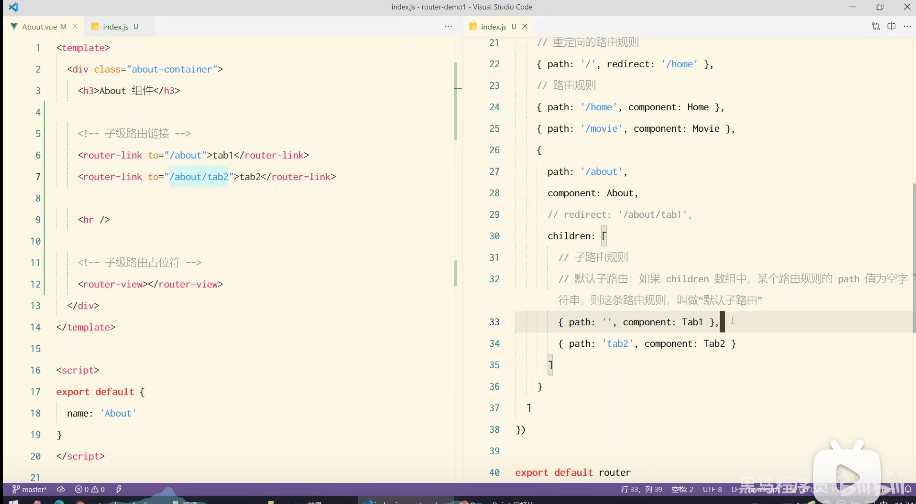

#   vite

[Vite](https://github.com/vitejs/vite) 是一个 web 开发构建工具，由于其原生 ES 模块导入方式，可以实现闪电般的冷服务器启动。

通过在终端中运行以下命令，可以使用 Vite 快速构建 Vue 项目。

使用 npm：

首先要进入到项目文件目录下，然后cmd

```bash
$ npm init @vitejs/app <project-name>
$ cd <project-name>
$ npm install
$ npm run dev
```

# Vue2

1.新建一个项目空目录，通过cmd终端npm init -y命令初始化package.json

2.新建src源代码目录

3.在src目录编写页面代码

4.运行npm install jquery -S命令，安装jquery

5.通过ES6模块化的方式导入jquery

# webpack

主要作用是实现兼容性问题

进入项目 npm install webpack webpack-cli -D 安装

**配置**

1.在根目录创建webpack.config.js文件

```js
// 使用Node.js中的导出语法，向外导出一个webpack的配置对象
module.exports4 = {
    // 代表webpack的运行模式，development开发模式和production发布模式
    mode: 'development'
}
```

2.在package.json中的scripts节点下，新增dev

```json
 "scripts": {
    "dev": "webpack" //可以npm run dev 执行脚本
  },
```

3.在终端npm run dev启动webpack进行项目打包构建

**思路**

在完成项目打包构建的时候生成dist包，及子目录main.js文件，main.js中包含了自己写的index.js和jQuery.js文件，实现了浏览器的向下兼容

**默认的打包入口文件为src -> index.js ，输出文件路径为dist -> main.js**

webpack.config.js中修改默认约定

```js
const path = require('path') // d
// 使用Node.js中的导出语法，向外导出一个webpack的配置对象 
module.exports = {
    // 代表webpack的运行模式，development开发模式和production发布模式
    mode: 'development',
    entry: path.join(__dirname, './src/index.js'), // 打包入口文件的路径
    output: {
        path: path.join(__dirname, './dist'),// 输入文件的存放路径
        filename: 'bundle.js' //输入文件的名称
    }

}
```

# webpack-dev-server

实时打包工具

安装 npm install webpack-dev-server -D

修改package.json文件中的scripts

```json
"scripts": {
    "dev": "webpack serve"
  },
```

修改样式代码保存后效果会立马反应在浏览器

# html-webpack-plugin

安装

npm install html-webpack-plugin -D

```js
// 导入Html插件。得到一个构造函数
const HtmlPlugin =require('html-webpack-plugin')

// 创建Html插件的实例对象
const htmlPlugin = new HtmlPlugin({
    template: './src/index.html', // 指定原文件的存放路径
    filename: './index.html', // 指定生成的文件存放路径
})
module.exports = {
    mode: 'development',
    plugins:[htmlPlugin],// 通过plugins节点，使htmlPlugin插件生效
}
```

将index.html文件复制到src路径同级位置，以供访问

# webpack中的插件devServer

```js
 devServer:{

​    open: true, // 默认浏览器是否打开

​    host: '127.0.0.1', //实时打包主机的地址

​    port: 81, //端口号

  }
```

在webpack.config.js文件中，devServer节点会被加载

# loader

webpack默认处理的是js文件，所以无法处理css等其他文件，通过loader插件实现其他格式文件处理

css

安装 npm i style-loader css-loader -D

在webpack.config.js文件中添加module节点

```js
module:{
        rules: [{
            test: /\.css$/,use: ['style-loader','css-loader']
        }]
    }
```

less

安装 npm i less-loader less -D

```json
{
            test: /\.less$/,use: ['style-loader','css-loader','less-loader']
            }
```


在webpack.config.js文件中添加module节点

# build

将前端的代码打包，提供访问

```json
"scripts": {

  "dev": "webpack serve",

  "build": "webpack --mode production"

 }
```

production代表生产环境，serve是放在缓存中，"build": "webpack --mode production"是放在物理磁盘中

**防止旧文件dist冲突**

安装插件npm install --save-dev clean-webpack-plugin

webpack.config.js配置文件中，先导入const {CleanWebpackPlugin} = require('clean-webpack-plugin')，然后在 plugins数组中加入new CleanWebpackPlugin()


引入依赖

  <script src="https://cdn.jsdelivr.net/npm/vue@2.6.14/dist/vue.js"></script>

# **基本语法**

```html
<!DOCTYPE html>
<html lang="en">
<head>
    <meta charset="UTF-8">
    <meta http-equiv="X-UA-Compatible" content="IE=edge">
    <meta name="viewport" content="width=device-width, initial-scale=1.0">
    <title>Document</title>
</head>
<body>
    <div id="ccc">
        {{message}}
    </div>


   <script src="https://cdn.jsdelivr.net/npm/vue@2.6.14/dist/vue.js"></script>
    <script>
        // const(常量)--let(变量)
        const app= new Vue({
            el: '#ccc',
            data:{
                message:"你好！钱！"
            }
        });
    </script>
</body>
</html>
```

# vue的两个特性

**数据驱动视图**

数据的变换驱动试图的变化，是单项的数据绑定

**双向数据绑定**

form表单采集数据，Ajax提交数据，

# 指令

**内容渲染指令**

v-text	值渲染到标签内容，会覆盖之前的内容

{{}}	插值表达式

v-html

**属性绑定指令**

v-bind	比如v-bind:placeholder="",v-bind:src="",可以简写为：

 **事件绑定指令**

v-on:click	在methods中添加所需的方法,可以简写为@click

```js
methods: {
                add(){
                   this.count++;
                },
                sub(n){
                    this.count -=  n;
                }
                
            }
```

$event等于原生DOM的事件对象e

```js
sub(n,e){
                    this.count -=  n;
                    console.log(e)
                    if(this.count % 2 === 0){
                        
                        e.target.style.backgroundColor = 'red'
                    }else{
                        e.target.style.backgroundColor = 'yellow'
                    }
                }
```

事件修饰符

.prevent	阻止默认行为（例如链接的跳转，阻止表单的提交）

.stop	阻止事件冒泡

.capture	以捕获模式触发当前的事件处理函数

.once	绑定的事件只触发一次

.self	只有在event.target是当前元素自身时触发事件处理函数

按键修饰符@keyup

@keyup.esc  @keyup.enter

**v-model**

双向数据绑定

input	select	textarea标签等绑定使用

专用修饰符

.number	自动将用户的输入值转为数值类型

.trim	自动过滤用户的首尾空白字符

.lazy	在change时而非input时更新，也就时是文本输入失去焦点才更新model数据

**条件渲染指令**

- [x] v-if和v-show


二者的功能实现一样，当值为true时显示，为false隐藏，区别在于v-if是直接删除了底层的标签，v-show是在标签的属性上添加display:onoe实现隐藏。如果频繁操作时v-show性能更优，如果起始页面不需要被展示时v-if更推荐

v-if配套指令v-else-if，v-else

**列表渲染指令**

v-for

声明式，遍历获取值，例如

```html
<script>
        // const(常量)--let(变量)
        const app= new Vue({
            el: '#ccc',
            data:{
                message:"你好！钱！",
                friends: ['cc','zq','xh','mr','cz']
            }
        });
    </script>
```

```html
<div id="ccc">
        {{message}}
        <ul>
            <li v-for="i in friends" :key="">{{i}}</li>
        </ul>
    </div>
```


# **MVVM模型**

mvvm是有m、v、vm、组成


v表示view视图层

```html
<div id="app">
    {{ message }}
  </div>
```

m表示model模型数据层

```js
data: {
    message: 'Hello Vue!'
  }
```

vm代表的是viewModel控制器层

```js
const app = new Vue
```

# 过滤器

vue3取消了过滤器，过滤器常用于文本的格式化。可以用在两个地方：插值表达式和v-bind属性绑定。

过滤器应该添加在js表达式的尾部，由“管道符 | ”进行调用

```js
<p>message:{{message | cap}}</p>
```

```js
const app= new Vue({
            el: '#chb',
            data:{
                numbers:["cd","ds","sd","rr"],
                message:'hello word'
            },
            filters:{
                cap(val){
                    // 过滤器一定要有返回值
                    // val 形参都是管道符前的值
                    // val.charAt(0)  接受缩影值
                    const fir =val.charAt(0).toUpperCase();
                    const oth = val.slice(1); // 从缩影1开始截取
                    return fir + oth;
                }
            }
            
        });
```

全局过滤器

```js
Vue.filter('capi' , function (val){
            const fir =val.charAt(0).toUpperCase();
                    const oth = val.slice(1); 
                    return fir + oth;
        })
```

全局过滤器是filter，非filters。全局和私有在一起时就近原则选择私有的。

过滤器可串联多个

```js
<p>message:{{message | cap | xxx | yyy}}</p>
```

逐次调用，过滤器本是一个函数，即可传参

```js

<p>message:{{message | cap(age1,age2)}}</p>
//注意val就是message，非参数
Vue.filter('cap' , function (val,age1,age2){ })
```

# 侦听器（watch）

监视数据变化进行操作

**函数格式的侦听器**

```js
// 方法格式侦听器，不会开始就触发
watch:{
                message(newValue,oldValue){

                    console.log(newValue,oldValue)
                }
            }
            
        });
```

实质为函数，与data平级。所有侦听的对象都放在watch函数中，侦听的对象作为里面的函数名，比如侦听message的变化，将message作为函数名，参数为变化后的新值和变化前的旧值。

**对象格式的侦听器**

```js
watch:{
                numbers:{
                    handler(newValue,oldValue){
                        console.log(newValue,oldValue)
                    },
                 // immediate指是否开始就触发侦听器，默认false 
                    immediate:true
                }

            }
            
```

深度监听

```js
 data:{
               
                info:{
                    username: "chb",
                    age: 21
                }
            }
```

```js
watch:{     
                info:{
                    handler(newValue,oldValue){
                        console.log(newValue,oldValue)
                    },
 // 开启深度监听，监听的对象属性发生变化时也会触发,默认false
                    deep: true
                }

            }
```

如果侦听对象的子属性,无需deep也可

```js
'info.username'(newvalue){
     console.log(newValue)
}
```

侦听器配合v-model双向绑定使用

# 计算属性

实现代码复用

computed节点，同样和data平级

```js
// 所有的计算属性都要定义在computed节点下
            // 计算属性在定义的时候要定义为方法格式
            computed:{

                rgb(){
                    return 'rgb(${this.r},${this.g},${this.b})'
                }
            }
```

只要计算的属性数据源变了则计算属性会自动重新求职

# axios

专注于数据请求的库，返回值为一个promise实例对象

npm安装

npm i vue-axios

npm i axios -s

直接下载js

https://unpkg.com/browse/axios@0.21.4/dist/axios.js

1.发起get请求

```js
axios({
            // 请求方式
            method: 'get',
            // 请求地址
            url: 'http://www.liulongbin.top:3006/api/getbooks',
            // url中的数据
            params:{
                id: 1
            }
        }).then(function(result) {
            console.log(result);
        })
```

2.发起post请求

```js
 axios({
            // 请求方式
            method: 'post',
            // 请求地址
            url: 'http://www.liulongbin.top:3006/api/getbooks',
            // 请求体中的数据
            data:{
                name: 'zs',
                age: 20
            }
        }).then(function(result) {
            console.log(result);
        })
```

**async和await**

```js
 document.querySelector('#btnpost').addEventListener('click', async function(){

            // 如果调用某个方法的返回值是promise实例，则前面可以添加await
            // await只能用在被async修饰的方法中
            await axios({
            // 请求方式
            method: 'post',
            // 请求地址
            url: 'http://www.liulongbin.top:3006/api/getbooks',
            // 请求体中的数据
            data:{
                name :'zs',
                age : 20
            }
         })
        })
```

解构赋值

```js
// data重命名为res
const { data: res} = await axios({
```

**axios.get和axios.post**

```js

        document.querySelector('#btnget').addEventListener('click', async function(){
            const {data: res} = await axios.get('http://localhost.3306xxxx',{
                params:{id :1}
            })
            console.log(res)

        })

        document.querySelector('#btnpost').addEventListener('click', async function(){
            const {data: res} = await axios.post('http://localhost.3306xxxx',{name: 'zs',gender: '女'})
            console.log(res)

        })
```

注意：post请求中请求体数据直接跟在url后，不需data，而get需要加params数据对象

# 数据代理

Object.defineProperty

        

# vue-cli

https://cli.vuejs.org/zh/guide/

安装

```bash
npm install -g @vue/cli
```

npm安装，-g使用终端命令安装全局变量

**注意**

vue-cli环境变量

新建系统环境变量.

变量名:vue

路径：H:\nodejs\npmDownload

其次在path里面加成这个路径

创建项目步骤和vite一样

创建项目vue create objname

启动项目npm run serve

**vue运行流程**

vue通过main.js把App.vue渲染到index.html的指定区域


mian.js

```js
// 导入vue包，得到vue构造函数
import Vue from 'vue'
// 导入App.vue根组件，将来要把App.vue中的模板结构，渲染到HTML页面中
import App from './App.vue'

Vue.config.productionTip = false

// 创建vue实例
new Vue({
  // 把render函数指定的组件渲染到HTML中
  render: h => h(App),
}).$mount('#app') // 相当于el绑定id=app的vue，等于是把App.vue组件替换了id=app的div

```

# vue组件化

vue结尾的文件都是组件

每个.vue组件都是由3部分组成，分别是

**template	->组件的模板结构**

只能有一个根节点，所以先放一个div，防止出错

**script	->组件的js行为**

组件里的data必须是函数形式，然后return

**style	-> 组件的样式**

less语法，在style加属性lang="less"，默认是css·

```vue
<template>
    <span>hello vue----{{username}}</span>
</template>
<script>
export default {
    data(){
        return {username:"chb"}
    }
}
</script>

<style lang="less">
span
{
    background-color:paleturquoise;
}
</style>
```

# 组件的父子关系

和components平级的App.vue是根组件

通过impor导入组件模块

```js
import Header from  '@/components/Header.vue'
```

然后定义注册的组件

```js
export default {
    components:{
      // 'Header':Header
      Header,
      Body
    }
}
```

使用的时候在<template>中的根便签中以标签的形式使用

```vue
<template>
<div>
  <Header></Header>
    <span>hello vue----{{username}}</span>
  <Body></Body>
</div>
</template>
```

# 全局组件注册

上面的是私有子组件的注册

全局组件在main.js中，通过Vue.component方法实现注册

```js
import Count from '@/components/Count.vue'
Vue.component('MyCount',Count)
```

然后在其他组件中都可使用

# 组件的自定义属性

**props**语法

```js
export default {
  // props是自定义属性，为当前组件指定初始值 
  props:['init'],
  data(){
    return{
      count
    }
  }

}
```

```vue
<template>
    <div>
        这是header
        <MyCount :init="6"></MyCount>
    </div>
</template>
```

:init指定的值是js类型的，所以他是数字

init指定的是字符串6

**props是只可读的，不可直接修改**

若要修改，通过data数据的指定

```js
export default {
  // props是自定义属性，为当前组件指定初始值 
  props:['init'],
  data(){
    return{
      count: this.init
    }
  }

}
```

props的default默认值

```js
export default {
  // props是自定义属性，为当前组件指定初始值 
  props:{
    init:{
      default:0
    }
  }

}
```

 ***type类型***

```js
// 类型校验，规定传什么类型的数据
props:{
    init:{
      default:0,
      type:number // boolean string array object
    }
  },
```

**required**

true表示传参必须

```js
props:{
    init:{
      default:0,
      type:number ,// boolean string array object
      // 必填项效验
      requird:true
    }
```

# **组件之间的样式冲突**

**scoped**

style标签添加属性scoped，vue会在当前组件自动添加data-v-xxx，样式中会选择添加的标签生效属性

**样式穿透**

scoped在子标签下无法生效，通过deep实现样式穿透，在样式选择中添加/deep/ 

```css
/deep/ h2{
    color: pink
}
```

# **组件生命周期**

生命周期函数分类


# 组件数据共享

**父子组件**

父---》子

引用组件,props来自定义属性

子---》父

```vue
// 父组件
<template>
  <div id="app">
    <div>这是父类组件</div>
    <br>
    <span >age:{{namevalue}}</span>
    <hr>
    <HelloWorld @namechange="getnamechange"></HelloWorld>


  </div>
</template>

<script>
import HelloWorld from './components/HelloWorld.vue'

export default {
  name: 'App',
  components: {
    HelloWorld
  },
  data(){
    return {namevalue:0}
  },
  methods:{
    getnamechange(val){
      this.namevalue = val

    }
  }
 
}
</script>

<style lang="less">

</style>

```

```vue
// 子组件
<template>
  <div class="hello">
   <span >age:{{username}}</span>
   <br>
   <button @click="add">age+</button>
  </div>
</template>

<script>
export default {
  name: 'HelloWorld',
  
  data(){
    return {
      username: 0
      
    }
  } 

 },
 methods: {
    add(){
      this.username +=1
      this.$emit('namechange',this.username)
    }
  }
}
</script>


<style scoped lang="less">

</style>

```

子组件中$emit来将发生改变的username值以'namechange'给父组件调用。

父组件调用的时候@namechange获得子组件的调用，然后在data中返回方法里接收的值

**兄弟组件**

兄弟组件之间数据共享的方案是EventBus

在组件模块创建EventBus.js

```js
import Vue from 'vue';
export default new Vue()
```

发送数据的组件

```vue
<template>
  <div >
   <button @click="send">发送诗歌</button>
  </div>
</template>

<script>
import bus from "./eventBus.js"

export default {
  name: 'Hihaha',
  
  data(){
    return {
      str: '唧唧复唧唧，木兰当户织'
    }
  },


 methods: {
    send(){
      
      bus.$emit('sahr',this.str)
    }
  }
}
</script>


<style scoped lang="less">

</style>

```

接受数据的组件

```vue
<template>
  <div >
   <p>{{song}}</p>
  </div>
</template>

<script>
import bus from "./eventBus.js"

export default {
  name: 'HelloWorld',
  
  data(){
    return {
      song : ''
    }
   

 },
 created(){
   bus.$on('sahr',(val)=>{
     this.song = val;
   })

 }
 
}
</script>


<style scoped lang="less">

</style>

```

不管是哪个组件都要导入EventBus，发送数据的组件通过导入EventBus模块的vue实例来调用$emit，接受数据的组件需要在created生命周期函数中调用$on方法

# ref引用

ref用来辅助开发者在不依赖jQuery的情况下，获取DOM元素或组件的引用

每个vue组件上默认都有一个$refs实例

首先要在标签上定义添加ref属性，然后通过组件调用

```html
<div ref="change">hello</div>
```

```js
this.$refs.change.style.color = 'pink';
```

也可以挂到引用的组件上来获取组件的值

 **$nextTick(cd)**

组件 $nextTick(cd)方法会把cd回调推迟到下一个DOM更新周期之后执行

```js
this.$nextTick.(() =>{
      this.$refs.hi.focus();
    })
// focus是获得焦点的意思
```

# **数组**

some方法

```js
// 遍历数据，forEach函数无法中途终止，some实现
const arr = ['hushb','sdv','dsfsd'];
arr.some((item, index) =>{
  if(item == 'sdv'){
    console.log(index);
    return true; // return true跳出循环
  }
})
```

every方法

```js
// 等于全选功能 只要一个条件为false，则结果为false
const arr = [false, true, true, true, true, true, true, true];
const result = arr.every(item => item)
  console.log(result)

```

reduce方法

```js
//累加器
const arr = [8,3,6];
const result =arr.reduce((amt // 累加的值，开始等于初始值
                          ,item //遍历的值
                         ) =>{
  return amt += item
},0// 初始值
                        )

console.log(result)

// 简化
const arr = [8,3,6];
const result =arr.reduce((amt,item) => amt += item,0)

console.log(result)


```

# 动态组件

动态切换组件的切换和位置

<components>组件提供渲染

```vue
<div id="app">
    <div id="header">
      这是APP
    </div>
    <div class="box">
      <components :is="comName"></components>
    </div>
    
  </div>
</template>
<script>
import left from './components/left.vue'
import right from './components/right.vue'

//首先是导入组件，设置一个返回值data
export default {
  name: 'App',
  data(){
    return {
      comName:'right'
    }
  },
  components: {
    left,
    right
  }
}
</script>
```

主要的元素是<components :is="comName"></components>

# keep-alive

为了保持组件切换时数据不丢失的缓存，它会缓存组件从而不被销毁

**生命周期**

activated当组件被缓存时自动触发

deactivated当组件被激活时自动触发

**include属性**

指定要缓存的组件，默认缓存所有包裹的组件

```vue
<keep-alive include="right,left">  
    <components :is="comName"></components>
    </keep-alive>
```

**exclude属性**

指定不能缓存的组件

```vue
<keep-alive exclude="right,left">  
    <components :is="comName"></components>
    </keep-alive>
```

注意：两个组件不能同时使用

**组件注册名称和申明组件名称的区别**

当提供了name属性后组件的名称以name值为主。默认是在注册时的名称

注册的名称主要是以标签的形式使用，声名名称主要应用是结合keep-alive组件的缓存

# 插槽

插槽（slot）是vue为组件的封装提供的能力。允许开发者在封装组件时，把不确定的，希望由用户指定的部分定义为插槽。

基本语法

在被引入的子组件中使用<slot></slot>插槽，引用时组件内的标签才会有效果显示

## v-slot

首先是在被引入的组件中添加声名卡槽，如果没有name属性，则默认是default，需要去引用的组件引入时，如果不声明默认是引用default插槽中

**被引用组件**

```vue
<template>
<div class="slot-test">
    <p>这是一个对slot插槽的测试</p>
    <slot name="newGo"></slot>
</div>


</template>

<script>
export default {
  name: 'testSlot'

}
</script>
<style lang="less">
.slot-test{
    background-color:brown;
    height:520px;
}
</style>
```

**需要引用的父类组件**

```vue
<template>
  <div id="app">
    <div id="header">
      这是APP
    </div>
    <button type="button" @click="comName='left'" >显示左组件</button>
    <button type="button" @click="comName='right'" >显示右组件</button>   
    <div class="box">
    <keep-alive include="right,left">  
    <components :is="comName"></components>
    </keep-alive>
    </div>  
    <p>-----------</p>
    <Testslot>
      <template v-slot:newGo>
        <p>插入插槽的标签</p>
      </template>
    </Testslot>
  </div>
</template>

<script>
import left from './components/left.vue'
import right from './components/right.vue'
import slotTest from '@/components/testslot.vue'
import Testslot from './components/testslot.vue'

export default {
  name: 'App',
  data(){
    return {
      comName:'right'
    }
  },
  components: {
    left,
    right,
    slotTest,
    Testslot

  }
}
</script>

<style lang="less">
#app {
  font-family: Avenir, Helvetica, Arial, sans-serif;
  -webkit-font-smoothing: antialiased;
  -moz-osx-font-smoothing: grayscale;
  text-align: center;
  color: #2c3e50;
  margin-top: 60px;
}
#header {
  height: 50px;
  background-color: pink;
}
</style>

```

在引用的时候<template>标签是虚拟的，没有标签定义的结构

"**v-slot:**"的简写为#

**插槽的后背内容**

在插槽的定义标签中加如内容。引用时如果没有“插卡”，则默认内容会显示，就是所谓的后背内容

## 作用域插槽

被引用

```vue
<template>
  <div class="new-container">
      <div class="title">
          <slot name="title" msg="hellot title"></slot>
      </div>
      <div class="body">
          <slot name="body" :user="newD"></slot>
      </div>
      <div class="footer">
          <slot name="footer" msg="hellot footer" :users="newD"></slot>
      </div>

  </div>
</template>

<script>
export default {
  name: 'artic',
  data(){
    return {
      newD:{
          name: 'artic',
          age: 30
      }
    }
  }
}
</script>

<!-- Add "scoped" attribute to limit CSS to this component only -->
<style scoped lang="less">

.title{
    background-color:lightcyan;
    height:100px;
}
.body{
    background-color:lightpink;
    height:500px;
}
.footer{
    background-color:lightgreen;
    height:100px;
}
</style>

```

引用

```vue
<template>
  <div id="app">
    <div class="slot-pro">
      <artic>
        <template #title="scoped">
          title
          {{scoped}}
          </template>
        <template v-slot:body="{user}">
          body
          {{user}}
          </template>
        <template v-slot:footer="{msg,users}">
          footer
          {{msg}}
          {{users}}
          </template>
      </artic>
      
    </div>
  </div>
</template>

<script>
import artic from './components/slotPro.vue'

export default {
  name: 'App',
  data(){
  },
  components: {
    artic

  }
}
</script>

<style lang="less">
#app {
  font-family: Avenir, Helvetica, Arial, sans-serif;
  -webkit-font-smoothing: antialiased;
  -moz-osx-font-smoothing: grayscale;
  text-align: center;
  color: #2c3e50;
  margin-top: 60px;
}
#header {
  height: 50px;
  background-color: pink;
}
</style>

```

# 自定义指令

## 私有自定义指令

```vue
<template>
<div id="header" v-color>
      这是APP
    </div>
</template>
<script>
directives:{
    // 定义一个名为color的私有自定义指令
    color:{
      // 当指令被第一次绑定到元素上时，会立即触发bind函数
      // el表示绑定的元素
      bind(el){
        el.style.color = 'red'
        
      }
    }
  }
    </script>
```

带参数

```vue
<template>
<div id="header" v-color="color">
      这是APP
    </div>
<p v-color="'red'">hahahahah </p>
</template>
<script>
     data(){
    return {
      color:"blue"

    }
  },
directives:{
    //v-color="'red'"表达式的形式也可以生效
    // 定义一个名为color的私有自定义指令
    color:{
      // 当指令被第一次绑定到元素上时，会立即触发bind函数
      // el表示绑定的元素
      bind(el){
        el.style.color = 'red'
        
      }
    }
  },
   directives:{
    // 定义一个名为color的私有自定义指令
    color:{
      // 当指令被第一次绑定到元素上时，会立即触发bind函数
      // el表示绑定的元素
      bind(el,blinding){
        el.style.color = blinding.value;
        
      }
    }
  }
    </script>
```

## update函数

当DOM更新时update函数会被触发

```vue
 color:{
      // 当指令被第一次绑定到元素上时，会立即触发bind函数
      // el表示绑定的元素,blinding表示传递的值
      bind(el,blinding){
        el.style.color = blinding.value;
        
      },
      update(el,blinding){
        el.style.color = blinding.value;
      }
    }
```

简写

```vue
 //   bind(el,blinding){
    //     el.style.color = blinding.value;
        
    //   },
    //   update(el,blinding){
    //     el.style.color = blinding.value;
    //   }
    // }
    color(el,blinding){
      el.style.color = blinding.value;
    }
```

## 全局自定义指令

全局自定义的属性都要放到main.js

```js
// 全局自定义指令
Vue.directive('colors',function(el,blinding){
  el.style.backgroundColor =blinding.value
  
})
```

# ESLint

可组装的JavaScript和JSX检查工具

代码规范约束

基本语法规范查询

https://eslint.bootcss.com/docs/rules/

# axios

安装

npm i axios -s

**axios挂载到vue原型上**

首先是把axios导入，然后设定vue的属性

```js 
import Vue from 'vue'
import App from './App.vue'
import axios from 'axios'

Vue.config.productionTip = false

Vue.prototype.axios = axios
// Vue.prototype.$http = axios

new Vue({
  render: h => h(App)
}).$mount('#app')

```

组件使用

```vue
<template>
  <div class="left-container">
    <h3>Left组件</h3>
    <button class="btn" @click="getInfo">GET请求2</button>
  </div>
</template>

<script>
export default {
  methods: {
    async getInfo () {
      const { data: res } = await this.axios.get('http://www.liulongbin.top:3006/api/get')
      console.log(res)
    }
  }

}
</script>

<style lang="less" scope>
.left-container{
  background-color:lightcoral;
  height:500px;
}

</style>

```

设置默根路径

main.js

// axios.defaults.baseURL = ''

直接挂载到vue原型上的缺陷就是无法实现api的复用

# 跨域资源共享问题踩坑


当前后端项目端口不一样的时候，会产生跨域资源共享问题，浏览器会阻止这种请求，详情了解

https://www.ruanyifeng.com/blog/2016/04/cors.html

可以通过前端的方式来解决

https://blog.csdn.net/huichao199175/article/details/108263176

vue-cli3以上的项目中，要自己建vue.config.js文件。文件放项目根目录


vue.config.js

```js
module.exports = {
  // 设置为false打包时不生成.map文件
  productionSourceMap: false,
  // 这里写你调用接口的基础路径，来解决跨域，如果设置了代理，本地开发环境的axios的baseUrl要写为''，即空字符串
  devServer: {
    proxy: {
      '/board': {
        target: 'http://localhost:8080', // 接口域名
        changeOrigin: true, // 是否跨域
        pathRewrite: {
          // eslint-disable-next-line no-useless-computed-key
          ['/board']: '' // 需要rewrite的
        }
      }
    }
  }
}

```

组件应用

```vue
<template>
  <div class="left-container">
    <h3>Left组件</h3>
    <button class="btn" @click="getInfo">GET请求本地</button>
  </div>
</template>

<script>
import axios from 'axios'

export default {
  methods: {
    async getInfo () {
      const prefix = '/board'
      // debugger
      // const { data: res } = await this.axios.get('http://www.liulongbin.top:3006/api/get')
      const { data: res } = await axios.get(prefix + '/personMan')
      console.log(res)
      // axios.get(prefix + '/personMan').then((r) => {
      //   console.log(r)
      // }).catch((err) => {
      //   console.error(err)
      // })
    }
  }

}
</script>

<style lang="less" scope>
.left-container{
  background-color:lightcoral;
  height:200px;
}

</style>

```

后端的方式解决

springBoot在controller上加注解**@CrossOrigin** 

# 路由

路由（router）就是一个对应关系

**工作方式**

1.用户点击页面上的路由链接

2.导致url地址栏中的hash值发生了变化

3.前端路由监听到hash地址的变化

4.前端路由把当前hash地址对应的组件渲染到浏览器中

**vue提供的路由库引用vue-router**

https://router.vuejs.org/zh/

npm install vue-router -S

安装路由后，在src/router/index.js下配置路由，默认是没有包，这个路径要自己建。

index.js

```js
// 导入vue和VueRouter包
import Vue from 'vue'
import VueRouter from 'vue-router'

// 调用Vue.use函数,把VueRouter安装为vue的插件
Vue.use(VueRouter)

// 创建路由的实例对象
const router = new VueRouter()

// 向外共享路由的实例对象
export default router

```

可以通过vue-cli来创建

实现路由的条件

第一，路由的跳转链接入口

```vue
// 显示的主页
<template>
  <div id="app">
    <div id="nav">
      <router-link to="/home">Home</router-link> |
      <router-link to="/about">About</router-link>
      <router-link to="/other">Other</router-link>
    </div>
    <!-- 只要项目配置安装了vue-router，就可以使用
    作用就是占位符 -->
    <router-view/>
  </div>
</template>
```

第二，路由的hash地址与组件的关联映射

```js
import Vue from 'vue'
import VueRouter from 'vue-router'
import Home from '../views/Home.vue'
import About from '../views/About.vue'
import Other from '../views/Other.vue'

Vue.use(VueRouter)

// const routes = [
//   {
//     path: '/',
//     name: 'Home',
//     component: Home
//   },
//   {
//     path: '/about',
//     name: 'About',
//     // route level code-splitting
//     // this generates a separate chunk (about.[hash].js) for this route
//     // which is lazy-loaded when the route is visited.
//     component: () => import(/* webpackChunkName: "about" */ '../views/About.vue')
//   }
// ]

const router = new VueRouter({
  // routes是一个数组，用来定义“hash 地址” 与组件的关系
  routes: [
    { path: '/', redirect: 'home' },
    { path: '/home', component: Home },
    { path: '/about', component: About },
    { path: '/other', component: Other }
  ]
})

export default router

```

路由的重定向，当初始默认访问是根路径时。重定向到home{ path: '/', redirect: 'home' },

# 嵌套路由




# 动态路由

动态路由指的是：把hash地址中可变的部分定义为参数项，从而提高路由规则的复用性。在vue-router中使用英文的冒号:来定义路由的参数项。


```vue
<template>
   <div id= 'pet'>宠物组件
      <p>{{this.$route.params.id}}</p>
   </div>
</template>

<script>
export default {
   name: 'Pet',
   data () {
      return {

      };
   },

   components: {},

   computed: {},

   methods: {}
}
</script>
<style lang='less' scoped>
#pet {
   height: 200px;
   background-color: lightgreen;
}

</style>
```

根组件

```vue
<template>
  <div id="app">
    <div id="nav"> 
     <router-link to="/pet/01">小狗</router-link>
     <router-link to="/pet/02">小猫</router-link>
     <router-link to="/pet/03">小熊</router-link>
    </div>
    <router-view></router-view>
  </div>
</template>

<style lang="less">
#app {
  font-family: Avenir, Helvetica, Arial, sans-serif;
  -webkit-font-smoothing: antialiased;
  -moz-osx-font-smoothing: grayscale;
  text-align: center;
  color: #2c3e50;
}

#nav {
  padding: 30px;

  a {
    font-weight: bold;
    color: #2c3e50;

    &.router-link-exact-active {
      color: #42b983;
    }
  }
}
</style>

```

index.js

```js
import Vue from 'vue'
import VueRouter from 'vue-router'
import Pet from '../components/pet.vue'

Vue.use(VueRouter)
const router = new VueRouter({
  routes: [
    { path: '/pet/:id', component: Pet }
  ]
})

export default router

```

# 路由传参props

定义props来接受传递的数据

```vue
<template>
   <div id= 'pet'>宠物组件
      <p>{{this.$route.params.id}}</p>
      <span>{{id}}</span>
   </div>
</template>

<script>
export default {
   name: 'Pet',
   // 接受数据
   props: ['id'],
   data () {
      return {

      };
   },

   components: {},

   computed: {},

   methods: {}
}
</script>
<style lang='less' scoped>
#pet {
   height: 200px;
   background-color: lightgreen;
}

</style>
```

路由配置加props: true 

```js
const* router = new VueRouter({

 routes: [

  { path: '/pet/:id', component: Pet, props: true }

 ]

})
```

**扩展**

<router-link to="/pet/01">小狗</router-link>
<router-link to="/pet/02">小猫</router-link>
<router-link to="/pet/03">小熊</router-link>

这种属于路径参数，通过params获得值

<router-link to="/pet/01name=cll&age=20">小狗</router-link>
<router-link to="/pet/02name=jjb&age=20">小猫</router-link>
<router-link to="/pet/03?name=chb&age=20">小熊</router-link>

这种属于查询参数，需要通过this.$route.query访问获取，可以打印this来查看对象属性

**fullPath**

完整的路径，包含了param和query的路径数据

# vue-router常用API

**编程式导航**

1.this.$router.push('hash 地址')

-跳转到指定的hash地址，并增加一条历史记录

2.this.$router.replace('hash地址')

-跳转到指定的hash地址，替换掉当前的历史纪录

3.this.$router.go(数值n)

-可以在浏览历史中前进和后退

--$router.back() 简写回退一层

--$router.forward() 简写前进一层

# 导航守卫

可以控制路由的访问权限

**1.全局前置守卫**

每次发生路由的导航跳转时，都会触发全局前置守卫。因此，**再全局前置守卫中**，程序员可以对每个路由进行访问权限的控制：

```js
*const* router = new VueRouter({})
router.beforeEach((to,from,next) => {})
```

next函数的三种调用方式

next()	放行

next('/login')	强制跳转到登录页面

next(false)	不允许跳转到后台主页，停留在当前页面

```js
const router = new VueRouter({})
// 为router实例对象，声名全局前置导航守卫
// 只要发生了路由的跳转，必然会触发beforeEach指定的fn回调函数
router.beforeEach((to,from,next) => {
  // to将要访问的路由的信息对象
  // from是将要离开的路由信息对象
  // next 是一个函数，调用next()表示放行，允许这次路由导航

})
```

**控制访问权限**

 // 1. 要拿到用户将要访问的hash地址

 // 2. 判断hash地址是否等于/main

 // 2.1 如果等于/main，证明需要登录才能访问

 // 2.2 如果不等于/main，则不需要登录，直接放行next()

 // 3 如果访问的地址是/main，则需要读取localStorage中的token值

 // 3.1 如果由token，则放行

 // 3.2 如果没有token，则强制跳转到/login


