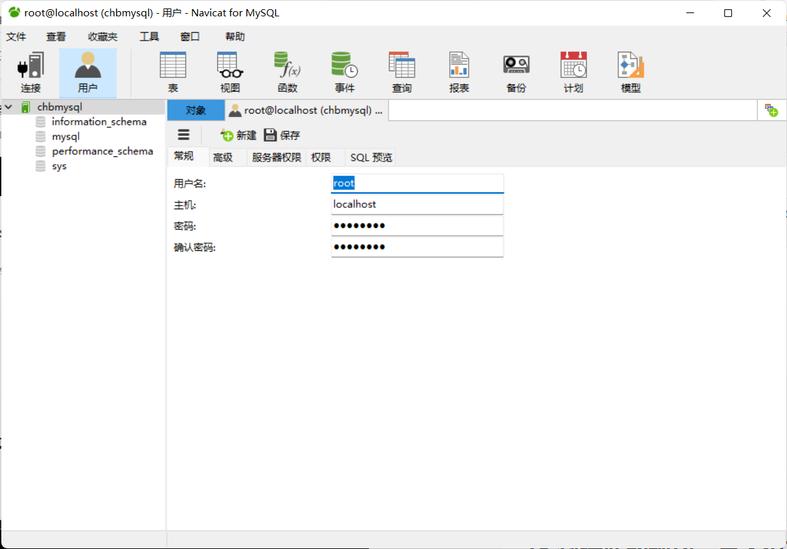

#    Mysql

## 1.连接数据库

​	1.mysql -uroot -p[密码]

```mysql
`update mysql.user set authentication_string=password('123456') where user='root' and Host = 'localhost';--修改用户密码
flush privileges;--刷新权限

-- 显示表的内容
describe student;
-- 显示所有表
show tables;
-- 创建数据库
create database mysql;
-- 选择数据库
use mysql;
```

2.DDL 定义

3.DML 操作

4.DQL 查询

5.DCL 控制

## 2.操作数据库

```mysql
-- 创建数据库，关键字不区分大小写
create database if not exists mysql;
-- 移除数据库
drop database cmysql;
-- 特殊字符冲突，反引号
`user`
-- 修改表
alter table student rename as pupil;
-- 增加字段
alter table pupil add hobby varchar(30) default null;
-- 修改约束
alter table pupil modify hobby int(10);
-- 重命名
alter table pupil change hobby interest varchar(20);
-- 删除表的字段
alter table pupil drop interest;
-- 删除表
drop table pupil;
```

**数据库列表类型**

**数值**

tinyint	一个字节

smallint	两个字节

mediumint	三个字节

int   四个字节(最常用)

bigint	八个字节

float 四个字节

double	八个字节

decimal	字符串形式的浮点数，金融计算

**字符串**

char	字符串0-255

varchar 	可变字符串	0~65535

tingtext	微型文本 	2**8-1

text      文本串		2**16-1

**时间**

data YYYY-MM-DD	日期格式

time 	HH: mm：ss 时间格式

timestamp 时间戳		1970.1.1到现在的毫秒数

year 年

**null**

没有值

数据库字段属性

**Unsigned**：

无符号的整数

声明了该列不能声明为负数

**zerofill**

0填充的

不足的位数使用0填充。int(3) ,2 ----- 002

**自增**

自动在上一条数据上加一，必须是整数类型

**非空**

null     not null

**default**

设置默认值；

**实例**

```mysql
 create table `student`(
     `id` int(4) not null auto_increment,
     `name` varchar(30) not null default '李明',
     `password` varchar(20) not null default '123456',
     `sex` varchar(2) not null default '男',
     `birthday` datetime default null,
     `address` varchar(100) default null,
     `email` varchar(50) default null,
      primary key(`id`)
     )engine=innodb default charset=utf8;
     
 -- 常用偷懒命令
 show create database cschool -- 查询创建数据库的语句
 show create table student -- 查看创建表的语句
 desc student -- 显示表的结构
```

## 3.外键

**方式一；**

创建表的时候使用

```mysql
 -- 创建一个年纪表
 create table `grade`(
      `gradeid` int(10) not null auto_increment comment '年纪id',
      `gradename` varchar(50) not null comment '年纪名称',
      primary key (`gradeid`)
     )engine=innodb default charset=utf8;
     
     
     
create table `student`(
     `id` int(4) not null auto_increment,
     `name` varchar(30) not null default '李明',
     `password` varchar(20) not null default '123456',
     `sex` varchar(2) not null default '男',
     `birthday` datetime default null,
     `gradeid` int(10) not null,
     `address` varchar(100) default null,
     `email` varchar(50) default null,
     primary key(`id`),
     key `FK_gradeid` (`gradeid`),
     constraint `FK_gradeid` foreign key (`gradeid`) references `grade`(`gradeid`)
     )engine=innodb default charset=utf8;
```

**方式二；**

```mysql
-- 在学生表中添加一个需要关联的字段
alter table pupil add `gradeid` int(10) default null;
-- 添加外键，FK_gradeid是外键名称，前提是要创建grade表
alter table `pupil` add constraint `FK_gradeid` foreign key(`gradeid`) references `grade`(`gradeid`);

```

以上物理外键，不推荐使用，

## 4.DML

**添加**

insert语句

```mysql
-- 单一插入，自增不需要理会
insert into `grade`(`gradename`)values('大四');
-- 单一多值插入
insert into `grade`(`gradename`)values('大四'),('大三'),('大一');
-- 多字段单一插入
insert into `pupil`(`name`)values('李华');
-- 多字段插入
insert into `pupil`(`name`,`password`,`sex`)values('Mr.Prefect','0715','男');
-- 多指插入
insert into `pupil`(`name`,`password`,`sex`)values('Mr.Prefect','0715','男'),('Ms.beautiful','0715','女');
```

**修改**

update语句

```mysql
update `pupil` set name = '小李' where name = '李华';
-- 判断
-- and 和运算
update `pupil` set name = '小李' where name = '李华' and '小明';
update `pupil` set name = '小李' where name = '李华' and sex = '女';
-- or
update `pupil` set name = '小李' where name = '李华' or sex = '女';
-- <>  !=
update `pupil` set name = '小李' where name = '李华' <> sex = '女';
-- =
-- between ... and ... 
update `pupil` set name = '小李' where id between 2 and 4;
```


```mysql
-- 不指定具体条件会改所有值
update `pupil` set name = '小李';
-- 多个属性
update `pupil` set name = '小李', sex = '女' where name = '李华' and '小明';
-- 获取时间
update `pupil` set birthday = current_time where name <> '陈和斌' or <> sex '女';

```

**删除**

delete

truncate

```mysql
delete from `student` where id = 1;
-- 清空表
truncate `pupil`;
```

truncate `pupil`  和 delete from `pupil`的 区别

前者清空后计数器为零，不会影响事务。

## 5.DQL

核心语言

select查询

```mysql
select * from student;
select `studentno`,`studentname` from `student`;
-- as用作别名
select studentno as 学号,studentname as 学生姓名 from student as stu;
-- 函数拼接
select concat('姓名：',studentname) as 新名字 from student;
```

去重

```mysql
select distinct `studentname` from student;
```


```mysql
-- 查询自增步长
select @@auto_increment_increment;
```

## 6.Where条件子句

```mysql
select studentno , studentresult from result where studentresult > 80;

select studentno , studentresult from result where not studentresult > 80;

```

## 7.模糊查询 

```mysql
-- like
-- 模糊查询李开头的所有，%表示0到任意字符
select studentno , studentname from student where studentname like '李%';
-- 模糊查询李开头后面只有一个字符的，_表示一个占位符
select studentno , studentname from student where studentname like '李_';
-- 模糊查询，利用拼接法查询包含指定字符的
select studentno , studentname from student where studentname like '%爱%';
-- in 模糊查询表示包含
select studentno , address from student where address in('甘肃');
select studentno , studentname from student where studentno in('1','2','6');
select studentno , studentname from student where studentno is not null;
```

## 8.联表查询

 p113

```mysql
-- 语法
select s.studentNO,studentname,subjectno,studentresult
from student s
left join result r
on s.studentno = r.studentno
where studentresult is null;

select s.studentNO,studentname,subjectno,studentresult
from student s
inner join result r
on s.studentno = r.studentno;


select s.studentNO,studentname,subjectno,studentresult
from student s
left join result r
on s.studentno = r.studentno
inner join `subject` sub
on r.subjectno = sub.subjectno;


```

|       | 相同 | 不同     |
| ----- | ---- | -------- |
| where |      | 等值查询 |
| on    |      | 连接查询 |
|       |      |          |

## 9.自连接

```mysql
-- 将一个表划分，按照里面的关系嵌套，分父子类。

select a.categoryname as '父',b.categoryname as '子'
from category as a,category as b
where b.categoryid = a.pid ;


```

## 10.分页排序

排序

p122

​	升序：asc

​	降序：desc

```mysql
select student.studentno,studentname,studentresult
from student
right join result
on student.studentno = result.studentno
order by studentresult asc;
```

分页

```mysql
select student.studentno,studentname,studentresult
from student
right join result
on student.studentno = result.studentno
order by studentresult asc
limit 5,3;
-- limit x,y
-- x ：表示从第几条开始，y ：表示步长
```

## 11.子查询

```mysql
-- 语法
select a , b 
from AB 
where c =(
    select c from CC
    where c.x = "y"
);

-- 分组和过滤 having
select studentresult as 成绩 from result having 成绩>80;
```


## 12.Mysql函数

 12.1常用函数

```mysql
select ABS(-8) -- 绝对值
select CEILING(9.4) -- 向上取整
select FLOOR(9.4) -- 向下取整
select RAND() -- 返回一个0~1之间的随机数
select SIGN(10) -- 判断一个数的符号 

select CHAR_LENGTH('嗨喽，世界') -- 字符长度

select concat('A''b''陈''a'); -- 拼接字符串

-- 2表示从第二个位置开始，3表示替换三位。后面是替换的值
select insert('我爱沙琪玛',2,3,'是皇阿');
select lower('AcBBiLqPPBCH'); -- 把里面的大写转成小写
select upper('AcBBiLqPPBCH'); -- 把里面的小写转成大写 
select instr('AcBBiLqPPBCH','i'); -- 返回第一次出现的索引5
select replace('我是魔王','魔王','乖孩子'); -- 后置替换前面指定
select substr('我是魔王',3,2); -- 截取字符串，指定位置3开始，2长度
select reverse('我是魔王'); -- 反转
-- 获取当前时间日期
select current_date(); 
select curdate();
-- 附加精确时间
select now();
select localtime();
-- 获取系统用户
select system_user();

```

12.2聚合函数

```mysql
 -- 指定字段统计 -不含null
select count(studentno) from student;
-- 不会忽略null
select count(*) from student; -- 不会忽略
select count(1) from student; -- 不会忽略 忽略所有null

-- sum()求和 avg()求平均 max() min()
select sum(studentresult) as 总分 from result;
```

## 13.MD5加密

*不可逆

```mysql
-- loginpwd(varchar)
update student set loginpwd=md5(loginpwd); 
-- 插入的时候加密
insert into student values(1,'name',md5('45628'))


```

## 14.事务

*要么都成功，要么都失败

ACID

-事务具有4个特征，分别是原子性、一致性、隔离性和持久性，简称事务的ACID特性；

一、原子性（atomicity)

一个事务要么全部提交成功，要么全部失败回滚，不能只执行其中的一部分操作，这就是事务的原子性

二、一致性（consistency)

事务的执行不能破坏数据库数据的完整性和一致性，一个事务在执行之前和执行之后，数据库都必须处于一致性状态。

如果数据库系统在运行过程中发生故障，有些事务尚未完成就被迫中断，这些未完成的事务对数据库所作的修改有一部分已写入物理数据库，这是数据库就处于一种不正确的状态，也就是不一致的状态

三、隔离性（isolation）

事务的隔离性是指在并发环境中，并发的事务时相互隔离的，一个事务的执行不能不被其他事务干扰。不同的事务并发操作相同的数据时，每个事务都有各自完成的数据空间，即一个事务内部的操作及使用的数据对其他并发事务时隔离的，并发执行的各个事务之间不能相互干扰。

在标准SQL规范中，定义了4个事务隔离级别，不同的隔离级别对事务的处理不同，分别是：未授权读取，授权读取，可重复读取和串行化

1、读未提交（Read Uncommited），该隔离级别允许脏读取，其隔离级别最低；比如事务A和事务B同时进行，事务A在整个执行阶段，会将某数据的值从1开始一直加到10，然后进行事务提交，此时，事务B能够看到这个数据项在事务A操作过程中的所有中间值（如1变成2，2变成3等），而对这一系列的中间值的读取就是未授权读取

2、授权读取也称为已提交读（Read Commited），授权读取只允许获取已经提交的数据。比如事务A和事务B同时进行，事务A进行+1操作，此时，事务B无法看到这个数据项在事务A操作过程中的所有中间值，只能看到最终的10。另外，如果说有一个事务C，和事务A进行非常类似的操作，只是事务C是将数据项从10加到20，此时事务B也同样可以读取到20，即授权读取允许不可重复读取。

3、可重复读（Repeatable Read)

就是保证在事务处理过程中，多次读取同一个数据时，其值都和事务开始时刻是一致的，因此该事务级别禁止不可重复读取和脏读取，但是有可能出现幻影数据。所谓幻影数据，就是指同样的事务操作，在前后两个时间段内执行对同一个数据项的读取，可能出现不一致的结果。在上面的例子中，可重复读取隔离级别能够保证事务B在第一次事务操作过程中，始终对数据项读取到1，但是在下一次事务操作中，即使事务B（注意，事务名字虽然相同，但是指的是另一个事务操作）采用同样的查询方式，就可能读取到10或20；

4、串行化

是最严格的事务隔离级别，它要求所有事务被串行执行，即事务只能一个接一个的进行处理，不能并发执行。

四、持久性（durability）

一旦事务提交，那么它对数据库中的对应数据的状态的变更就会永久保存到数据库中。--即使发生系统崩溃或机器宕机等故障，只要数据库能够重新启动，那么一定能够将其恢复到事务成功结束的状态

*mysql默认事务开启

```mysql
set autocommit = 1; -- 设置开启事务自动提交， = 0 设置关闭
-- 事务开启
start transaction -- 标记一个事务的开始，从此之后的SQL都在一个事务中
-- 提交（成功）
commit
-- 回滚 - 回到原来的样子（失败）
rollback
-- 保存点
savepoint xx; -- 设置一个事务的保存点
rollback to savepoint xx; -- 回滚到保存点
release savepoint xx; -- 撤销保存点
```

## 15.索引

索引是帮助MySQL高效获取数据的数据结构，其本质是数据结构。

简单的可理解为一句话：排好序的快速查找数据结构，用于排序和快速查找。

一般来索引本身也很大，不可能全部存储在内存中，因此索引往往以索引文件的形式存储在磁盘上。

*分类

① 普通索引（单列索引）

普通索引（单列索引）：单列索引是最基本的索引，它没有任何限制。

（1）直接创建索引

```MySQL
CREATE INDEX index_name ON table_name(col_name);
```


（2）修改表结构的方式添加索引

```mysql
ALTER TABLE table_name ADD INDEX index_name(col_name);
```

（3）创建表的时候同时创建索引

```mysql
CREATE TABLE `news` (
    `id` int(11) NOT NULL AUTO_INCREMENT ,
    `title` varchar(255)  NOT NULL ,
    `content` varchar(255)  NULL ,
    `time` varchar(20) NULL DEFAULT NULL ,
    PRIMARY KEY (`id`),
    INDEX index_name (title(255))
)

```


（4）删除索引

```mysql
DROP INDEX index_name ON table_name;
或者
alter table `表名` drop index 索引名;
```

② 复合索引（组合索引）

复合索引：复合索引是在多个字段上创建的索引。**复合索引遵守“最左前缀”原则**，**即在查询条件中使用了复合索引的第一个字段，索引才会被使用**。因此，在复合索引中索引列的顺序至关重要。

（1）创建一个复合索引

```mysql
create index index_name on table_name(col_name1,col_name2,...);
```

（2）修改表结构的方式添加索引

```mysql
alter table table_name add index index_name(col_name,col_name2,...);
```

③ 唯一索引

唯一索引：唯一索引和普通索引类似，主要的区别在于，唯一索引限制列的值必须唯一，但允许存在空值（只允许存在一条空值）。

如果在已经有数据的表上添加唯一性索引的话：

如果添加索引的列的值存在两个或者两个以上的空值，则不能创建唯一性索引会失败。（一般在创建表的时候，要对自动设置唯一性索引，需要在字段上加上 not null）
如果添加索引的列的值存在两个或者两个以上的null值，还是可以创建唯一性索引，只是后面创建的数据不能再插入null值 ，并且严格意义上此列并不是唯一的，因为存在多个null值。
对于多个字段创建唯一索引规定列值的组合必须唯一。
比如：在order表创建orderId字段和 productId字段 的唯一性索引，那么这两列的组合值必须唯一！

（1）创建唯一索引

```mysql
# 创建单个索引

CREATE UNIQUE INDEX index_name ON table_name(col_name);

# 创建多个索引

CREATE UNIQUE INDEX index_name on table_name(col_name,...);


```


（2）修改表结构

```mysql
# 单个

ALTER TABLE table_name ADD UNIQUE index index_name(col_name);

# 多个

ALTER TABLE table_name ADD UNIQUE index index_name(col_name,...);
```

（3）创建表的时候直接指定索引

```MySQL
CREATE TABLE `news` (
    `id` int(11) NOT NULL AUTO_INCREMENT ,
    `title` varchar(255)  NOT NULL ,
    `content` varchar(255)  NULL ,
    `time` varchar(20) NULL DEFAULT NULL ,
    PRIMARY KEY (`id`),
    UNIQUE index_name_unique(title)
)
```

④ 主键索引

主键索引是一种特殊的唯一索引，一个表只能有一个主键，不允许有空值。一般是在建表的时候同时创建主键索引：

（1）主键索引(创建表时添加)

```mysql
CREATE TABLE `news` (
    `id` int(11) NOT NULL AUTO_INCREMENT ,
    `title` varchar(255)  NOT NULL ,
    `content` varchar(255)  NULL ,
    `time` varchar(20) NULL DEFAULT NULL ,
    PRIMARY KEY (`id`)
)
```


（2）主键索引(创建表后添加)

```MySQL
-- alter table tbl_name add primary key(col_name);

CREATE TABLE `order` (
    `orderId` varchar(36) NOT NULL,
    `productId` varchar(36)  NOT NULL ,
    `time` varchar(20) NULL DEFAULT NULL
)

alter table `order` add primary key(`orderId`);


```

⑤ 全文索引

在一般情况下，模糊查询都是通过 like 的方式进行查询。但是，对于海量数据，这并不是一个好办法，在 like “value%” 可以使用索引，但是对于 like “%value%” 这样的方式，执行全表查询，这在数据量小的表，不存在性能问题，但是对于海量数据，全表扫描是非常可怕的事情,所以 like 进行模糊匹配性能很差。

这种情况下，需要考虑使用全文搜索的方式进行优化。全文搜索在 MySQL 中是一个 FULLTEXT 类型索引。

小技巧：
在数据量较大时候，先将数据放入一个没有全局索引的表中，然后再用CREATE index创建fulltext索引，要比先为一张表建立fulltext然后再将数据写入的速度快很多。

（1）创建表的适合添加全文索引

```MySQL 
CREATE TABLE `news` (
    `id` int(11) NOT NULL AUTO_INCREMENT ,
    `title` varchar(255)  NOT NULL ,
    `content` text  NOT NULL ,
    `time` varchar(20) NULL DEFAULT NULL ,
     PRIMARY KEY (`id`),
    FULLTEXT (content)
)
```

（2）修改表结构添加全文索引

```mysql
ALTER TABLE table_name ADD FULLTEXT index_fulltext_content(col_name)
```

（3）直接创建索引

```mysql
CREATE FULLTEXT INDEX index_fulltext_content ON table_name(col_name)
```

*原则

--索引不是越多越好

--不要对进程变动数据加索引

--小数据量的表不需要索引

--索引一般加在常用来查询的字段上

*索引的数据结构{重点}

## 16.数据库备份

-*拷贝物理文件，Data文件

-*可视化工具中手动导出

-*命令导出cmd

```mysql 
mysqldump -hlocalhost -uroot -p221700 mysql >D:/a.sql
```

-*导入

```MySQL 
-- 已登录的情况
source d:/a.sql
-- 未登录
mysql -u用户名 -p密码 库名< 备份文件
```


## 17.权限管理



## 18.数据库的规约，三大范式

数据库设计

1.分析需求

2.概要设计

******

为什么需要数据规范化

*信息重复

*更新异常

*插入异常

*删除异常

三大范式

1NF：字段不可分；原子性，字段不可再分，否则就不上关系数据库

2NF：有主键，非主键字段依赖主键；唯一性，一个表只说明一个事物

3NF：非主键字段不能相互依赖；每列都与主键有直接关系，不存在传递依赖

#### 第一范式(1NF)：

即表的列具有原子性，不可再分割，即列的信息，不能分解，只要数据库是关系型数据库(mysql/oracle/db2/informix/sysbase/sql server)就自动的满足1NF。数据库表的每一列都是不可分割的原子数据项，而不能是集合，数组，记录等非原子数据项,**如果实体中的某个属性有多个值时，必须拆分为不同的属性** 。通俗理解即一个字段只存储一项信息。

#### 第二范式(2NF):

第二范式是在第一范式的基础上建立起来的，即满足第二范式一定满足第一范式。第二范式要求数据库表中的每个实例或行必须可以被唯一区分。**为实现区分通常需要我们设计一个主键来实现(这里的主键不包含业务逻辑)。**

即满足第一范式前提，当存在多个主键的时候，才会发生不符合第二范式的情况。比如有两个主键，不能存在这样的属性，它只依赖于其中一个主键，这就是不符合第二范式。**通俗理解是任意一个字段都只依赖表中的同一个字段**。（涉及到表的拆分）

#### 第三范式(3NF)

满足第三范式（3NF）必须先满足第二范式（2NF）。简而言之，第三范式（3NF）要求一个数据库表中不包含已在其它表中已包含的非主键字段。就是说，表的信息，如果能够被推导出来，就不应该单独的设计一个字段来存放(能尽量外键join就用外键join)。很多时候，我们为了满足第三范式往往会把一张表分成多张表。

即满足第二范式前提，如果某一属性依赖于其他非主键属性，而其他非主键属性又依赖于主键，那么这个属性就是间接依赖于主键，这被称作传递依赖于主属性。 **通俗解释就是一张表最多只存两层同类型信息**。  

## 19.批量更新

案例：要把teachers表中的几个字段的批量数据更新到students对应的表中。

```mysql
#创建临时表tmp
CREATE TEMPORARY TABLE tmp(id int(20) primary key, `name` VARCHAR(20), birthday datetime, age int(10) , sex VARCHAR(20));
#临时表tmp批量插入数据从teachers
INSERT into tmp SELECT id,`name`,birthday,age,sex from teachers;
#联表更新students从tmp获取得到数据
UPDATE students,tmp SET students.age = tmp.age,students.birthday = tmp.birthday,students.`name` = tmp.`name`,students.sex = tmp.sex
where students.id = tmp.id;
```

批量新增导入


