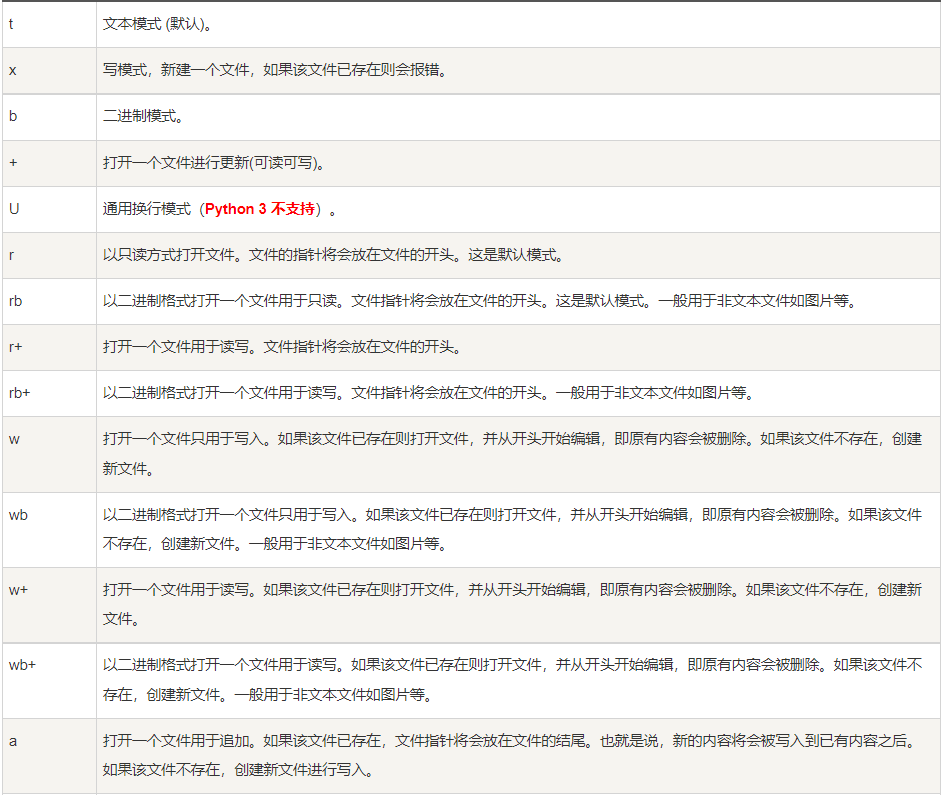
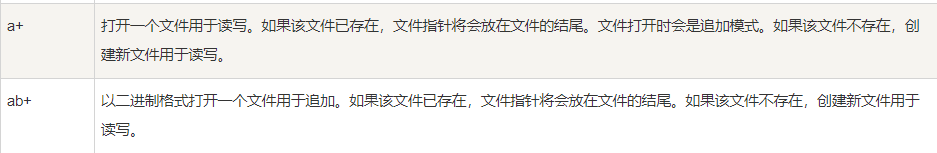

# Input函数

input函数的返回值数据类型为str型

```python
# -*- coding: utf-8 -*-
# @File    : meGo-02
# @Author  : Mr.Prefect
# @Time    : 2021/12/20 17:04
# @Note    :
data = input("重新开始python：")
print(data,type(data))
num = int(input("请输入一个数值："))
print(num)
```

# 算术运算符

```python
# -*- coding: utf-8 -*-
# @File    : meGo-03
# @Author  : Mr.Prefect
# @Time    : 2021/12/20 17:28
# @Note    :
print(89/6) #普通除法运算
print(89//6) #整除运算
print(12%5) #取余运算
print(2**3) #幂运算
```

# 赋值运算符

https://www.runoob.com/python3/python3-basic-operators.html

# Python数据类型

## 数字

### 数学函数

| 函数                                                         | 返回值 ( 描述 )                                              |
| :----------------------------------------------------------- | :----------------------------------------------------------- |
| [abs(x)](https://www.runoob.com/python3/python3-func-number-abs.html) | 返回数字的绝对值，如abs(-10) 返回 10                         |
| [ceil(x)](https://www.runoob.com/python3/python3-func-number-ceil.html) | 返回数字的上入整数，如math.ceil(4.1) 返回 5                  |
| cmp(x, y)                                                    | 如果 x < y 返回 -1, 如果 x == y 返回 0, 如果 x > y 返回 1。 **Python 3 已废弃，使用 (x>y)-(x<y) 替换**。 |
| [exp(x)](https://www.runoob.com/python3/python3-func-number-exp.html) | 返回e的x次幂(ex),如math.exp(1) 返回2.718281828459045         |
| [fabs(x)](https://www.runoob.com/python3/python3-func-number-fabs.html) | 返回数字的绝对值，如math.fabs(-10) 返回10.0                  |
| [floor(x)](https://www.runoob.com/python3/python3-func-number-floor.html) | 返回数字的下舍整数，如math.floor(4.9)返回 4                  |
| [log(x)](https://www.runoob.com/python3/python3-func-number-log.html) | 如math.log(math.e)返回1.0,math.log(100,10)返回2.0            |
| [log10(x)](https://www.runoob.com/python3/python3-func-number-log10.html) | 返回以10为基数的x的对数，如math.log10(100)返回 2.0           |
| [max(x1, x2,...)](https://www.runoob.com/python3/python3-func-number-max.html) | 返回给定参数的最大值，参数可以为序列。                       |
| [min(x1, x2,...)](https://www.runoob.com/python3/python3-func-number-min.html) | 返回给定参数的最小值，参数可以为序列。                       |
| [modf(x)](https://www.runoob.com/python3/python3-func-number-modf.html) | 返回x的整数部分与小数部分，两部分的数值符号与x相同，整数部分以浮点型表示。 |
| [pow(x, y)](https://www.runoob.com/python3/python3-func-number-pow.html) | x**y 运算后的值。                                            |
| [round(x [,n\])](https://www.runoob.com/python3/python3-func-number-round.html) | 返回浮点数 x 的四舍五入值，如给出 n 值，则代表舍入到小数点后的位数。**其实准确的说是保留值将保留到离上一位更近的一端。** |
| [sqrt(x)](https://www.runoob.com/python3/python3-func-number-sqrt.html) | 返回数字x的平方根。                                          |

------

### 随机数函数

随机数可以用于数学，游戏，安全等领域中，还经常被嵌入到算法中，用以提高算法效率，并提高程序的安全性。

Python包含以下常用随机数函数：

| 函数                                                         | 描述                                                         |
| :----------------------------------------------------------- | :----------------------------------------------------------- |
| [choice(seq)](https://www.runoob.com/python3/python3-func-number-choice.html) | 从序列的元素中随机挑选一个元素，比如random.choice(range(10))，从0到9中随机挑选一个整数。 |
| [randrange ([start,\] stop [,step])](https://www.runoob.com/python3/python3-func-number-randrange.html) | 从指定范围内，按指定基数递增的集合中获取一个随机数，基数默认值为 1 |
| [random()](https://www.runoob.com/python3/python3-func-number-random.html) | 随机生成下一个实数，它在[0,1)范围内。                        |
| [seed([x\])](https://www.runoob.com/python3/python3-func-number-seed.html) | 改变随机数生成器的种子seed。如果你不了解其原理，你不必特别去设定seed，Python会帮你选择seed。 |
| [shuffle(lst)](https://www.runoob.com/python3/python3-func-number-shuffle.html) | 将序列的所有元素随机排序                                     |
| [uniform(x, y)](https://www.runoob.com/python3/python3-func-number-uniform.html) | 随机生成下一个实数，它在[x,y]范围内。                        |

## 字符串

```python
var1 = 'Hello World!'
 var2 = "Runoob"
```

## 列表

```python 
list1 = ['Google', 'Runoob', 1997, 2000]
list2 = [1, 2, 3, 4, 5 ]
list3 = ["a", "b", "c", "d"]
list4 = ['red', 'green', 'blue', 'yellow', 'white', 'black']
```

## 元组

Python 的元组与列表类似，不同之处在于元组的元素不能修改。

元组使用小括号 **( )**，列表使用方括号 **[ ]**。

元组创建很简单，只需要在括号中添加元素，并使用逗号隔开即可。


实例(Python 3.0+)

\>>> tup1 = ('Google', 'Runoob', 1997, 2000)
\>>> tup2 = (1, 2, 3, 4, 5 )
\>>> tup3 = "a", "b", "c", "d"  #  不需要括号也可以
\>>> type(tup3)
<**class** 'tuple'>

创建空元组

```
tup1 = ()
```

元组中只包含一个元素时，需要在元素后面添加逗号 **,** ，否则括号会被当作运算符使用：

实例(Python 3.0+)

\>>> tup1 = (50)
\>>> type(tup1)   # 不加逗号，类型为整型
<**class** 'int'>

\>>> tup1 = (50,)
\>>> type(tup1)   # 加上逗号，类型为元组
<**class** 'tuple'>

## 字典

字典是另一种可变容器模型，且可存储任意类型对象。

字典的每个键值 **key=>value** 对用冒号 **:** 分割，每个对之间用逗号(**,**)分割，整个字典包括在花括号 **{}** 中 ,格式如下所示：

```
d = {key1 : value1, key2 : value2, key3 : value3 }
```

**注意：****dict** 作为 Python 的关键字和内置函数，变量名不建议命名为 **dict**。


键必须是唯一的，但值则不必。

值可以取任何数据类型，但键必须是不可变的，如字符串，数字。

一个简单的字典实例：

```
tinydict = {'name': 'runoob', 'likes': 123, 'url': 'www.runoob.com'}
```


也可如此创建字典：

```
tinydict1 = { 'abc': 456 }
tinydict2 = { 'abc': 123, 98.6: 37 }
```

------

创建空字典

字典是另一种可变容器模型，且可存储任意类型对象。

字典的每个键值 **key=>value** 对用冒号 **:** 分割，每个对之间用逗号(**,**)分割，整个字典包括在花括号 **{}** 中 ,格式如下所示：

```
d = {key1 : value1, key2 : value2, key3 : value3 }
```

**注意：****dict** 作为 Python 的关键字和内置函数，变量名不建议命名为 **dict**。


键必须是唯一的，但值则不必。

值可以取任何数据类型，但键必须是不可变的，如字符串，数字。

一个简单的字典实例：

```
tinydict = {'name': 'runoob', 'likes': 123, 'url': 'www.runoob.com'}
```


也可如此创建字典：

```
tinydict1 = { 'abc': 456 }
tinydict2 = { 'abc': 123, 98.6: 37 }
```

访问字典里的值

把相应的键放入到方括号中，如下实例:

实例

tinydict = {'Name': 'Runoob', 'Age': 7, 'Class': 'First'}  

print ("tinydict['Name']: ", tinydict['Name'])

print ("tinydict['Age']: ", tinydict['Age'])

## 集合

集合（set）是一个无序的不重复元素序列。

可以使用大括号 **{ }** 或者 **set()** 函数创建集合，注意：创建一个空集合必须用 **set()** 而不是 **{ }**，因为 **{ }** 是用来创建一个空字典。

1、添加元素

**语法格式如下：**

```python
s.add( x )
```

2、移除元素

**语法格式如下：**

```
s.remove( x )
```

3、计算集合元素个数

**语法格式如下：**

```
len(s)
```

4、清空集合

**语法格式如下：**

```
s.clear()
```

5、判断元素是否在集合中存在

**语法格式如下：**

```
x in s
```

集合内置方法完整列表

|                             方法                             |                             描述                             |
| :----------------------------------------------------------: | :----------------------------------------------------------: |
|   [add()](https://www.runoob.com/python3/ref-set-add.html)   |                        为集合添加元素                        |
| [clear()](https://www.runoob.com/python3/ref-set-clear.html) |                     移除集合中的所有元素                     |
|  [copy()](https://www.runoob.com/python3/ref-set-copy.html)  |                         拷贝一个集合                         |
| [difference()](https://www.runoob.com/python3/ref-set-difference.html) |                      返回多个集合的差集                      |
| [difference_update()](https://www.runoob.com/python3/ref-set-difference_update.html) |         移除集合中的元素，该元素在指定的集合也存在。         |
| [discard()](https://www.runoob.com/python3/ref-set-discard.html) |                     删除集合中指定的元素                     |
| [intersection()](https://www.runoob.com/python3/ref-set-intersection.html) |                        返回集合的交集                        |
| [intersection_update()](https://www.runoob.com/python3/ref-set-intersection_update.html) |                       返回集合的交集。                       |
| [isdisjoint()](https://www.runoob.com/python3/ref-set-isdisjoint.html) | 判断两个集合是否包含相同的元素，如果没有返回 True，否则返回 False。 |
| [issubset()](https://www.runoob.com/python3/ref-set-issubset.html) |           判断指定集合是否为该方法参数集合的子集。           |
| [issuperset()](https://www.runoob.com/python3/ref-set-issuperset.html) |           判断该方法的参数集合是否为指定集合的子集           |
|   [pop()](https://www.runoob.com/python3/ref-set-pop.html)   |                         随机移除元素                         |
| [remove()](https://www.runoob.com/python3/ref-set-remove.html) |                         移除指定元素                         |
| [symmetric_difference()](https://www.runoob.com/python3/ref-set-symmetric_difference.html) |               返回两个集合中不重复的元素集合。               |
| [symmetric_difference_update()](https://www.runoob.com/python3/ref-set-symmetric_difference_update.html) | 移除当前集合中在另外一个指定集合相同的元素，并将另外一个指定集合中不同的元素插入到当前集合中。 |
| [union()](https://www.runoob.com/python3/ref-set-union.html) |                      返回两个集合的并集                      |
| [update()](https://www.runoob.com/python3/ref-set-update.html) |                        给集合添加元素                        |

# 条件控制

## if语句

Python中if语句的一般形式如下所示：

```
if condition_1:    
 statement_block_1 
elif condition_2:    
 statement_block_2 
else:    
 statement_block_3
```

- 如果 "condition_1" 为 True 将执行 "statement_block_1" 块语句
- 如果 "condition_1" 为False，将判断 "condition_2"
- 如果"condition_2" 为 True 将执行 "statement_block_2" 块语句
- 如果 "condition_2" 为False，将执行"statement_block_3"块语句

# 循环语句

Python 中的循环语句有 for 和 while。

## while 循环

Python 中 while 语句的一般形式：

```
while 判断条件(condition)：
    执行语句(statements)……
```

执行流程图如下：


在 Python 中没有 do..while 循环。

## for 语句

Python for 循环可以遍历任何可迭代对象，如一个列表或者一个字符串。

for循环的一般格式如下：

for <variable> in <sequence>:    <statements> else:    <statements>

**流程图：**


range()函数

如果你需要遍历数字序列，可以使用内置range()函数。它会生成数列，例如:


\>>>for i in range(5): ...     print(i) ... 0 1 2 3 4

你也可以使用range指定区间的值：


\>>>for i in range(5,9) :    print(i)      5 6 7 8 >>>

也可以使range以指定数字开始并指定不同的增量(甚至可以是负数，有时这也叫做'步长'):


\>>>for i in range(0, 10, 3) :    print(i)      0 3 6 9 >>>

# 推导式

```python
# 列表推导式
lists = [i for i in range(10)]
listpro = [i for i in range(20) if i // 2 == 0]
print(lists)
print(listpro)
# 字典推导式
dic = {key: key * key for key in (2, 5, 8)}
dicpro = {key: key * 2 for key in lists}
print(dic)
print(dicpro)
# 元组推导式
tup = (i for i in range(5))
print(tup)
print(tuple(tup))

```

# 面向对象

```python
# -*- coding: utf-8 -*-
# @File    : 面向对象
# @Author  : Mr.Prefect
# @Time    : 2022/6/22 13:58
# @Note    :
class people:
    name = ''
    age = 0

    def __init__(self, name, age):
        self.name = name
        self.age = age

    def say(self):
        print('姓名：', self.name)
        print('年龄：', self.age)


class goodPeople(people):
    style = ''

    def __init__(self, name, age, style):
        people.__init__(self, name, age)
        self.style = style

    def say(self):
        print('姓名：', self.name)
        print('年龄：', self.age)
        print('类型：', self.style)


if __name__ == '__main__':
    # people01 = people('chb', 18)
    # people01.say()
    godpeople01 = goodPeople('chb', 21, '温柔')
    godpeople01.say()

```

# 文件操作

```python
# -*- coding: utf-8 -*-
# @File    : 文本.py
# @Author  : Mr.Prefect
# @Time    : 2022/6/22 13:43
# @Note    :
def fileFunction(str):
    updatefile = open('H:\Python\pythonProject\ha.txt', mode='r+')
    updatefile.write(str)
    updatefile.close()


# with语句体不需要再写close，因为上下文管理器内置是关闭io流的
def copyFile(urlfrom, urlto):
    with open(urlfrom, mode='rb') as filefr:
        with open(urlto, mode='wb') as fileto:
            fileto.write(filefr.read())


if __name__ == '__main__':
    # str = '这就是你？'
    # fileFunction(str)
    copyFile('../hhk.png', 'chb.png')

```





# 爬虫

安装requests包

```
pip install requests
```

```python
# -*- coding: utf-8 -*-
# @File    : arachnid2
# @Author  : Mr.Prefect
# @Time    : 2022/6/30 14:40
# @Note    :
import requests

url = "https://zy.youku.com/"
header = {
    "user-agent": "Mozilla/5.0 (Windows NT 10.0; Win64; x64) AppleWebKit/537.36 (KHTML, like Gecko) Chrome/102.0.0.0 Safari/537.36"
}
param = {
    "spm": "a2ha1.14919748_WEBHOME_GRAY.drawer3.4"
}

taobao = requests.get(url, params=param, headers=header)
texts = taobao.text
with open("new.html", mode="w", encoding="utf-8") as f:
    f.write(taobao.text)
taobao.close()
```

# 进阶爬虫

模仿登录