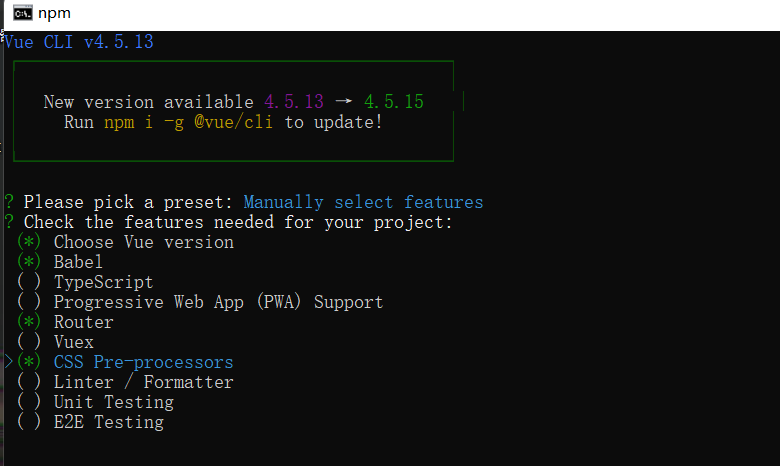
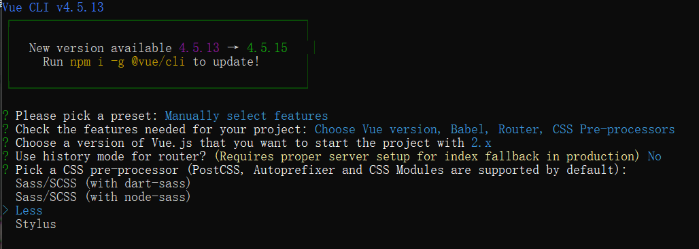
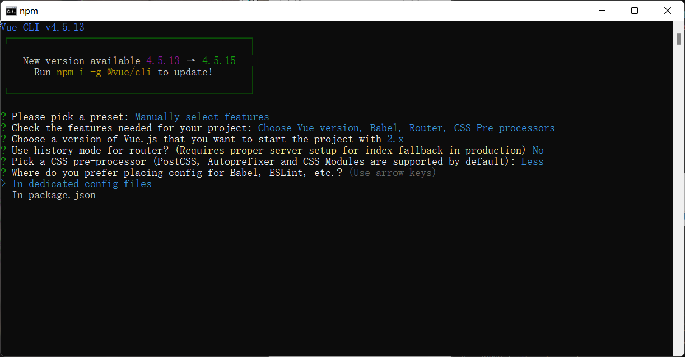

# 创建项目

1.进入项目目标文件，cmd打开终端

2.输入指令

```bash
vue create objname
```

3.选择路由等需要的配置



4.选择css预处理器



5.选择默认的单独存储配置文件



# 引入组件库

移动端使用vant

https://vant-contrib.gitee.io/vant/#/zh-CN/

pc端使用element或者bootstrap

https://element.eleme.cn/#/zh-CN/component/quickstart